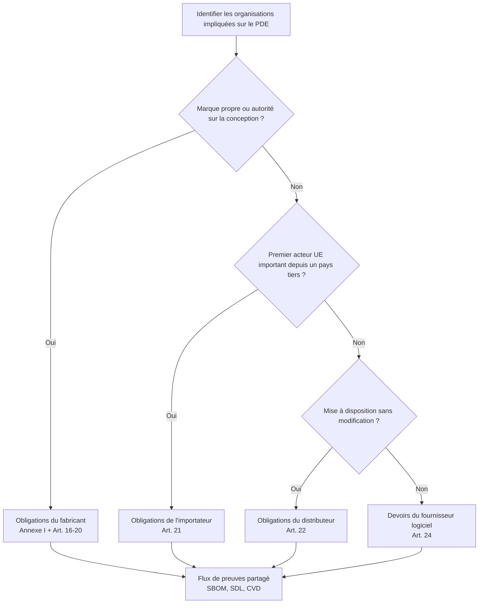

## Pourquoi le périmètre est important

Avant d’investir du temps d’ingénierie, vous devez savoir **si votre produit entre dans le périmètre du CRA** et, le cas échéant, **dans quelle classe** il se situe. Cela détermine :

- le niveau d’exigence de **l’évaluation de conformité**,  
- la quantité de **documentation technique** à maintenir,  
- et les **obligations post‑commercialisation** applicables.  

Le CRA utilise le terme générique **« produit avec éléments numériques » (PEN / PDE)** défini à l’Article 3(1).[1] En pratique, la plupart des dispositifs embarqués, passerelles et images de firmware que vous développez entreront dans cette définition.

> 📘 **Référence.** Dès que vous avez besoin du libellé juridique exact, consultez la publication au Journal officiel du Règlement (UE) 2024/2847.[1]

L’Article 2(2) précise également ce qui est **hors périmètre** : par exemple, les produits développés exclusivement pour la défense/la sécurité nationale, les prototypes de recherche classifiés non mis sur le marché, ou les logiciels fournis gratuitement sans monétisation.[2] Utilisez ces exclusions avec prudence et documentez votre raisonnement dans le dossier technique CRA.

---

## Mon produit embarqué est‑il dans le périmètre ?

Posez‑vous ces questions (issues des Articles 2–3 du CRA).[1][2]

1. **Le produit contient‑il un logiciel ou firmware capable d’exécuter du code ?**  
   - Microcontrôleur, SoC, API, routeur, passerelle, capteur intelligent, etc.  
2. **Est‑il mis sur le marché de l’UE (ou mis en service) en tant que produit ?**  
   - Vendu comme dispositif, intégré dans une machine ou livré dans le cadre d’un système.  
3. **Peut‑il être connecté directement ou indirectement à un réseau ?**  
   - Ethernet, Wi‑Fi, cellulaire, bus de terrain, BLE, USB, RF propriétaire…  

Si la réponse aux trois questions est « oui », vous traitez très probablement un **PDE au sens du CRA**.  

Les outils purement internes (par exemple un gabarit de programmation utilisé uniquement au labo) sont généralement hors périmètre, mais les cartes, modules ou firmwares livrés aux clients ne le sont pas.

---

## Rôles : qui est le « fabricant » ?

Le CRA raisonne en termes de rôles, pas d’intitulés de poste. Le Chapitre II associe chaque rôle à des obligations juridiques concrètes ; il faut donc une définition précise avant de planifier la documentation ou la délégation.

**Fabricant.** Le fabricant est toute personne physique ou morale qui met un PDE sur le marché sous son propre nom ou sa propre marque en maîtrisant la conception, la nomenclature (BOM) et le cycle de développement sécurisé.[3] Si vous contrôlez le contenu du firmware ou le dossier de marquage CE, vous êtes le fabricant, même si le matériel vient d’un partenaire ODM ou EMS.

**Importateur.** L’importateur est le premier acteur établi dans l’UE qui reçoit un produit d’un pays tiers pour distribution. Il doit vérifier que la Déclaration de Conformité couvre bien la version effective du firmware, confirmer la présence du marquage CE et de la documentation technique, et bloquer les livraisons si les conditions du CRA ne sont pas remplies.

**Distributeur.** Les distributeurs mettent le PDE à disposition sans le modifier. Ils conservent les données de traçabilité, évitent de commercialiser des lots non conformes et contribuent aux actions correctives issues de la gestion des vulnérabilités ou de la surveillance du marché.

**Fournisseur de logiciel.** Un éditeur de firmware, SDK ou service cloud devient fournisseur au sens de l’Article 24, mais le fabricant reste responsable sauf accord contractuel contraire. Les fournisseurs doivent néanmoins produire des preuves de SDL et de gestion des vulnérabilités pour alimenter le dossier technique du fabricant.

---

## Classes de criticité (produits importants / critiques)

Le CRA distingue les **PDE ordinaires** de ceux considérés comme **importants** ou **critiques** (risque plus élevé). Exemples :

- systèmes de gestion d’identité, jetons de sécurité,
- certains composants de contrôle industriel,
- systèmes d’exploitation et hyperviseurs exécutant d’autres PDE (consultez directement l’Annexe III).[3]  

Pour les classes importantes/critiques :

- une **évaluation de conformité par tierce partie** est souvent obligatoire,  
- les défaillances de sécurité attirent davantage l’attention des autorités.

Si vous développez des microcontrôleurs basse consommation pour capteurs ou de simples passerelles, vous êtes en général dans la catégorie **« PDE normal »**, mais vérifiez toujours l’Annexe III avant de conclure qu’une auto‑évaluation suffit.[3] Documentez ce contrôle d’annexe dans votre suivi CRA (Jira, Notion, etc.) afin que les auditeurs puissent reconstituer la décision.

---

## Termes clés du CRA

- **Vulnérabilité** : faiblesse pouvant être exploitée pour compromettre la confidentialité, l’intégrité ou la disponibilité.  
- **Mise à jour de sécurité (correctif)** : modification logicielle/firmware qui corrige une ou plusieurs vulnérabilités ou améliore la sécurité.  
- **Période de support** : durée pendant laquelle le fabricant s’engage à fournir des mises à jour de sécurité et une gestion des vulnérabilités.  
- **Mise sur le marché** : première mise à disposition d’un produit pour distribution ou utilisation dans l’UE, et non chaque vente.  

Gardez ces définitions à l’esprit (elles se rattachent directement à l’Article 3 et à l’Annexe I du CRA)[1]. Vous les retrouverez dans les sections **SDL**, **gestion des vulnérabilités** et **évaluation de conformité**. En cas de doute, citez la définition exacte dans les revues de conception ou les exigences produit afin que tous raisonnent à partir de la même base.

\[1]: CRA Règlement (UE) 2024/2847 (Article 3 et Annexe I) https://eur-lex.europa.eu/legal-content/EN/TXT/?uri=CELEX:32024R2847  
\[2]: CRA Règlement (UE) 2024/2847 (Article 2): https://eur-lex.europa.eu/legal-content/EN/TXT/?uri=CELEX:32024R2847  
\[3]: CRA Règlement (UE) 2024/2847 (Chapitre II et Annexe III): https://eur-lex.europa.eu/legal-content/EN/TXT/?uri=CELEX:32024R2847

