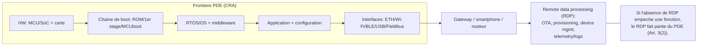
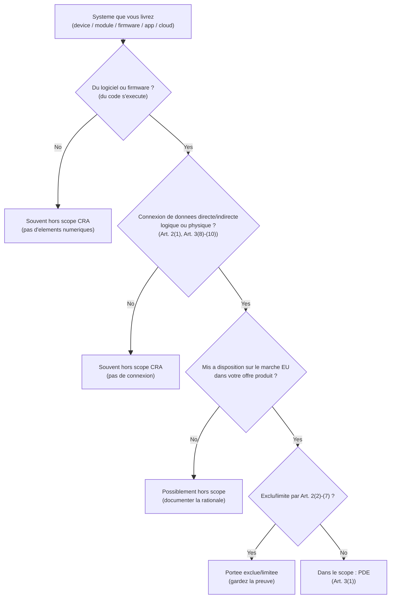
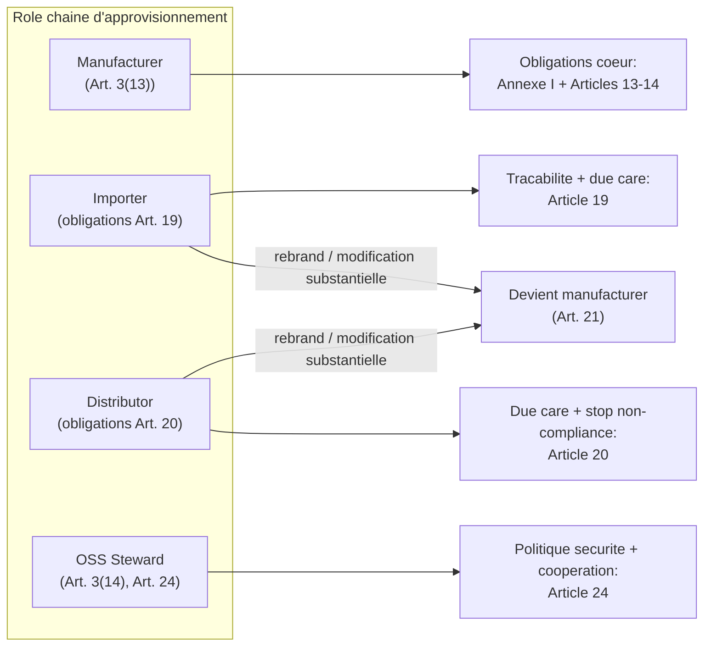
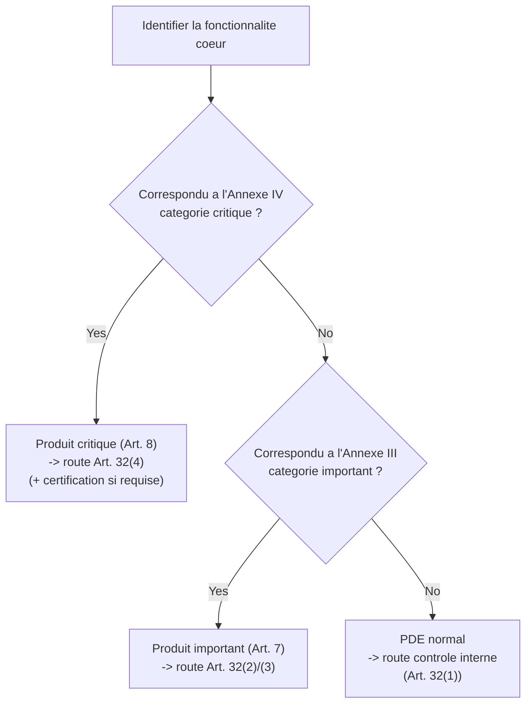

## Pourquoi la portee compte (pour l'embarque)

Le Cyber Resilience Act (CRA) est un **reglement de marquage CE pour la cybersecurite** : il definit *ce qui* doit etre integre au produit, *comment* le fabricant gere les vulnerabilites dans le temps, et *quelles preuves* doivent figurer dans le dossier technique.

Pour un produit embarque, bien definir la portee des le depart fixe :

- le **niveau de securite vise** a mettre en oeuvre (Annexe I),
- la **route d'evaluation de conformite** (auto vs tiers) selon si vous relevez des **Annexes III / IV**,
- la taille et la duree de vie de votre **documentation technique** (mises a jour pendant la periode de support),
- et les obligations operationnelles de **traitement des vulnerabilites** et de **mises a jour de securite**.

---

## 1) Portee CRA : declencheur legal, traduit en termes d'ingenierie

Le CRA s'applique aux **produits avec elements numeriques** mis a disposition sur le marche de l'UE **lorsque l'usage prevu ou raisonnablement previsible inclut une connexion logique ou physique directe ou indirecte a un appareil ou a un reseau** (Art. 2(1)).

Si votre appareil (ou son logiciel) peut echanger des donnees via *n'importe quelle* interface pouvant raisonnablement se connecter a un environnement reseau, considerez que le CRA s'applique.

### Connexion de donnees (ce qui compte)

Le CRA definit explicitement :

- **connexion logique** : representation virtuelle via une interface logicielle (Art. 3(8));
- **connexion physique** : connexion par des moyens physiques, y compris fils ou ondes radio (Art. 3(9));
- **connexion indirecte** : connexion faisant partie d'un systeme plus large directement connectable (Art. 3(10)).

Pour l'embarque, tout ceci est donc une "connexion" au sens CRA :

- Ethernet, Wi-Fi, cellulaire, Thread, BLE, Zigbee, LoRaWAN
- USB (CDC/DFU), UART, SPI, I2C utilises via gateway / host
- CAN / CAN-FD, Modbus, RS-485, PROFINET, EtherCAT quand pontes vers IP
- interfaces debug (SWD/JTAG) si accessibles sur le terrain (analyse de risque)

---

## 2) Definitions a utiliser de facon coherente

### 2.1 Product with Digital Elements (PDE)

Un **produit avec elements numeriques** est un produit logiciel ou materiel **et ses solutions de traitement de donnees a distance**, y compris des composants mis sur le marche separement (Art. 3(1)).

Lecture ingenierie :

- Un seul "PDE" peut etre l'**appareil + firmware + appli mobile + backend cloud** si la partie distante est requise pour une fonction.
- Un **livrable logiciel seul** peut etre un PDE (ex. agent gateway).
- Un module/SDK/lib peut etre un PDE si vous le mettez sur le marche sous votre controle.

### 2.2 Remote data processing (RDP)

Le **traitement de donnees a distance** est un traitement a distance concu/developpe par (ou sous responsabilite du) fabricant, **et sans lequel le PDE serait empeche d'executer une de ses fonctions** (Art. 3(2)).

Ceci compte beaucoup en embarque car l'OTA, le provisioning, la telemetrie et la gestion flotte sont souvent hors appareil.

#### Diagramme de frontiere PDE (produit embarque typique)

---

## 3) Ce qui est hors scope (et ce qui ne l'est pas)

### 3.1 Exclusions explicites (Art. 2)

Le CRA **ne s'applique pas** a :

- certains produits de secteurs reglementes listes a l'Art. 2(2)-(4) (ex. regimes dispositifs medicaux; regimes certification aviation);
- pieces de rechange remplaçant des composants identiques fabriques aux memes specs (Art. 2(6));
- produits developpes ou modifies uniquement pour la securite/defense nationale, ou concus pour traiter des informations classees (Art. 2(7)).

Le CRA peut aussi etre limite/exclu si d'autres regles UE couvrent deja les memes risques cyber au meme niveau ou plus (Art. 2(5)).

### 3.2 Erreur courante "FOSS hors scope"

**Ne considerez pas l'Art. 2 comme une exemption FOSS globale.** Le CRA introduit un regime specifique pour les **open-source software stewards** (Art. 3(14), Art. 24) et traite soigneusement la mise sur le marche et les roles.

Si vous livrez un produit commercial integrant de l'open source, votre appareil reste un PDE et vous gardez les obligations de fabricant.

---

## 4) "Mon produit embarque est-il dans le scope ?" - workflow decision

Si vous arrivez a **"Dans le scope : PDE"**, continuez avec :
- *Fundamental Security Requirements* (Annexe I, Part I),
- *Secure Development Lifecycle / Processes* (Annexe I, Part II),
- *Vulnerability handling & reporting* (Art. 14 + Annexe I Part II),
- et *Conformity assessment* (Art. 32 + Annexe VIII).

---

## 5) Roles : qui porte quelles obligations ?

Le CRA assigne des obligations aux **operateurs economiques** (Art. 3(12)). Pour la chaine embarquee, les roles clefs sont :

### 5.1 Manufacturer (vous possedez l'histoire securite)

Un **manufacturer** est toute personne qui developpe/fabrique un PDE (ou le fait concevoir/fabriquer) et le commercialise sous son nom ou marque, payant ou non (Art. 3(13)).

En pratique, si vous controlez le **contenu firmware**, la **politique de mises a jour de securite**, et le **dossier CE**, vous etes manufacturer meme si le hardware est ODM/EMS.

Les obligations manufacturer sont surtout dans **Articles 13 et 14** (Assurer la conformity Annexe I; documentation et EU DoC; traitement des vulnerabilites; reporting incident; support period; fournir updates).

### 5.2 Importer

Obligations importateur dans **Article 19** (tracabilite, conserver DoC, fournir doc technique aux autorites, actions correctives, signaler risque cyber significatif, etc.).

### 5.3 Distributor

Obligations distributeur dans **Article 20** (due care; verifier marquage CE et presence documentation; ne pas mettre sur marche un produit non conforme; informer manufacturer des vulnerabilites; cooperer avec autorites).

### 5.4 Quand importateur/distributeur devient "manufacturer"

Si un importateur/distributeur met un PDE sur le marche sous son nom/marque **ou realise une modification substantielle**, il est traite comme manufacturer et soumis aux Articles 13 et 14 (Art. 21).

Les autres personnes qui font une modification substantielle et mettent le produit a disposition sont aussi traitees comme manufacturers pour le scope modifie (Art. 22).

### 5.5 Open-source software stewards (si pertinent)

Un **open-source software steward** est defini a l'Art. 3(14). Ses obligations sont a l'Art. 24 (politique cyber, cooperation avec autorites, obligations incidents lorsqu'il opere l'infrastructure de dev).

#### Diagramme role mapping

---

## 6) Classification : produit normal vs important vs critique

Cela change la route de conformity assessment et la profondeur du controle.

### 6.1 Important products (Annexe III)

Les produits dont la **fonctionnalite essentielle** correspond aux categories de **l'Annexe III** sont des **important products** et suivent les procedures d'evaluation de conformite des Art. 32(2) et (3) (Art. 7(1)).

L'Annexe III est en **Classe I** et **Classe II**; la Commission peut mettre a jour la liste (Art. 7(3)) et publiera des descriptions techniques (Art. 7(4)).

### 6.2 Critical products (Annexe IV)

Les produits dont la fonctionnalite essentielle correspond a **l'Annexe IV** sont des **critical products**. Ils doivent demontrer la conformity via un schema de certification cyber europeen (si impose) ou via les routes d'evaluation plus elevees (Art. 8 + Art. 32(4)).

### 6.3 Workflow pratique de classification

**Astuce ingenierie :** la "fonctionnalite coeur" n'est pas "contient telle lib". Si vous embarquez un serveur SSH dans un capteur, la question est si SSH est une fonction coeur du produit commercialise, pas juste present.

---

## 7) Vocabulaire CRA a reutiliser (definir une fois)

Utilisez les definitions CRA pour garder coherence entre analyse de risque, docs d'architecture et politique de mises a jour :

- **cybersecurity risk** et **significant cybersecurity risk** (Art. 3(37)-(38))
- **SBOM** (Art. 3(39))
- **vulnerability / exploitable / actively exploited** (Art. 3(40)-(42))
- **incident impactant la securite du PDE** (Art. 3(44))

Ces termes pilotent vos decisions de declenchement de reporting et vos arguments "no known exploitable vulnerabilities" en release.

---

## 8) Livrables embarques pratiques qui prouvent vos decisions de portee

Pour un audit ou la surveillance du marche, vous devez montrer une trace claire :

1. **Scope statement** (1 page) : frontiere PDE + frontiere RDP + interfaces. (Art. 2(1), Art. 3(1)-(2))
2. **Inventaire connectivite** : interfaces physiques/logiques, exposees en prod, et comment protegees. (Art. 3(8)-(10))
3. **Role statement** : mapping manufacturer/importer/distributor + qui maintient l'infra update. (Art. 3(12)-(14), Art. 19-21, Art. 24)
4. **Decision de classification** : cross-check Annexes III / IV avec rationale "fonction coeur". (Art. 7-8)
5. **Regle change-control** : ce qui compte comme "modification substantielle" en interne, et comment vous refaites classification + analyse de risque. (Art. 21-22)

---

## 9) Problemes frequents dans cette section (et solutions)

### A) "Ou tracer la frontiere PDE ?"
**Pb typique :** on ne documente que l'appareil, alors que l'OTA/provisioning/telemetry est necessaire.  
**Fix :** si l'absence de la partie distante empeche une fonction, traitez-la comme RDP dans la frontiere PDE (Art. 3(2)). Documentez-la dans l'architecture et l'analyse de risque.

### B) "USB / UART / BLE est-ce vraiment une connexion reseau ?"
**Pb typique :** "c'est local, donc CRA ne s'applique pas".  
**Fix :** la portee CRA inclut les connexions indirectes (Art. 2(1) + Art. 3(10)). Si l'interface peut realiser un pont vers un systeme reseau, incluez-la dans le scope et le threat model.

### C) "On utilise de l'open source, on est exemptes ?"
**Pb typique :** confusion entre stewardship FOSS et obligations manufacturer.  
**Fix :** votre produit commercial reste un PDE; vous restez manufacturer (Art. 3(13)). Les devoirs FOSS steward (Art. 24) ne retirent pas les devoirs manufacturer.

### D) "On est distributeur mais on ajoute notre firmware"
**Pb typique :** distributeur pense avoir des obligations legeres mais reflashe et rebrand.  
**Fix :** rebrand ou modification substantielle peut faire de vous le manufacturer (Art. 21-22). Traitez la release comme un manufacturer (Articles 13-14).

### E) "Classification important/critique floue"
**Pb typique :** confusion presence composant vs fonction coeur.  
**Fix :** documentez l'usage marketing du produit; mappez aux Annexes III/IV par **fonction coeur** (Art. 7-8). Gardez la rationale dans le dossier technique.

### F) "On ne sait pas quoi mettre dans le dossier technique"
**Fix :** au minimum, gardez diagrammes de frontiere, inventaire interfaces, mapping roles, decision de classification, et regle change-control. Le CRA exige la documentation technique avant la mise sur le marche et mise a jour pendant la periode de support (Art. 31).

---

## References (normatives)

[1] Regulation (EU) 2024/2847 (Cyber Resilience Act) - texte consolide (EUR-Lex): https://eur-lex.europa.eu/legal-content/EN/TXT/?uri=CELEX:32024R2847  
[2] CRA Article 2 (Scope) - voir [1], Art. 2(1)-(7).  
[3] CRA Article 3 (Definitions : PDE, RDP, connexion logique/physique/indirecte, manufacturer, OSS steward) - voir [1], Art. 3(1)-(14).  
[4] CRA Article 7-8 (Important/Critical products) et Annexes III-IV - voir [1], Art. 7-8 et annexes.  
[5] CRA Articles 19-22 et 24 (Importer/Distributor duties, quand ils deviennent manufacturer; OSS stewards) - voir [1], Art. 19-22 et Art. 24.  
