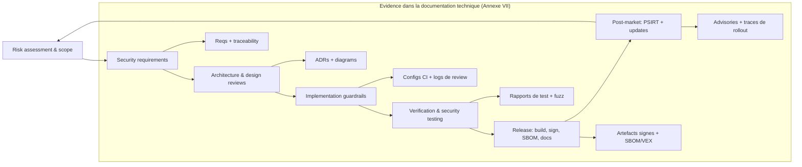
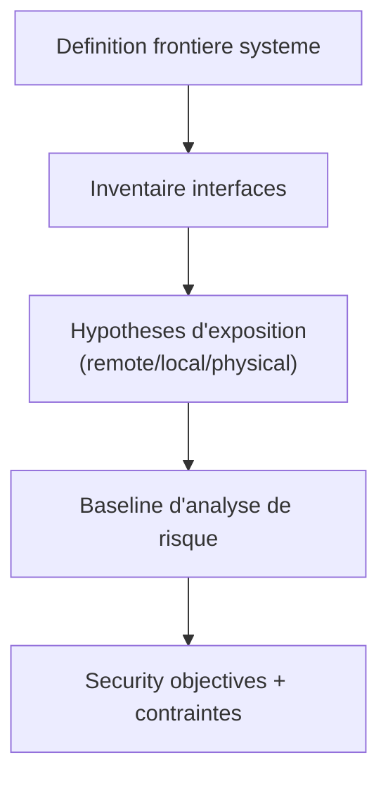
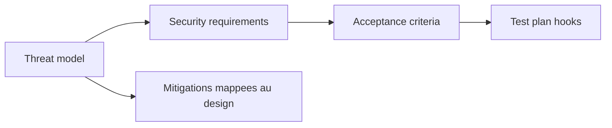
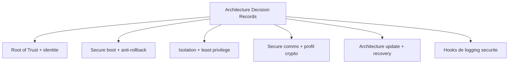
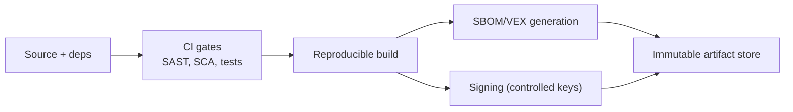
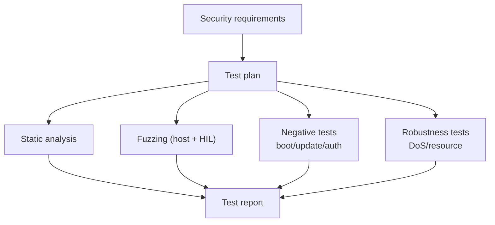
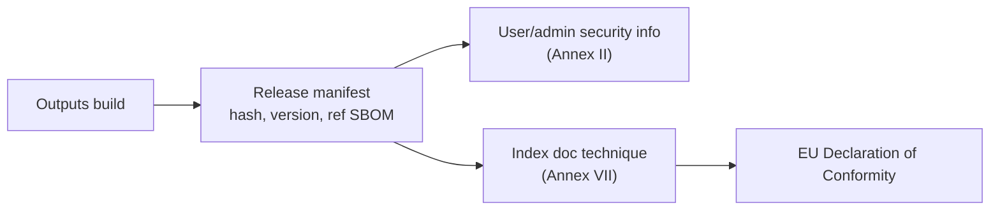
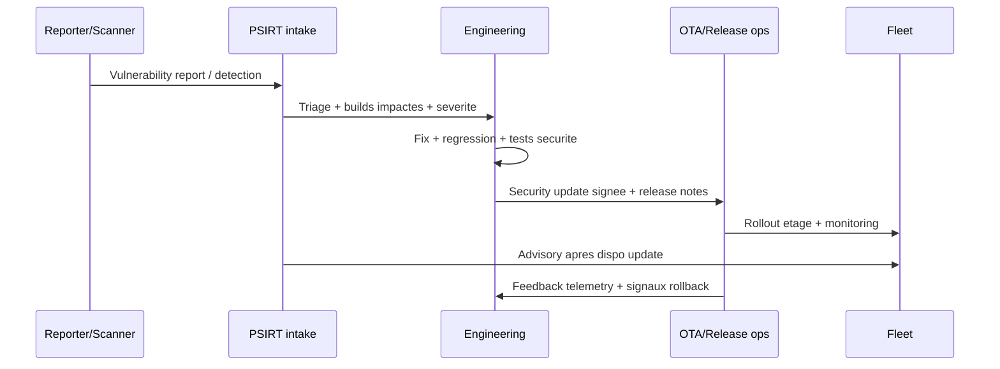
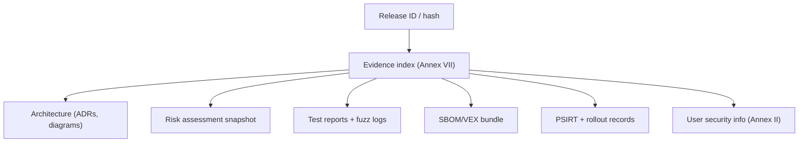

---
id: cra-sdl
slug: /security/cra/secure-development-lifecycle
title: Secure Development Lifecycle (SDL)
sidebar_position: 5
last_update:
  author: 'Ayoub Bourjilat (AC6)'
  date: '2025-12-18'
---

## Pourquoi un SDL est requis (vue CRA)

Le CRA ne se limite pas a l'image firmware finale. Lors de la mise sur le marche d'un PDE, le manufacturer doit garantir qu'il a ete **concu, developpe et produit** conforme aux exigences essentielles de securite de **l'Annexe I Part I**.[1]

Le CRA va plus loin :

- Le manufacturer doit mener une **analyse de risque cyber**, la documenter, et prendre son resultat en compte pendant les phases **planification, design, developpement, production, livraison et maintenance**.[2]
- La documentation technique doit etre creee **avant** la mise sur le marche et **mise a jour en continu** au moins durant la **support period** (et contenir les elements de l'Annexe VII).[3]
- La conformite peut etre demontree via des **standards harmonises** ou **common specifications** (presomption de conformite), d'où la necessite d'un SDL **standardisable** et auditable.[4]

En termes d'engineering : **le SDL est le mecanisme qui prouve que l'Annexe I est appliquee**, release apres release.

---

## A quoi ressemble un SDL "CRA-ready" pour l'embarque

Pour un device embarque, un SDL CRA-ready a trois caracteristiques :

1. **Evidence-first** : chaque phase produit des artefacts indexables dans le dossier technique (Annexe VII).[3]
2. **Risk-driven** : les controles sont choisis et justifies par l'analyse de risque produit (Art. 13(2)-(4)).[2]
3. **Lifecycle-complete** : couvre design → release → maintenance terrain, y compris vulnerability handling et security updates (Annexe I Part II).[1]

---

## Phases SDL embarque (gates, outputs, ancres CRA)

### Gate 0 - Scope produit, frontiere, classification

**Objectif :** definir la frontiere PDE et l'"environnement securite" pour rendre le risque mesurable.

Specifiques embarques a capturer :
- interfaces device (connexions logiques/physiques/indirectes),
- hypotheses debug et acces manufacturing,
- dependances distantes requises (updates, identite, telemetry),
- variants produit (memory map, boot chain, radio stack, SKUs regionaux).

**Outputs (minimum) :**
- scope statement + system context diagram,
- inventaire d'interfaces + hypotheses d'exposition,
- baseline initiale d'analyse de risque.

**Ancres CRA :** analyse de risque sur le cycle de vie (Art. 13(2)-(4)) ; besoins de doc technique (Art. 31 + Annexe VII).[2][3]

---

### Gate 1 - Exigences securite et threat modelling

**Objectif :** transformer les proprietes de l'Annexe I Part I en exigences d'engineering, puis les valider face aux menaces.

Threat modelling embarque doit couvrir :
- menaces remote (parsers protocoles, auth bypass, spoofing update),
- menaces locales (abus UART/USB, debug, hypotheses fault injection),
- menaces supply chain (compromission dependances, tampering build pipeline).

**Outputs (minimum) :**
- liste d'exigences securite taggees clauses Annexe I,
- threat model avec mitigations,
- criteres d'acceptation testables (definition de "pass").

**Ancres CRA :** Annexe I Part I exigences essentielles ; analyse de risque montrant comment Annexe I(2) s'applique (Art. 13(3)).[1][2]

---

### Gate 2 - Revues d'architecture (decisions secure-by-design)

**Objectif :** figer tot les choix chers a changer (root of trust, isolation, update path).

Checkpoints design embarque a formaliser :
- root of trust & identite device (key storage, provisioning, revocation),
- chaine de secure boot & politique anti-rollback,
- frontieres d'isolation (MPU/MMU/TrustZone; least privilege),
- profil de communications securisees (protocoles, cipher suites, validation credentials),
- hooks de logging securite et modele d'export,
- strategie d'update (slots A/B, swap, recovery) et matrice d'echec.

**Outputs (minimum) :**
- diagrammes d'architecture avec frontieres de confiance,
- ADRs (architecture decision records) pour chaque choix majeur,
- design key management et provisioning (meme si externalise).

**Ancres CRA :** proprietes Annexe I Part I(2) (secure-by-default, access control, confidentialite/integrite, reduction surface, logging, updates) ; contenu doc technique (Annexe VII).[1][3]

---

### Gate 3 - Garde-fous d'implementation (code + deps + integrite build)

**Objectif :** eviter les vulns evitables et la compromission du pipeline.

Garde-fous embarques :
- regles de code pour langages "unsafe" (C/C++) : APIs bannies, bornes, overflows,
- securite des parsers : validation stricte, checks longueur, state machine durcie,
- gouvernance des dependances : version pinning, suivi vuln, allow/deny lists,
- integrite build : builds reproductibles si possible, signature controlee, logs CI tamper-evident.

**Outputs (minimum) :**
- politique CI : checks requis et conditions de blocage,
- manifest dependances + job de generation SBOM,
- SOP de gestion des cles de signature (qui/ou/comment).

**Ancres CRA :** "no known exploitable vulnerabilities" a la release (Annexe I Part I(2)(a)) ; due diligence composants tiers (Art. 13(5)-(6)) ; doc technique doit decrire les moyens utilises (Art. 31(1)).[1][3][2]

---

### Gate 4 - Verification et tests securite (prouver les proprietes)

**Objectif :** montrer que les controles implementes satisfont l'Annexe I et restent efficaces.

Pour l'embarque, "security testing" doit inclure :
- static analysis pour memory safety et usage crypto/API,
- fuzzing protocoles/formats (harness host + HIL nocturne),
- tests negatifs pour secure boot et update (mauvaise signature, downgrade),
- tests de robustesse disponibilite (exhaustion ressources, rate limiting, watchdog/recovery).

**Outputs (minimum) :**
- plan de test securite lie aux exigences,
- rapports de test avec pass/fail, bugs, preuves de closure,
- corpus fuzz + logs de triage crash pour parsers.

**Ancres CRA :** Annexe I Part I(2) (integrite, access control, disponibilite, logging) ; attentes Annex I Part II (tests reguliers) ; evidences de test dans doc technique (Annexe VII).[1][3]

---

### Gate 5 - Release engineering (creer des artefacts "compliance-grade")

**Objectif :** produire les artefacts exacts qui rendent une release defensible.

Package minimum pour un produit embarque :
- images firmware signees + hashes + metadata de politique de version,
- SBOM par build (et VEX/notes de triage si utilise),
- instructions update et guidance config securite pour users/operators,
- resume "coverage Annexe I" liant clause → controle → evidence.

**Ancres CRA :** security updates + user info associee (Annexe I Part I(2)(c) + Annexe II) ; doc technique avant mise sur le marche (Art. 31(2)) ; DoC UE declare le respect Annexe I (Art. 28(1)).[1][3][5]

---

### Gate 6 - Post-market : PSIRT + security updates (rester conforme sur le terrain)

**Objectif :** garder le PDE securise pendant la support period avec un process de vuln handling fonctionnel et une distribution d'updates securisee.

Obligations embarque pratiques :
- canal d'intake de vuln (single point of contact),
- triage (exposition + exploitabilite + builds impactes),
- distribution securisee des security updates (signees, integrite verifiee, rollback-safe),
- advisory/notification apres disponibilite des updates (timing aligne a votre politique).

**Outputs (minimum) :**
- doc process PSIRT + outils de workflow,
- traces de rollout d'updates securite (staged, segmentation flotte),
- templates d'advisory + preuves de cloture vuln.

**Ancres CRA :** exigences de vuln handling (Annexe I Part II) ; analyse de risque mise a jour pendant support period (Art. 13(3)) ; doc technique mise a jour pendant support period (Art. 31(2)).[1][2][3]

---

## Mapper le SDL a NIST SSDF et IEC 62443-4-1 (optionnel mais utile)

Le CRA est la base legale. Des cadres comme **NIST SSDF (SP 800-218)** et **IEC 62443-4-1** aident a structurer les activites SDL et a produire des evidences coherentes, mais ne remplacent pas l'Annexe I.[6][7]

Alignement pratique pour equipes embarque :

- **Prepare (SSDF PO)** → Gates 0-1 (scope, roles, risk model, exigences)
- **Protect (SSDF PS)** → Gates 2-3 (architecture securisee, integrite build, gouvernance deps)
- **Produce (SSDF PW)** → Gates 4-5 (tests, signature, SBOM, evidences release)
- **Respond (SSDF RV)** → Gate 6 (PSIRT + updates)

---

## Que stocker et ou (pour eviter l'archeologie d'audit)

Modele de stockage CRA-friendly :
- artefacts design (ADRs, diagrams) dans le repo architecture,
- artefacts CI et releases en stockage immutable avec retention,
- enregistrements PSIRT dans un tracker exportable,
- et un **index unique de documentation technique** qui pointe vers tous les artefacts par hash de release (Annexe VII).[3]

---

## Problemes courants (et pourquoi ils comptent sous CRA)

Si votre SDL parait "lourd", c'est souvent qu'il manque un de ces fondamentaux :

1. **Frontiere PDE non definie** : device documente mais OTA/provisioning/telemetry absents → obligations update/logging non prouvables.[2][3]
2. **Support period decidee tard** : strategie update et couts non alignes avec le handling lifecycle requis (analyse de risque et doc doivent etre mises a jour pendant support period).[2][3]
3. **Explosion de variantes sans evidences** : multiples SKUs/boot chains mais une seule testee/documentee → evidences non representatives.
4. **Signature/cles traitees comme detail build** : pas de garde des cles ni logs de signature → difficulte a prouver authenticite/integrite des updates.[1][3]
5. **Pas de tests negatifs** : secure boot/update implémentes mais jamais attaques en test (downgrade, corruption, replay) → integrite non prouvee.
6. **SBOM creee une fois** : SBOM non liee au hash exact de release et pas de workflow triage/VEX → "no known exploitable vulnerabilities" indefendable.[1]
7. **Lifecycle debug non gouverne** : politiques SWD/JTAG/UART tribales → casse secure-by-default et reduction surface d'attaque.[1]
8. **PSIRT = email** : pas de flux documente intake/triage/update/advisory → attentes Annexe I Part II non verificables.[1]
9. **Evidences dispersees** : artefacts non indexes par release dans la doc technique → audits lents et a risque (Art. 31 + Annexe VII).[3]
10. **Process ignore l'evolution des standards** : production serie ne reagit pas aux standards harmonises/common specs mis a jour → le CRA exige de maintenir la conformite dans le temps.[2][4]

---

## References

[1]: Regulation (EU) 2024/2847 (CRA) - Annexe I (Part I & Part II) (EUR-Lex) https://eur-lex.europa.eu/legal-content/EN/TXT/?uri=CELEX:32024R2847  
[2]: CRA - Article 13 (obligations manufacturer : analyse de risque integree au lifecycle; mise a jour pendant support period; incluse dans doc technique; procedures pour production conforme) https://eur-lex.europa.eu/legal-content/EN/TXT/?uri=CELEX:32024R2847  
[3]: CRA - Article 31 + Annexe VII (doc technique : etablie avant mise sur le marche; mise a jour pendant support period; contenu requis) https://eur-lex.europa.eu/legal-content/EN/TXT/?uri=CELEX:32024R2847  
[4]: CRA - Article 27 (presomption de conformite via harmonised standards et common specifications; demandes de normalisation) https://eur-lex.europa.eu/legal-content/EN/TXT/?uri=CELEX:32024R2847  
[5]: CRA - Article 28 (DoC UE declare le respect Annexe I) + Annexe II (user security information) https://eur-lex.europa.eu/legal-content/EN/TXT/?uri=CELEX:32024R2847  
[6]: NIST SP 800-218 (Secure Software Development Framework - SSDF) https://csrc.nist.gov/pubs/sp/800/218/final  
[7]: IEC 62443-4-1 (Secure product development lifecycle requirements) (standard reference; via IEC/ISA)  

