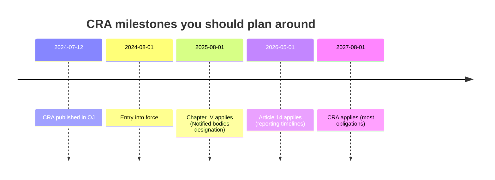
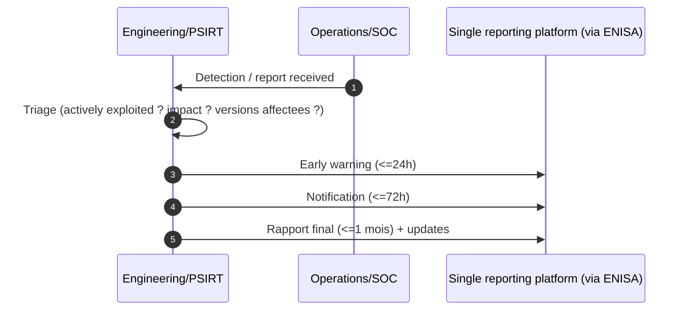
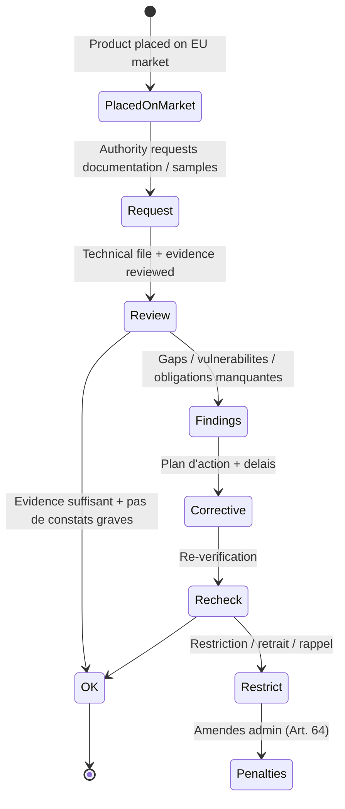
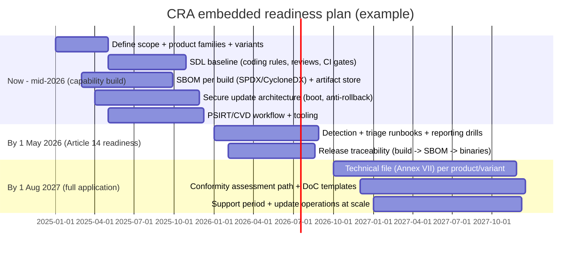

---
id: cra-timelines
slug: /security/cra/timelines-and-enforcement
title: Chronologie, enforcement et penalites
sidebar_position: 9
last_update:
  author: 'Ayoub Bourjilat (AC6)'
  date: '2025-12-18'
---

## Pourquoi les timelines comptent (surtout pour l'embarque)

Le CRA est un **reglement de marquage CE** : une fois applicable, on ne peut pas "patcher la conformite" plus tard. Pour des produits embarques (MCU sur le terrain 10+ ans), le plus difficile n'est pas la crypto mais de planifier **support period**, **logistique d'update**, **retention d'evidence**, et **reporting incident/vuln** sur toutes les variantes.

---

## Dates CRA clefs pour votre plan

Regulation (EU) 2024/2847 (CRA) publiee au JO le **12 juillet 2024**. Entree en vigueur le **1er aout 2024** (+20 jours). Article 71 etale les dates d'application :

- **+12 mois (1 aout 2025)** : Chapitre IV (designation des notified bodies)
- **+21 mois (1 mai 2026)** : Article 14 (timelines reporting vuln/incident)
- **+36 mois (1 aout 2027)** : Obligations principales applicables (Annexe I, doc, updates, CE/DoC, surveillance marche, etc.)

Ne pas confondre **entree en vigueur** et **application** : les obligations ne sont opposables qu'aux dates d'application.

| Date (application) | Ce qui s'applique | Impact pratique (vue embarquee) |
|---|---|---|
| **1 aout 2025** | **Chapitre IV** (notification des organismes d'evaluation) | Les notified bodies peuvent etre designes tot pour preparer des evaluations avant l'application totale. |
| **1 mai 2026** | **Article 14** (timelines reporting) | Vous devez pouvoir reporter certaines vulns exploitees/incidents avec des delais stricts. Jalons de capacite process. |
| **1 aout 2027** | **CRA applicable (la plupart des dispositions)** | Obligations CRA pleines (Annexe I, doc technique, vuln handling, updates, CE/DoC, pouvoirs surveillance marche). |

**Implication ingenierie :** attendre fin 2027 pour batir vos process rate l'objectif : le CRA attend des **evidences repetables**, pas un sprint unique.

---

## "Produits existants" pour devices longue vie

Piège courant : "modele shippe il y a des annees, donc pas impacte".

En vocabulaire CE, c'est **la mise sur le marche** qui compte. Si vous continuez a shipper le *meme modele* apres application du CRA, il vous faut une release conforme + dossier technique **pour la version mise sur le marche a ce moment**.

Cas pratiques :

- **Meme hardware, nouveau firmware** : nouvelle release a garder dans l'enveloppe CRA (SBOM/VEX, tests, chemin d'update, support period declaree).
- **Respin hardware (nouvelle revision MCU/SoC)** : re-verifier analyse de risque, proprietes securite (debug lock, TRNG, stockage securise), impact classification Annexe III.
- **Familles/SKUs** : pouvoir generer des evidences **par variante** (radios, accelerateurs crypto, tailles memoire, boot chains).

---

## Timelines de reporting a tenir (Article 14)

Quand **l'Article 14** s'applique (**1 mai 2026**), readiness = detection, triage, reporting. Delais CRA :

- **Early warning** sous **24h** apres prise de conscience d'une *actively exploited vulnerability* ou d'un incident, puis
- **notification** sous **72h**,
- **rapport final** sous **1 mois** (avec suivis si besoin).

**Reality check embarque :** pour tenir ces delais, il faut un minimum de logging/telemetry, un workflow PSIRT, et un mapping rapide rapport → builds impactes (SBOM + trace release).

---

## Surveillance marche et enforcement : ce que fait l'autorite

Quand le CRA s'applique, les autorites nationales peuvent :

- demander la **documentation technique**,
- tester les produits,
- imposer des **actions correctives** (fix, restriction, retrait/rappel),
- et appliquer des penalites.

Modele mental utile :

**Ce qui echoue souvent en embarque :**
- chemin d'update non securise ou non documente,
- SBOM manquante pour firmware + toolchain,
- pas de process vuln handling / CVD credible,
- defaults faibles (debug ouvert, mots de passe par defaut, services exposes),
- "paper security" : assertions sans preuve de test.

---

## Penalites (Article 64) : chiffres clefs

| Non-conformite (simplifie) | Amende admin max |
|---|---|
| Manquement aux **exigences essentielles** (Annexe I) et certaines obligations coeur (incl. reporting) | jusqu'a **€15,000,000** ou **2.5%** du CA mondial (le plus eleve) |
| Manquement aux obligations de certains **operateurs economiques** (doc, cooperation, supply-chain) | jusqu'a **€10,000,000** ou **2%** du CA |
| **Infos incorrectes/incompletes/trompeuses** aux autorites | jusqu'a **€5,000,000** ou **1%** du CA |

Notes pratiques :
- **Ajustements PME** sur certains delais de reporting (Article 64).
- **OSS stewards** : plafond d'amende nettement plus bas (Article 64).

---

## Feuille de route embarquee alignee sur les dates CRA

Plan realiste (cartes, branches firmware, support long) :

---

## Compliance par phases (PT1, PT2, PT3) et strategie standards

Nombre d'equipes structurent la readiness CRA en trois phases :

- **PT1 (baseline readiness)** : cadrer scope et classification (Annexe III), definir support period, politique d'update, generation SBOM/VEX, workflow PSIRT, squelette technical file. S'aligner sur des **standards horizontaux** meme avant harmonisation.
- **PT2 (implementation + evidence)** : implementer controles/tests alignes sur les **harmonized standards** des qu'ils sont cites au JO. En absence de standards harmonises, suivre les drafts EN/ISO/IEC et **standards horizontaux** reconnus (ex. 62443-4-2, 81001-5-1, ETSI EN 303 645) et les mapper a l'Annexe I. Appliquer des **standards verticaux** si le domaine l'exige (auto, medical, industriel).
- **PT3 (assessment + market placement)** : finaliser le technical file (Annexe VII), executer la route d'evaluation choisie (auto vs tierce partie selon criticite), preparer DoC et marquage CE, et s'assurer que surveillance/updates sont en place pour la support period declaree.

Rappels :
- Les standards harmonises donnent presomption de conformite mais peuvent etre en retard. Commencer avec les standards horizontaux et mettre a jour le mapping des que les textes sont publies.
- Les standards verticaux s'appliquent selon le domaine : documenter la rationale et les evidences par produit/variante.
- Garder les mappings dans le technical file : exigence Annexe I -> controle -> test/evidence -> standard applique (harmonise/horizontal/vertical).

---

## Problemes frequents

Auto-check avant de quitter "timelines & enforcement" :

1. **Confusion entree en vigueur vs application.**  
   Plan base sur la mauvaise date → jalons process (aout 2025 / mai 2026) manques.

2. **Pas de modele "placing on the market" pour le firmware.**  
   Incapable de repondre : *quel build firmware est lie au dossier CE pour ce lot ?*

3. **Support period indefinie.**  
   Sales promet 5-10 ans, engineering planifie 18 mois. Le CRA force a l'acter et a le prouver.

4. **Connectivite offline/intermittente.**  
   Il faut quand meme un update credible : updates signees, checks integrite, recovery, guide utilisateur.

5. **Explosion de variantes.**  
   SoC/radios/memoire/boot flows differents → evidences par variante, pas "un PDF pour tous".

6. **Reporting readiness sous-estimee.**  
   Les fenetres 24h/72h ne sont pas compatibles avec "prochaine sprint". Besoin d'un PSIRT on-call et de seuils clairs.

7. **Trous d'evidence fournisseurs.**  
   ODM/OEM/SDK ne fournissent pas SBOM/tests/statut vuln → obligations impossibles a clore.

---

## References

[1]: Regulation (EU) 2024/2847 (Cyber Resilience Act), Article 71 (dates d'application) et Article 14 (timelines reporting) : https://eur-lex.europa.eu/eli/reg/2024/2847/oj  

[2]: Regulation (EU) 2024/2847, Article 64 (amendes administratives) : https://eur-lex.europa.eu/eli/reg/2024/2847/oj  

