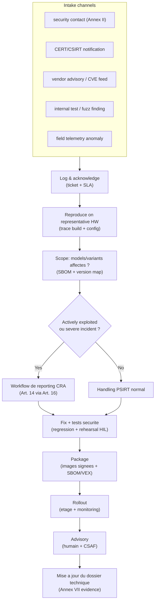
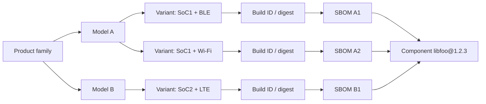

---
id: cra-vuln-handling
slug: /security/cra/vulnerability-handling
title: Gestion des vulnerabilites et reporting
sidebar_position: 7
last_update:
  author: 'Ayoub Bourjilat (AC6)'
  date: '2025-12-18'
---

## Pourquoi la gestion des vulnerabilites est une obligation centrale CRA

Dans le CRA, la securite n'est pas "ship it and forget it". Pour les **PDE** (products with digital elements), le manufacturer doit :

- gerer les vulnerabilites efficacement **pendant toute la support period** (Art. 13(8)),
- appliquer les exigences de **vulnerability handling** de **l'Annexe I, Part II**,
- maintenir la **documentation technique** requise (Annexe VII),
- fournir des **infos utilisateur** et un point de contact de signalement (Annexe II),
- et **notifier** certains evenements via la **single reporting platform** (Art. 14-16).

Pour l'embarque, PSIRT, SBOM/VEX, pipeline d'update et telemetry d'incident sont des *controles de conformite*, pas des "nice-to-have".

---

## Definitions a maitriser (Article 3 CRA)

Ces termes pilotent vos declencheurs de reporting et vos evidences :

- **Vulnerability** : faiblesse exploitable par une cyber menace.
- **Exploitable vulnerability** : exploitable dans des conditions operationnelles pratiques.
- **Actively exploited vulnerability** : preuve fiable qu'un acteur malveillant l'a exploitee dans un systeme sans permission du proprietaire.
- **Incident ayant un impact sur la securite du PDE** : affecte (ou peut affecter) la capacite du PDE a proteger **availability, authenticity, integrity, confidentiality** des donnees/fonctions.
- **SBOM** : enregistrement formel des composants et relations supply-chain inclus dans les elements logiciels.

**Pourquoi c'est crucial pour l'embarque :** le triage doit distinguer "une CVE existe dans une dependance" de "nous sommes affectes" et de "c'est activement exploite sur le terrain". Obligations, delais et communications varient.

---

## Annexe I Part II comme checklist ingenierie (vue embarquee)

L'Annexe I Part II est le socle minimum PSIRT + update. Mappez chaque point a des mecanismes et artefacts concrets.

### 1) Identifier/documenter vulns + composants (SBOM)

**Exigence (Annexe I Part II(1))**  
Maintenir une SBOM en format machine courant couvrant au moins les **top-level dependencies**.

**Notes embarque**
- Generer une SBOM **par build** et **par variante** (SoC, stack radio, feature flags, bootloader, backend crypto).
- Considerer la **toolchain** et les generateurs build comme composants "security-relevant".
- Lier la SBOM a une **identite firmware** (build ID + cle de signature + digest image).

**Outputs**
- `sbom.cdx.json` ou `sbom.spdx.json` rattache aux artefacts de build
- table composant/version (variant ↔ SBOM)

### 2) Remedier sans delai (security updates, separees si possible)

**Exigence (Annexe I Part II(2))**  
Traiter/remedier les vulns **sans delai**, en fournissant des **security updates** ; les separer des feature updates si techniquement faisable.

**Notes embarque**
- Maintenir une branche **security-fix-only** pour clients safety/industriels qui refusent les features.
- Rendre explicites les regles de compatibilite (bootloader ↔ app image; contraintes firmware radio).
- Definir une politique downgrade/rollback (fuses anti-rollback, version monotone) coherente avec la recovery.

**Outputs**
- procedure de release security patch
- matrice de compatibilite d'update + regles rollback

### 3) Tests reguliers et reviews securite

**Exigence (Annexe I Part II(3))**  
Appliquer des **tests et reviews efficaces et reguliers** de la securite du PDE.

**Notes embarque**
- Combiner fuzzing host (parsers protocoles/fichiers) avec **regressions HIL** sur cartes representatives.
- Rendre les resultats de tests securite traçables a un build et a un ticket vuln.

**Outputs**
- rapports de fuzz + archive corpus
- logs de rehearsal update HIL (coupure courant, brownout, tentatives rollback)

### 4) Publier l'info sur les vulns corrigees (avec option de delai securise)

**Exigence (Annexe I Part II(4))**  
Une fois l'update disponible, divulguer les vulns corrigees avec :
- description,
- identification produit affecte,
- impacts et severite,
- remediation claire.

Publication peut etre retardee *uniquement* si le risque de publier immediatement excede le benefice securite, et si les users peuvent appliquer le patch.

**Notes embarque**
- Publier des advisories en **CSAF** pour clientele indus/enterprise.
- L'"affected product identification" doit etre lisible sur le terrain (modele + rev HW + version firmware + build ID).

**Outputs**
- advisory (humain + CSAF)
- liste "affected versions" derivee de SBOM/mapping variantes

### 5) Politique de Coordinated Vulnerability Disclosure (CVD)

**Exigence (Annexe I Part II(5))**  
Mettre en place et faire respecter une **politique CVD**.

**Notes embarque**
- Documenter un safe-harbour et des limites de test (ex. pas de tamper physique, pas d'attaques sur reseaux tiers).
- Definir delais d'acknowledge et de status updates (eviter la "boite noire").

**Outputs**
- `security.md` + page de politique publiee
- SOP PSIRT interne (roles, triage, disclosure gates)

### 6) Faciliter le reporting (adresse de contact)

**Exigence (Annexe I Part II(6))** + **Annexe II(2)**  
Fournir un point de contact unique pour reporter des vulns et trouver la politique CVD.

**Notes embarque**
- Contact accessible pendant toute la support period.
- Offrir chiffrement (PGP) et canaux authentifies pour rapports sensibles.

**Outputs**
- adresse de contact + cle publique
- lien inclus dans la doc utilisateur

### 7) Distribution securisee des updates (automatique si applicable)

**Exigence (Annexe I Part II(7))**  
Fournir des mecanismes de distribution **securisee** des updates, et, si applicable pour les security updates, de maniere **automatique**.

**Notes embarque**
- Update securisee = auth + integrite + anti-rollback + install sûre + chemin de recovery.
- Pour les devices contraints, "automatique" peut signifier "l'appareil verifie/notifie/installe en fenetre de maintenance", mais le mecanisme doit rester fiable et securise.

**Outputs**
- threat model update
- spec des metadata d'update (manifestes, signatures, contraintes de version)

### 8) Diffuser les security updates sans delai, gratuitement (par defaut)

**Exigence (Annexe I Part II(8))**  
Security updates diffusees **sans delai** et, sauf accord specifique avec un business user pour un PDE sur-mesure, **gratuitement**, avec messages d'avis.

**Notes embarque**
- Outils de release doivent supporter des canaux "urgent security" (fast-track signature + rollout etage).
- Messages d'advisory doivent inclure contraintes operationnelles (downtime, reboot, stockage requis).

**Outputs**
- template de release notes securite
- plan de rollout + snapshot dashboard de monitoring

---

## Modele PSIRT embarque (ce que les auditeurs regardent)

Un PSIRT credible = **ownership clair**, **artefacts repetables**, **traçabilite** du report → fix → update shippee → disclosure → mise a jour des evidences.

---

## Scoping par variantes (piege embarque)

En embarque, un "produit" existe en multiples combinaisons :
- SoCs multiples,
- firmware radio par region,
- options compile in/out,
- bootloaders differents,
- endpoints cloud differents.

Si vous ne mappez pas "CVE-XXXX dans libfoo" aux "binaries shippees", vous ne pourrez pas :
- prouver la due diligence (Annexe I Part II(1)),
- cadrer l'impact vite,
- produire des advisories precis (Annexe I Part II(4)),
- ni notifier les autorites avec des infos credibles (Art. 14).

Approche pratique : maintenir un **Product Coverage Graph** :

**Regle pratique :** si vous pouvez repondre "quels binaries sont affectes ?" en quelques heures, vous etes assez mature pour la pression de reporting CRA.

---

## Obligations de reporting (Article 14 CRA) - declencheurs et delais

### Quels evenements declenchent le reporting obligatoire ?

1) **Actively exploited vulnerability** dans votre PDE (Art. 14(1)).  
2) **Severe incident** impactant la securite de votre PDE (Art. 14(3)-(5)).

Les deux sont notifies **simultanement** a :
- le **CSIRT coordinateur**,
- **ENISA**,
via la **single reporting platform** (Art. 16).

### Timeline obligatoire (interpretation embarquee)

Pour une **actively exploited vulnerability** :
- **≤ 24h** : early warning (Art. 14(2)(a))
- **≤ 72h** : notification de vulnerabilite (infos generales + mitigations) (Art. 14(2)(b))
- **≤ 14 jours apres qu'une mesure corrective/mitigante est disponible** : rapport final (Art. 14(2)(c))

Pour un **severe incident** :
- **≤ 24h** : early warning (Art. 14(4)(a))
- **≤ 72h** : notification d'incident (evaluation initiale + mitigations) (Art. 14(4)(b))
- **≤ 1 mois apres la notification d'incident** : rapport final (Art. 14(4)(c))

**Implication operationnelle :** avoir un dataset "reporting-ready" *avant* la fin de l'analyse racine.

### Dataset minimum a garder pret (pour tenir 24h/72h)

- Identification PDE : modele, versions firmware, build IDs, empreinte de distribution (Etats membres connus)
- date/heure detection + preuves d'exploitation active (ou indicateurs incident)
- severite initiale et impact probable (CIA + impact safety si pertinent)
- mitigations disponibles maintenant (guides config, disable interface, firewall rules, rotation de cle)
- statut du fix (en cours / disponible / rollout etage)

---

## Information des utilisateurs (Art. 14(8) CRA) - a ne pas oublier

En cas d'**actively exploited vulnerability** ou **severe incident**, informer les users impactes (et si approprie, tous les users) et fournir mesures de mitigation/correctif. Si approprie, au **format structure, machine-readable**.

Pratique embarquee :
- advisory client + release notes,
- advisory machine-readable (CSAF) pour fleets enterprise,
- et, si dispo, notifications device/app visibles sur le terrain.

---

## Coordination supply-chain (ODM/OEM + upstream + distributors)

Le CRA attend un vuln handling fonctionnel sur toute la chaine :

- **Upstream reporting** : si vous trouvez une vuln dans un composant integre (y compris open source), vous devez la reporter a l'entite qui le maintient et remedier ; si vous avez un fix, partager le code/doc si approprie (Art. 13(6)).
- **Distributors** doivent informer le manufacturer sans retard injustifie quand ils apprennent une vuln (Art. 20).
- **OSS stewards** ont des devoirs documentes de vuln handling ; certaines parties de l'Art. 14 peuvent s'appliquer quand ils participent au dev (Art. 24).

**Reality check embarque :** definir contractuellement qui possede :
- la veille CVE,
- les rebuilds d'urgence + signature,
- les endpoints d'update heberges,
- les communications clients,
- la telemetry post-market.

Si ce n'est pas ecrit, cela cassera sous pression.

---

## Ce qui doit figurer dans le dossier technique (Annexe VII)

La doc technique doit inclure la description des processus de design/dev/production **et de vuln handling**, y compris :
- SBOM,
- politique CVD,
- evidence d'une adresse de reporting,
- description des solutions techniques pour la distribution securisee des updates.

Traitez le dossier technique comme un systeme vivant : chaque advisory, SBOM/VEX, et evenement de reporting doit etre traçable et recuperable.

---

## Problemes frequents (et comment les derisquer)

1. **"Quelle est la frontiere produit ?"**  
   Votre scope PSIRT inclut-il seulement le firmware, ou aussi apps mobiles, gateways, APIs cloud, outils de provisioning ? Decidez et documentez, sinon reporting incoherent.

2. **Explosion de variantes**  
   Meme "produit" avec radios/SoCs/flags differents. Sans mapping variant ↔ build ↔ SBOM, l'analyse d'impact devient du guesswork.

3. **Pas de telemetry = pas de "awareness"**  
   Les delais Art. 14 demarrent quand vous "devenez conscient". Sans detection ni escalation client, vous apprendrez trop tard et serez quand meme juge sur la rapidite.

4. **Deployments offline / air-gapped**  
   Il faut quand meme un mecanisme d'update securise et un plan de diffusion. "USB update" acceptable uniquement si authenticite/integrite + controles operationnels sont solides.

5. **Operations de signature pas pretes pour l'urgence**  
   Si signer depend d'une seule personne et d'un laptop, 24h/72h seront difficiles. Utiliser une signature controlee et auditee (HSM ou process equivalent).

6. **Security update melangee aux feature updates**  
   Certains clients refusent les features. Maintenir un chemin pour livrer des security-only updates si faisable (Annexe I Part II(2)).

7. **Divulgation publique sans strategie d'identifiants produit**  
   Les advisories doivent permettre aux users d'identifier les produits affectes. Sans mapping "affected versions" clair, la divulgation est inutile.

8. **Trous de handover fournisseur/OEM**  
   Qui publie l'advisory ? Qui pousse l'update ? Qui repond aux researchers ? Sans RACI, le manufacturer reste comptable.

9. **Confusion "actively exploited" vs "exploitable"**  
   "Exploitable" ≠ "actively exploited". Votre seuil de preuve et votre log de decision doivent etre explicites.

10. **Support period mal alignee**  
    La support period doit refléter l'usage prevu et est d'au moins cinq ans sauf usage plus court (Art. 13(8)). Si vous ne pouvez pas patcher si longtemps, re-designez l'architecture ou le modele business.

---

## References

[1]: Regulation (EU) 2024/2847 (Cyber Resilience Act), texte Journal Officiel (ELI): http://data.europa.eu/eli/reg/2024/2847/oj  
[2]: Regulation (EU) 2024/2847 - Definitions (Article 3), obligations manufacturer (Article 13), reporting (Articles 14-17), user info (Annexe II), exigences de vuln handling (Annexe I Part II), doc technique (Annexe VII): https://eur-lex.europa.eu/legal-content/EN/TXT/?uri=CELEX:32024R2847  

