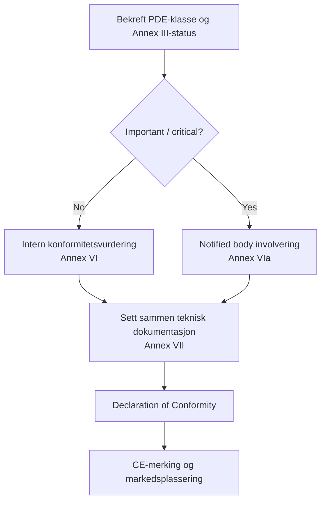

## CRA og CE‑økosystemet

CRA er en **CE‑markeringsforordning**, på linje med for eksempel RED eller EMC: du må kunne vise at produktet oppfyller sine vesentlige krav før det plasseres på markedet.[1]  

For mange innebygde PDE‑er vil dette være en **egenkonformitets‑vurdering**; for viktige/kritiske produkter må en **notified body** (teknisk kontrollorgan) involveres etter vedlegg VI/VIa.[1]

---

## Krav til evidens

Kjernen i konformitetsvurderingen er den **tekniske dokumentasjonen** og **prosess‑evidensen** som produseres av SDL‑, SBOM‑ og sårbarhetshåndterings‑løpene dine.[1]  

Eksempler:

- arkitekturdiagrammer og trusselmodeller  
- kobling mellom kontroller og krav i Annex I  
- testrapporter og sammendrag fra penetration‑testing  
- beskrivelse av provisioning‑ og oppdateringsprosesser  
- SBOM‑er og VEX eller tilsvarende formater for sårbarhetsuttalelser  
- CVD‑policy og logger for hendelser / sårbarhetshåndtering

---

## Rollen til standarder

Inntil harmoniserte standarder under CRA er publisert i Official Journal, kan du bruke **“state‑of‑the‑art”‑standarder** som er referert av Kommisjonen for å vise konformitet (artikkel 25).  

Typiske eksempler:

- **IEC 62443‑4‑1 / 4‑2** for industriell/embedded sikkerhet  
- **ETSI EN 303 645** for forbruker‑IoT  
- **NIST SSDF** for secure development lifecycle‑praksis

Ved å anvende anerkjente standarder får du en **presumption of conformity** for de tilhørende kontrollene, og dialogen med notified body blir enklere.

---

## Declaration of Conformity (DoC)

DoC er et kort dokument, signert av produsenten, som:

- identifiserer produktet og versjoner  
- lister relevant regelverk (CRA, RED, EMC, LVD, …)  
- refererer standarder og interne dokumenter brukt for å vise konformitet  
- identifiserer ansvarlig person i EU  

Hold DoC i synk med den tekniske dokumentasjonen, og oppdater den ved større firmware‑ eller funksjonsendringer, slik at forpliktelsene i artikkel 22 fortsatt er oppfylt.

---

## Sjekkliste for modenhet

Før du hevder konformitet, bør du verifisere:

- [ ] Scope og klassifisering bekreftet (PDE, important/critical). Se [Scope & Definitions](./scope-and-definitions).  
- [ ] SDL definert og fulgt for denne releasen. Se [SDL](./secure-development-lifecycle).  
- [ ] Embedded tekniske kontroller mappet til Annex I‑krav. Se [Embedded Technical Controls](./embedded-technical-controls).  
- [ ] Teknisk dokumentasjon og SBOM‑pakke komplett. Se [Docs & SBOM](./documentation-and-sbom).  
- [ ] Prosess for sårbarhetshåndtering operativ; supportperiode definert. Se [Vulnerability Handling](./vulnerability-handling).  

Denne sjekklisten henger direkte sammen med **Developer Checklist** som brukes av ingeniørteamene (se [Developer Checklist](./developer-checklist)).

[1]: https://eur-lex.europa.eu/legal-content/EN/TXT/?uri=CELEX:32024R2847 "Regulation (EU) 2024/2847 — Articles 16–25 and Annexes VI/VII"
