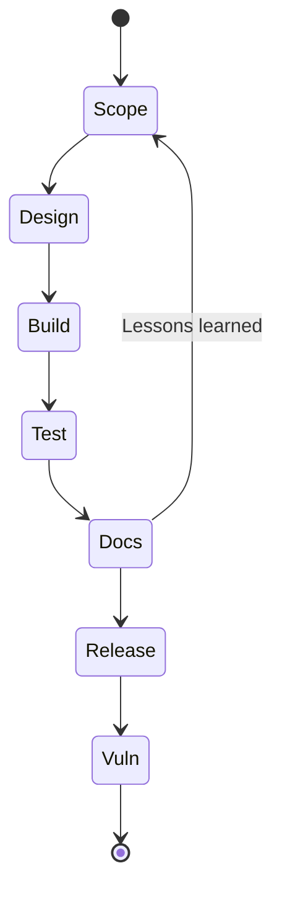

## Hvordan bruke denne sjekklisten

Dette er en **levende sjekkliste** som bør ligge i repoet ditt (f.eks. `doc/cra-checklist.md`). Den kobler daglige utviklingsoppgaver til evidens for CRA Annex I, slik at hver release kan demonstrere konformitet uten panikk på slutten.[1]  

**Tommelregel:** en boks er bare “ferdig” hvis den peker på **evidens**:
- ticket/issue‑ID(er)  
- MR/PR‑lenke(r)  
- build‑artefakter / logger  
- testrapporter  
- SBOM + VEX (eller tilsvarende)  
- oppdaterte dokumenter / risikovurdering / trusselmodell

Huk av per release; koble til saker, MR/PR‑ID‑er og dokumenter.

---

## Prosjekt‑oppsett

- [ ] Produktet er klassifisert som omfattet av CRA (PDE‑klasse, important/critical). Se [Scope & Definitions](./scope-and-definitions).  
    + Evidens: klassifiseringsnotat + beslutningslogg (ADR), liste over produktvarianter.  
- [ ] Sikkerhetsmål er definert for produktet (hva som skal beskyttes og hva som er “akseptabel risiko”).  
    - Evidens: dokument med sikkerhetskrav koblet til saker/ADR‑er.  
- [ ] Trusselmodell er opprettet eller oppdatert for denne releasen (aktiva, trust boundaries, angripermodell, viktige misbrukstilfeller).  
    - Evidens: trusselmodeller + endringslogg.  
- [ ] Komponentoversikt etablert (biblioteker, RTOS, bootloader, crypto, nettverksstack, build‑verktøy).  
    - Evidens: avhengighetsliste og eierskap (hvem som vedlikeholder/godkjenner oppdateringer).  

---

## Design og implementering

- [ ] Arkitektur er gjennomgått opp mot [Embedded Technical Controls](./embedded-technical-controls) (identitet, secure boot, kommunikasjon, oppdateringer).  
    - Evidens: arkitekturdiagram(mer) + notater som viser mapping av kontroller.  
- [ ] Debug‑, fabrikk‑ og vedlikeholdsgrensesnitt er beskyttet eller låst i produksjon (porter, test‑hooks, boot‑moduser). Se [Embedded Technical Controls](./embedded-technical-controls).  
    - Evidens: produksjonsprosedyre + konfigurasjon/option‑bytes + testresultater.  
- [ ] Hemmeligheter og nøkler håndteres sikkert (ingen secrets i kildekode, kryptert i rest der det er relevant, definert provisioning).  
    - Evidens: design for nøkkel/provisioning + revisjonssjekker.  
- [ ] Sikker standardkonfigurasjon implementert (ingen “admin/admin”, minimal tjenestemengde, least privilege).  
    - Evidens: dokumentert standardkonfigurasjon + tester som verifiserer defaults.  
- [ ] Defensive coding‑regler og code review‑krav fulgt (inputvalidering, trygg parsing, feilhåndtering, konsistent logging).  
    - Evidens: kodestandard + review‑sjekkliste + MR‑lenker.  
- [ ] Statisk analyse kjørt; funn triagert og fulgt opp til lukking eller begrunnet aksept. Se [SDL](./secure-development-lifecycle.md).  
    - Evidens: verktøyrapporter + lenker til saker.  

---

## Build‑ og release‑integritet (det vi shipper er kontrollert)

- [ ] Release‑build er tilstrekkelig reproducerbar for sporbarhet (versjon, commit/tag, konfigurasjon, toolchain fanget opp).  
    - Evidens: build‑metadatafil (commit‑hash + build‑opsjoner).  
- [ ] Release‑artefakter signert; signeringslogger lagret og tilgangsstyrt. Se [SDL](./secure-development-lifecycle).  
    - Evidens: signeringslogger, referanse til nøkkel‑ID, pipeline‑kjøring.  
- [ ] Identitet for hardware/firmware (versjonering, anti‑rollback hvis brukt) er definert og håndhevet.  
    - Evidens: versjonspolicy + tester.  

---

## Sikkerhetstesting (bevis)

- [ ] Unit‑ og integrasjonstester kjørt, inkludert negative sikkerhetstester (feil input, ugyldig auth, korrupte pakker).  
    - Evidens: lenker til CI‑testrapporter.  
- [ ] Statisk analyse + fuzzing for parsere/protokoller gjennomført (se [SDL](./secure-development-lifecycle)).  
- [ ] Ingen kjente utnyttbare sårbarheter åpne ved release (eventuelle unntak dokumenteres med VEX).  

---

## Build, SBOM og dokumentasjon

- [ ] Release‑build signert; signeringslogger lagret (se [SDL](./secure-development-lifecycle)).  
- [ ] SBOM generert og lagret sammen med artefakter; VEX oppdatert.  
- [ ] Pakke med teknisk dokumentasjon oppdatert (risikovurdering, design, tester, oppdateringsprosess).  

---

## Sårbarhetshåndtering og oppdateringer

- [ ] CVD‑kontakt og ‑policy publisert og referert i dokumentasjon (se [Vulnerability Handling](./vulnerability-handling)).  
- [ ] For hver fikset sårbarhet: advisory, release‑notater og VEX‑oppføring forberedt.  
- [ ] Mekanisme for sikkerhetsoppdateringer testet ende‑til‑ende (rollback, feilsituasjoner).  

Hold sjekklisten kort nok til at utviklere faktisk bruker den, men detaljert nok til å tilfredsstille **konformitetsvurdering** og forventningene i artikkel 24 om koordinering i leverandørkjeden.[1]

[1]: https://eur-lex.europa.eu/legal-content/EN/TXT/?uri=CELEX:32024R2847 "Regulation (EU) 2024/2847 — Annex I and Article 24"

## Implementering & tester

- [ ] Kodestandarder håndhevet; reviews arkivert
- [ ] Statisk analyse, fuzzing og enhetstester som porter i CI
- [ ] Avhengigheter vurdert; SBOM generert

## Release & oppdatering

- [ ] Artefakter signert; manifest og provenance dokumentert
- [ ] Oppdateringsløp testet (normal, avbrudd, gjenoppretting)
- [ ] Telemetri og logging bekreftet

## PSIRT & rapportering

- [ ] CVD policy publisert og lenket
- [ ] VEX oppdatert for relevante CVE-er
- [ ] Rapporteringsansvar definert; prosedyrer øvd

## Dokumentasjon

- [ ] Bruker-/admin-guider oppdatert
- [ ] Tekniske dossier-artefakter arkivert og sporbare
