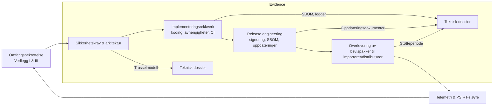

## Hvorfor utviklere har eksplisitte juridiske plikter

CRA tildeler cybersikkerhetsforpliktelser direkte til produsenter, importører, distributører og **leverandører**, men det meste av bevismaterialet lever i ingeniørenes backlogger.[1] Denne siden oversetter essensielle krav i vedlegg I og artiklene 16–24 til konkrete ansvar for utviklingsteam, slik at firmware-, plattform- og DevOps-ledere kan vise revisorer at kontrollene er eid, målt og gjennomgått.

## Produktdekningsmatrise

| CRA-klausul | Aktivitet eid av utviklere | Eksempelartefakter |
| --- | --- | --- |
| Vedlegg I(1)(a–d) | Trusselmodellering, sikkerhetskrav, design-godkjenning | Systemkontekstdiagram, STRIDE-notater, dokumenterte tiltak |
| Vedlegg I(1)(e–g) | Sikker standardkonfigurasjon, herding av grensesnitt, kryptoprofiler | Matrise for sikker konfigurasjon, API-autentiseringsspesifikasjon, kryptostykklist |
| Vedlegg I(1)(h–j) | Loggestrategi, mekanismer for håndtering av sårbarheter | Hendelsestaksonomi, design for eksport av logg, automatisering for PSIRT-inntak |
| Vedlegg I(2)(a–f) | Oppdateringsmekanisme, SBOM/VEX-automatisering, støtteverktøy | Oppdateringsrørledningsdiagrammer, SBOM CI-jobbdefinisjon, erklæring om støtteperiode |
| Artikler 21–24 | Koordinering med leverandør og importør | Tidsplan for firmwareleveranser, evidenspakke for ODM/OEM, RACI-tabeller |

Bruk matrisen når du skriver RACI-diagrammer eller utarbeider arbeidsbeskrivelser med underleverandører, slik at hver CRA-klausul har en navngitt eier i ingeniørmiljøet.

## Sjekkpunkter for sikker design og spesifikasjon

1. **Omfangsbekreftelse.** Bekreft PDE-klassifisering, status etter vedlegg III og tiltenkt driftsmiljø (industri, forbruker, sikkerhet). Registrer beslutnings-ID med referanse til [Omfang og definisjoner](./scope-and-definitions) og legg ved henvisningen til riktig CRA-artikkel.
2. **Baseline for sikkerhetskrav.** Konverter utdata fra trusselmodeller til krav tagget med vedlegg I-klausuler. Eksempel på krav-IDer: `CRA-I1e-secure-boot`, `CRA-I2b-auto-update-fallback`. Vedlikehold dem i samme repo som funksjonelle spesifikasjoner.
3. **Arkitekturgjennomgang.** Planlegg tverrfaglige gjennomganger for identitet, secure boot, kommunikasjonssikkerhet, diagnostikk og oppdateringsløp. Registrer tiltak med eiere og frister, slik at du kan bevise rettidig lukking under samsvarsvurderingen.

## Rekkverk for implementering

- **Kodestandarder og reviews.** Håndhev MISRA-C, CERT C eller Rust-regler for unsafe-kode via linters og obligatoriske sjekklister for reviewer. Lagre verktøykonfigurasjoner i repoet og arkiver gjennomgangslogger, ettersom vedlegg I krever bevis for prosess.
- **Styring av avhengigheter.** Vedlikehold hvite-/svartelister, automatiser lisensskanning, og håndhev minimum støttede versjoner for kryptostakker, protokollbibliotek og verktøykjeder. Knytt SBOM-generering til avhengighetsmanifestet som utviklere vedlikeholder.
- **Herding i CI.** Behandle statisk analyse, fuzzing-harness og enhetstester som blokkerende porter. Hold reproducerbare byggeskript i kildekontroll slik at enhver revisor kan bygge binæren som brukes i testing.

## Forpliktelser i release engineering

- **Signering og proveniens.** Utviklere må levere signerte artefakter, signeringslogger og manifestmetadata (hash, byggnummer, SBOM-referanse) til samsvarsteamet. Bruk Sigstore, Uptane, TUF eller lignende rammeverk for å standardisere metadata.
- **Generell oppdateringsprøve.** Før levering, kjør hardware-in-the-loop oppdateringsøvelser som dekker normal installasjon, rollback-prevensjon, avbrutt strøm og gjenoppretting. Ta skjermbilder fra konsoll og telemetri som vedlegg I(2)-evidens.
- **Artefakter for støtteperiode.** Legg den erklærte støtteperioden inn i enhetens metadata (f.eks. administrasjons-API, CLI `show info`, mobilapp) slik at distributører kan verifisere etterlevelse.

## Samarbeid med importører, distributører og OEM-er

Artiklene 21–24 forventer sømløs overlevering av sikkerhetsmateriale i hele forsyningskjeden. Utviklere bør:

- publisere en **CRA-evidenspakke** per release med SBOM, VEX, SDL-sammendrag og testrapporter,
- gi sikker oppdateringsdokumentasjon til OEM-partnere, inkludert staging-instruksjoner og gjenoppretting ved rollback,
- dele sårbarhetsvarsler under vilkår for koordinert offentliggjøring, slik at nedstrømsaktører kan oppdatere innenfor SLA,
- automatisere varsler når kryptografisk materiale eller oppdateringsendepunkter endres, slik at distributører kan revalidere CE-samsvar.

## Referansesjekkliste

Kombiner denne siden med [Utviklersjekklisten](./developer-checklist) for sporing per release, og lenk til [Grunnleggende sikkerhetskrav](./fundamental-security-requirements) for dypere kontroller. Hvert element bør sitere relevant CRA-klausul, standard, eller lokasjon for bevis i det tekniske dossieret.

[1]: https://eur-lex.europa.eu/legal-content/EN/TXT/?uri=CELEX:32024R2847 "Forordning (EU) 2024/2847 — Artikler 16–24 og vedlegg I"
