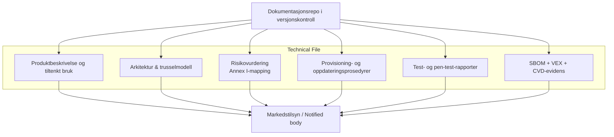

## Teknisk dokumentasjon under CRA

Annex VII beskriver hva som må inngå i den **tekniske dokumentasjonen** (technical file) for konformitetsvurdering, og stemmer overens med evidensen som etterspørres i artiklene 16–23.[1] For et innebygd produkt betyr dette typisk:  

- produktbeskrivelse og tiltenkt bruk  
- system‑ og arkitekturdiagrammer (inkludert trust boundaries)  
- beskrivelse av sikkerhetsfunksjoner og forutsetninger  
- risikovurdering og mapping til kravene i Annex I  
- beskrivelse av produksjons‑, provisioning‑ og oppdateringsprosesser  
- testrapporter (sikkerhet, funksjon, ytelse)  
- SBOM og evidens for sårbarhetshåndtering (CVD‑policy, VEX)  

Lagres dette i versjonskontroll eller et eget dokumentasjonsrepo, kan det utvikles i takt med produktet og er klart når markedstilsynsmyndigheter ber om innsyn etter artikkel 41.[1]

---

## Brukerrettet sikkerhetsinformasjon (Annex II)

CRA krever også spesifikk **brukerinformasjon** (Annex II) slik at kunder kan bruke PDE‑en sikkert.[2] Gi blant annet:

- hvordan sikkerhetsoppdateringer leveres og installeres (automatisk vs. manuelt)  
- hvilken **supportperiode** som gjelder for sikkerhetsoppdateringer  
- eventuelle **vesentlige gjenværende risikoer** som ikke kan elimineres helt  
- veiledning for sikker konfigurasjon og drift  

For innebygde enheter ligger dette typisk i:

- produktdatablader eller security‑whitepapers  
- administrator‑manualer / hjelpetekster i web‑UI  
- firmware‑release‑notater  

---

## Forventninger til SBOM

En SBOM er ikke lenger “kjekt å ha”; det er slik du viser at du håndterer kjente sårbarheter og tilfredsstiller Annex I(2)(c–f).[1]  

Anbefalt praksis for firmware‑prosjekter:

- bruk **SPDX** eller **CycloneDX** som utvekslingsformat  
- produser SBOM **per build og per hardware/SoC‑variant**  
- inkluder:  
  - bootloader (f.eks. MCUboot)  
  - RTOS og kernel  
  - middleware, protokollstakker og kryptobiblioteker  
  - applikasjoner  
  - toolchain og sentrale build‑verktøy  
- lagre SBOM‑er sammen med build‑artefakter i CI  

Knytt **VEX‑dokumenter** til SBOM‑ene for å kommunisere om kjente CVE‑er er utnyttbare eller ikke (for eksempel hvis et sårbart kode‑path ikke brukes på enheten), og referer til disse i kundeadvarsler som krevd i artiklene 55–57.[1]

---

## Minimal pakke med sikkerhetsdokumentasjon

En praktisk minimal struktur kan være:

1. `01-product-and-arch/` – diagrammer, trusselmodell, liste over sikkerhetsfunksjoner  
2. `02-sdl-and-testing/` – beskrivelse av SDL, testplaner og resultater  
3. `03-sbom-and-vuln-handling/` – SBOM‑er, VEX, CVD‑policy, hendelseslogger  
4. `04-updates-and-provisioning/` – secure‑boot‑konfig, nøkkelprovisioning, oppdateringsflyt  
5. `05-user-facing-info/` – manualer, release‑notater med sikkerhetsrelevante endringer  

Denne strukturen passer godt mot det **konformitetsvurderingen** trenger, og speiler overskriftene i Annex VII, slik at vurderinger fra notified body blir mer rett fram.[1]

[1]: https://eur-lex.europa.eu/legal-content/EN/TXT/?uri=CELEX:32024R2847 "Regulation (EU) 2024/2847 — Annexes I, II, VII and Articles 16–57"
[2]: https://digital-strategy.ec.europa.eu/en/library/cyber-resilience-act-summary "CRA summary — European Commission"
