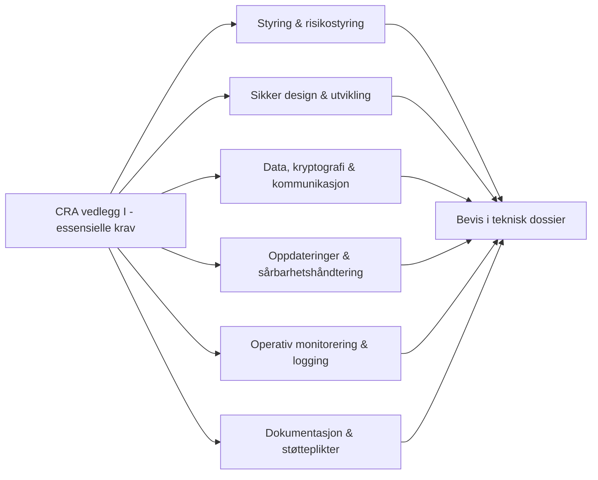
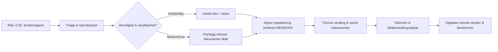

## Hvordan gjør vi det?

Når du stripper Cyber Resilience Act ned til det tekniske kjernet, er den i hovedsak en liste over sikkerhetsegenskaper som hvert produkt med digitale elementer må levere. Vedlegg I beskriver dem med juridisk språk; denne delen oversetter dem til konkrete ingeniørmål for innebygde systemer.

Vi grupperer CRA-kravene rundt den klassiske konfidensialitet–integritet–tilgjengelighet (CIA) triaden pluss to tverrgående temaer: beskyttelse mot kjente sårbarheter og robusthet gjennom hele livssyklusen (sikker konfigurasjon, logging/monitorering og oppdateringer). Ideen er enkel: hvis design og implementering overbevisende kan levere disse egenskapene for enheten, firmwaren og fjernprosesseringen av data, er du svært nær å tilfredsstille vedlegg I.

Resten av kapitlet gjør hver av disse abstrakte egenskapene til noe du faktisk kan bygge: hva det betyr for et MCU/RTOS-basert produkt, hvilke mekanismer som typisk implementerer det (TrustZone, secure boot, MPU, TLS, SBOM osv.), og hvilke CRA-klausuler det kartlegges tilbake til.

## Oversikt vedlegg I (sikkerhetsblikk)

| Klausul i vedlegg I | Operativ oversettelse | Primære bevis |
| --- | --- | --- |
| I.1(a–d) | Risikobasert design, dokumenterte trusselmodeller og proporsjonale mottiltak | Trusselmodell, aktivaliste, SDL-artefakter |
| I.1(e–g) | Sikkert som standard, reduksjon av angrepsflate og beskyttelse av data | Matrise for sikker konfigurasjon, spesifikasjon for grensesnitt-herding |
| I.1(h–j) | Håndtering av sårbarheter, logging og policy for koordinert avsløring | PSIRT-prosedyre, plan for logging og telemetri |
| I.2(a–f) | Sikker oppdatering, kontinuitet i sikkerhetsstøtte, tilgjengelige SBOM og dokumentasjon | Arkitektur for oppdatering, SBOM-eksport, støttepolicy |

## Styring og risikostyring

Start med et cybersikkerhetsstyringssystem som beskriver PDEs oppdragsprofil, aktivainventar, trusselantakelser og risikovilje. Poengsett hver risiko, spor tiltak som leveranser, og kjør registeret gjennom samme sprint- eller release-kadens som produktbackloggen, slik at vedlegg I(1)(a)-bevis alltid er ferske. Tildel en navngitt eier for hver kontroll (engineering, QA, produkt, support) og definer eskaleringsveier når telemetri eller hendelser viser økt eksponering. Arkiver utdata—kontekstdokumenter, risikovarmekart, tiltaksbeslutninger—i CRA teknisk dossier og referer dem under samsvarsvurderinger.

## Sikker arkitektur og designkontroller

Arkitekturdokumentasjon må vise hvordan konfidensialitet, integritet, tilgjengelighet, autentisering, autorisasjon og sikre standarder former PDE. Produser lagdelte diagrammer som eksponerer tillitsgrenser, sammenkoblinger og avhengighetskjeder fra silisium til sky. Fremhev hvor rot-av-tillit-elementer finnes, hvordan nøkler lagres, hvilke delsystemer som håndhever tilgangskontroll, og hva som skjer når komponenter svikter. For hver tredjepartsmodul eller rammeverk, beskriv sikkerhetsbakgrunn, oppdateringskadens og LTS-garantier. Fang eksplisitt opp gjenopprettingsatferd (fail-secure-modus, watchdogs, grasiøs degradering) slik at revisorer kan spore kontrolldekning til vedlegg I-klausuler uten gjetning.

## Utviklingsmiljø og byggerens integritet

Byggesystemet er selv en del av angrepsflaten. Lås ned CI/CD-infrastrukturen med MFA, rollebaserte tilganger og herdede løpere; isoler signeringsnøkler i HSM-er eller sikre enklaver; og håndhev reproducerbare bygg slik at manipulasjon kan oppdages. Registrer de automatiske sjekkene hver release må passere—statisk analyse, avhengighetsskanning, fuzzing, integrasjonstester—og krev manuelle sikkerhetsgjennomganger før artefakter signeres. Hold sterk separasjon mellom utvikling, staging og produksjon, og logg hver privilegert handling i manipulasjonssikre spor. Pin verktøykjeder og biblioteker til vurderte versjoner og dokumenter verifiseringssteg, slik at vedlegg I-bevis demonstrerer at sårbarheter ikke introduseres av pipeline.

## Beskyttende tekniske tiltak på enheten

Bygg inn sikkerhet ved oppstart, under runtime og på hver eksponerte grensesnitt.

1. **Boot-integritet.** Kjed tillit fra uforanderlig ROM gjennom hver oppstartsfase, håndhev signaturverifisering, forhindre rollback og dokumenter gjenopprettingsprosedyrer for feilsituasjoner. Forankre nøkler i sikker lagring (eFuser, PUF, enklaver) og registrer provisjoneringen.
2. **Runtime-beskyttelser.** Aktiver MPU/MMU-segmentering, execute-in-place-beskyttelse, stack-canaries, watchdog-timere, sikker klokke og minst privilegerte task-modus. Kombiner med kodestandarder (MISRA, CERT C, Rust-sikkerhet) for å redusere utnyttbarhet.
3. **Grensesnittdisiplin.** Lås debug-porter, deaktiver ubrukte periferi, autentiser og autoriser alle handlinger i administrasjonsplanet, valider konfigurasjonsinput og signer fjernkonfigurasjon.

CRA er teknologinøytral, men revisorer forventer å se disse konkrete forsvarene eller velbegrunnede ekvivalenter, knyttet tilbake til kravene.

## Data, kryptografi og sikker kommunikasjon

Katalogiser hver datatype PDE produserer eller prosesserer, klassifiser den, og dokumenter hvordan konfidensialitet, integritet og tilgjengelighet bevares fra produksjon til avhending. Referer kryptografiske profiler—ETSI EN 303 645, IEC 62443, NIST-kurver—og forklar hvorfor valgte algoritmer og nøkkellengder møter CRA-forventningene. Vedlikehold en nøkkelstyringsplan som dekker generering, lagring, rotasjon, tilbakekalling og respons ved kompromiss, med tillitsankre i sikre elementer eller tilsvarende. For kommunikasjon, håndhev TLS/DTLS med vurderte cipher suites, krev gjensidig autentisering der mulig, valider sertifikater (CRL/OCSP/pinning), og beskytt mot nedgradering eller replay-angrep. Knytt kontrollene tilbake til datainventaret slik at revisorer ser full dekning.

## Logging, monitorering og manipuleringsevidens

Vedlegg I(1)(i) krever at PDE-er fanger meningsfull sikkerhetstelemetri og eksponerer den trygt. Definer hendelsestaksonomi (boot-avgjørelser, autentiseringsforsøk, konfig-endringer, oppdateringsstatus, integritetsalarmer) og den manipulasjonssikre lagrings- eller eksportmekanismen. Selv begrensede enheter trenger oppbevaringsregler—rullerende buffere med kryptografisk forsegling, sikker eksport til samlere, eller autentiserte pull-grensesnitt. Legg til deteksjonslogikk som ratebegrensning, anomaliskåring eller maskinvare-sensorer og beskriv hvordan varsler mates inn i SOC- eller supportarbeidsflyter. Fysisk manipuleringsevidens (brytere, livssyklustellere, sikre tilstandsautomater) bør utløse samme rapporteringspipeline så operasjonelle team kan reagere likt.

## Sikker oppdatering og livssyklus for sårbarhetshåndtering

Vedlegg I(2) fokuserer på å holde PDE-er sikre etter release. Oppdateringssystemet må autentisere payloads, verifisere integritet, forhindre rollback og gi tydelig statusfeedback til operatører. Automatiser distribusjon med trinnvis utrulling, failsafe installasjonslogikk og kryptografiske metadata som beskriver proveniens, komponentversjoner og avhengigheter. Like viktig er arbeidsflyten for sårbarhetshåndtering: koordiner inntakskanaler, triage, CVE-tildeling, utbedring og varsler i en dokumentert PSIRT-prosess i tråd med ISO/IEC 29147 og 30111.

Sikkerhetskopier diagrammet med konkrete tjenestenivåmål (f.eks. kritiske sårbarheter rettet innen 14 dager), varslingsmaler og integrasjon med ENISA-rapportering hvis hendelser møter CRA-terskler. Vedlikehold VEX-erklæringer for høyprofilerte CVE-er selv når PDE-en ikke er berørt for å bevise aktsomhet.

## Støtteperiode, dokumentasjon og SBOM-forpliktelser

Produsenter må erklære minimum støtteperiode, gjenta den i kundemateriale, og varsle distributører i god tid før støtte slutt. Generer maskinlesbare SBOM-er (SPDX, CycloneDX) for hver release og arkiver eldre versjoner slik at myndigheter kan be om dem på kort varsel. Publiser deployerings- og herdingsguider som speiler den sikre standardposisjonen beskrevet tidligere, og sørg for at samsvarserklæringen, risikoanalyser, testlogger og PSIRT-bevis forblir synkronisert med produktendringer.

## Evidensmatrise for samsvarsvurdering

| Kravområde | Obligatoriske bevis | Foreslått lagringsplass |
| --- | --- | --- |
| Styring & risiko | Risikoregister, tiltaksplan, kontroller-eiere | CRA teknisk dossier (GRC-arbeidsflate) |
| Design & arkitektur | Trusselmodeller, DFD-er, secure boot-diagrammer | Systemdesignrepo / eksport fra modellverktøy |
| Utviklingspipeline | SDL-prosedyre, attestasjon av verktøykjede, testrapporter | DevSecOps-portal, CI-logger |
| Enhetsbeskyttelser | Konfigurasjonsmatrise, penetrasjonstest-rapporter | Produktsikkerhet SharePoint eller dokrepo |
| Data & kryptografi | Nøkkelstyringsplan, kryptopolicy, sertifikatinventar | PKI-styringssystem |
| Logging & monitorering | Hendelsestaksonomi, spesifikasjon for loggbeskyttelse, SLA for monitorering | Observabilitetsplattform-runbooks |
| Oppdateringer & PSIRT | PSIRT-charter, SLAer, utrullingslogger, VEX | Sikkerhetsrespons-tracker |
| Dokumentasjon & SBOM | Bruker-/admin-manualer, SBOM-er, samsvarserklæring | Dokportal, artefaktlager |

Hold matrisen oppdatert for hver release slik at samsvarsvurderende organ (eller intern QA) raskt finner artefakter.

## Referanser

\[1]: "CRA Regulation (EU) 2024/2847 (Annex I and Articles 16-24)" https://eur-lex.europa.eu/legal-content/EN/TXT/?uri=CELEX:32024R2847 
