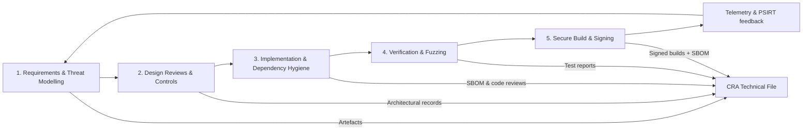

## Hvorfor en SDL er nødvendig

CRA vurderer ikke bare det ferdige binæret; forordningen krever at produktet **“designes, utvikles og produseres”** med cybersikkerhet i fokus (Annex I(1)(a–d)).[1] Det innebærer en repeterbar **secure development lifecycle** som revisorer kan inspisere.  

I Apollo tilpasses SDL‑en til **NIST SSDF** og **IEC 62443‑4‑1**, som begge er anerkjent i EU‑veiledning som egnede rammeverk for å vise dekning av Annex I‑krav.[2][3] Referer direkte til disse dokumentene når du beskriver SDL‑en i den tekniske dokumentasjonen.

---

## 1. Sikkerhetskrav og trusselmodellering

Ved prosjektstart:

- identifiser **aktiva**, **inngangspunkter** og **trusselaktører** for enheten og systemet  
- utled en kort liste med **sikkerhetskrav** mappet til CRA Annex I‑kontroller (se “Fundamental Security Requirements”)  

Bruk en lettvekts STRIDE‑modell for innebygde systemer: Spoofing, Tampering, Repudiation, Information disclosure, Denial of service, Elevation of privilege.

---

## 2. Designreviews og tekniske kontroller

Under arkitektur og design:

- bestem hvordan identitet, secure boot, kommunikasjonssikkerhet og oppdateringsløp skal implementeres (se “Embedded Technical Controls”)  
- dokumenter designvalg og valgte standarder (ETSI EN 303 645, IEC 62443‑4‑2 osv.) som evidens for konformitet (se [References](./references))  

---

## 3. Implementeringskvalitet og avhengighetshygiene

Under koding:

- følg kodestandarder (MISRA‑C, CERT C) og kjør statisk analyse  
- vurder alle **tredjepartsavhengigheter**; aksepter kun komponenter med aktivt vedlikehold og lisenskompatibilitet  
- hold en SBOM i repoet og oppdater den når avhengigheter endres  

---

## 4. Verifikasjon: statisk, dynamisk og fuzz‑testing

Før hver release:

- kjør **statisk analyse** på kritiske moduler (parsere, protokollhåndtering, bruk av crypto)  
- implementer **unit‑ og integrasjonstester** som øver sikkerhetsfunksjoner (access control, secure‑boot‑feiltilstander)  
- legg til **fuzzing** for parsere og protokoll‑state machines; for embedded brukes ofte host‑baserte harnesser kombinert med HW‑in‑the‑loop i nattlige jobber  

Registrer resultater, avvik og fiks slik at de kan kobles til CRA‑evidens og forpliktelsene i Annex I(1)(h) om sårbarhetshåndtering og testing.[1]

---

## 5. Sikker build, signering og release

For hver build som skal utgis:

- bruk reproducerbare builds der det er mulig (fikserte toolchain‑versjoner, deterministiske flagg)  
- signer firmware‑bilder med nøkler beskyttet offline; lagre signeringslogger  
- generer en pakke med **SBOM + VEX** og knytt den til release‑artefaktene  

Disse artefaktene går direkte inn i **teknisk dokumentasjon** og **utviklersjekklisten**, og støtter Annex I(2)(a–c) om readiness for oppdateringer.[1]

[1]: https://eur-lex.europa.eu/legal-content/EN/TXT/?uri=CELEX:32024R2847 "Regulation (EU) 2024/2847 — Annex I"
[2]: https://csrc.nist.gov/pubs/sp/800/218/final "NIST SP 800-218 (SSDF)"
[3]: https://webstore.iec.ch/publication/33615 "IEC 62443-4-1 SDL requirements"
