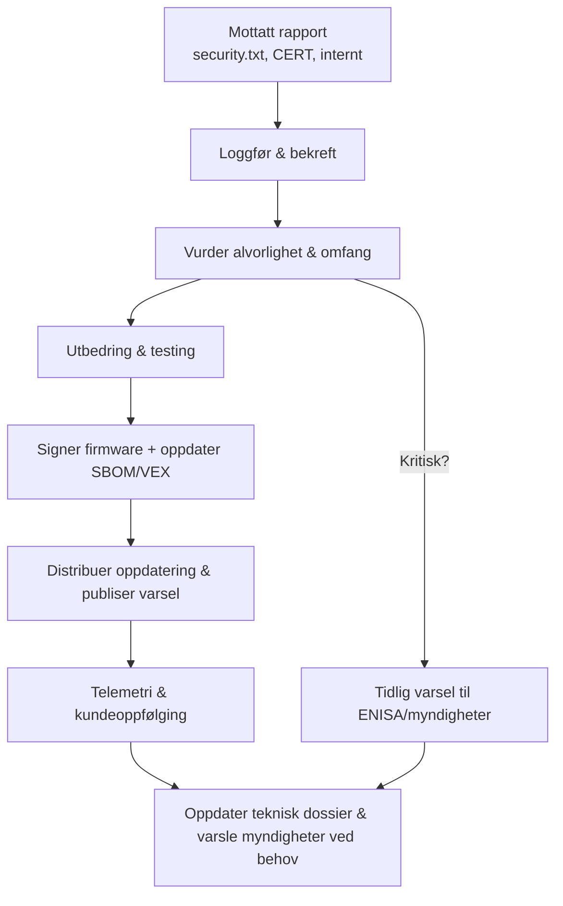

## Hvorfor håndtering av sårbarheter er en førstegangs CRA-plikt

Vedlegg I, del II og artiklene 53–57 legger eksplisitte plikter til for:

- mottak av sårbarhetsrapporter,  
- triagering og utbedring,  
- levering av sikkerhetsoppdateringer, og  
- rapportering av visse hendelser til myndigheter.   

Dette er ikke valgfritt; det er en del av produktets livssyklus.

---

## Policy for koordinert sårbarhetsavsløring (CVD)

Følg ISO/IEC 29147 og 30111:   

- Publiser en **security.txt** eller sikkerhetsside med:  
  - kontaktadresse,  
  - krypteringsnøkkel,  
  - forventede responstider,  
  - testomfang og juridisk "safe harbour"-erklæring.  
- Internt definer:  
  - hvem som mottar rapporter,  
  - hvordan de logges (ticketsystem),  
  - hvordan første bekreftelse og statusoppdateringer håndteres.

Denne policyen bør refereres i din tekniske dokumentasjonspakke og lenkes fra brukerinformasjon slik vedlegg II krever.

---

## Inntak, triage og utbedring

En enkel arbeidsflyt for innebygde systemer:

1. **Inntak**  
   - logg hver rapport med rapportørdetaljer, berørte versjoner og PoC hvis tilgjengelig;  
   - vurder raskt alvorlighetsgrad (CVSS, utnyttbarhet).  

2. **Triage**  
   - reproducer problemet på representativ maskinvare,  
   - identifiser alle berørte produktvarianter ved hjelp av **SBOM** og konfigurasjonsdata.   

3. **Utbedring**  
   - rett årsaken; legg til tester for å unngå regresjoner;  
   - forbered oppdatert firmware med signerte bilder og oppdatert SBOM/VEX;  
   - dokumenter endringen i versjonsnotater og sikkerhetsvarsel.

4. **Distribusjon og oppfølging**  
   - rull ut oppdateringer via din sikre oppdateringspipeline;  
   - overvåk for krasj/telemetri som kan indikere ufullstendige rettelser.

---

## Rapporteringsplikter

For visse hendelser, spesielt de med betydelig innvirkning på sikkerhet eller sikkerhet (safety), krever CRA **tidlig varsling og hendelsesrapportering** til kompetente myndigheter (via ENISAs plattformer).[1]   

Sørg for:

- at du kan **oppdage** slike hendelser (logging/monitorering),  
- at du vet hvem i organisasjonen som er ansvarlig for å sende rapporter,  
- og at din tekniske dokumentasjon har nok detaljer til å forklare påvirkning og tiltak.

---

## Bruk av VEX for å kommunisere utnyttbarhet

Når en CVE dukker opp i en av dine avhengigheter:

- Bruk VEX-dokumenter for å oppgi om sårbarheten er:  
  - berørt / ikke berørt / under undersøkelse / rettet.  
- Lenke VEX-oppføringer til SBOM-komponenter og produktversjoner.   

Dette viser regulatorer og kunder at du systematisk håndterer kjente sårbarheter, slik vedlegg I(2) og artiklene 55–57 krever.[1]

[1]: https://eur-lex.europa.eu/legal-content/EN/TXT/?uri=CELEX:32024R2847 "Forordning (EU) 2024/2847 — Vedlegg I del II og artiklene 53–57"
