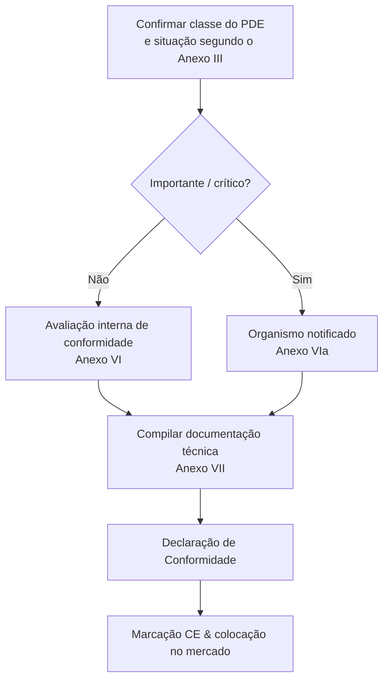

## CRA e ecossistema CE

O CRA é um **regulamento de marcação CE**, semelhante à RED ou à diretiva EMC: é necessário demonstrar que o produto cumpre os requisitos essenciais antes de ser colocado no mercado.[1]  

Para muitos PDEs embarcados, isso será feito por meio de **autoavaliação**; para produtos importantes/críticos, um **organismo notificado** deve ser envolvido segundo os Anexos VI/VIa.[1]

---

## Evidências necessárias

O centro da avaliação de conformidade é a **documentação técnica** e as **evidências de processo** produzidas pelo seu SDL, SBOM e fluxo de gestão de vulnerabilidades.[1]  

Exemplos:

- diagramas de arquitetura e modelos de ameaças,  
- mapeamento dos controles para os requisitos do Anexo I,  
- relatórios de testes e resumos de testes de penetração,  
- descrição de processos de provisionamento e atualização,  
- SBOM mais VEX ou formatos equivalentes de declaração de vulnerabilidade,  
- política de divulgação coordenada (CVD) e registros de incidentes/gestão de vulnerabilidades.  

---

## Papel das normas

Enquanto as normas harmonizadas CRA não forem citadas no Jornal Oficial, podem‑se usar normas **“state of the art”** referenciadas pela Comissão para demonstrar conformidade (art. 25).[1]  

Exemplos típicos:

- **IEC 62443‑4‑1 / 4‑2** para segurança industrial/embarcada,  
- **ETSI EN 303 645** para IoT de consumo,  
- **NIST SSDF** para processos de desenvolvimento seguro.  

Aplicar normas reconhecidas fornece uma **presunção de conformidade** e facilita a avaliação por organismos notificados.

---

## Declaração de Conformidade (DoC)

A DoC é um documento breve, assinado pelo fabricante, que:

- identifica o produto e as versões,  
- lista a legislação aplicável (CRA, RED, EMC, LVD, …),  
- referencia as normas e documentos internos usados para demonstrar conformidade,  
- identifica a pessoa responsável na UE.  

Mantenha a DoC alinhada ao dossiê técnico e atualize‑a sempre que houver alterações relevantes de firmware ou funcionalidades, para cumprir as obrigações do art. 22.

---

## Lista de verificação

Antes de declarar conformidade, verifique:

- [ ] Escopo e classificação confirmados (PDE, importante/crítico). Ver [Scope & Definitions](./scope-and-definitions).  
- [ ] SDL definido e seguido para a versão atual. Ver [SDL](./secure-development-lifecycle).  
- [ ] Controles técnicos embarcados mapeados aos requisitos do Anexo I. Ver [Embedded Technical Controls](./embedded-technical-controls).  
- [ ] Documentação técnica e pacote SBOM completos. Ver [Documentation & SBOM](./documentation-and-sbom).  
- [ ] Processo de gestão de vulnerabilidades operacional; período de suporte definido. Ver [Vulnerability Handling](./vulnerability-handling).  

Esta lista está ligada diretamente à **Developer Checklist** usada pelas equipas de engenharia (ver [Developer Checklist](./developer-checklist)).

[1]: https://eur-lex.europa.eu/legal-content/EN/TXT/?uri=CELEX:32024R2847 "Regulation (EU) 2024/2847 — Articles 16–25 and Annexes VI/VII"

