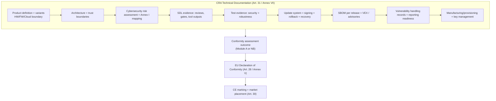

---
id: cra-conformity-assessment
slug: /security/cra/conformity-assessment
title: Conformity assessment och CE-märkning
sidebar_position: 8

last_update:
  author: 'Ayoub Bourjilat (AC6)'
  date: '2025-12-19'
---

## Varför detta är viktigt för inbyggt

CRA är en **CE-märkningsförordning**: innan du placerar ett Product with Digital Elements (PDE) på EU-marknaden måste du **visa efterlevnad** av de väsentliga cybersäkerhetskraven (Bilaga I) och hålla evidensen tillgänglig i ett **tekniskt dokumentationspaket** (Art. 31 + Bilaga VII).  
Conformity gäller inte bara den sista firmware-binära: CRA inkluderar uttryckligen **"processes put in place by the manufacturer"** (Art. 31, Art. 32). SDL, SBOM och sårbarhetshantering är **del av compliance-objektet**.

Den här sidan förklarar **(1) hur du väljer route**, **(2) hur ett CE-redo evidenspaket ser ut för inbyggt**, och **(3) hur du håller det giltigt över releaser**.

---

## 1) Välj route (normal / important / critical)

CRA-route beror på om PDE är:
- **"Normal" PDE** (inte listad som Important/Critical),
- **Important** (Bilaga III, klass I eller II),
- **Critical** (Bilaga IV).

**Förfaranden finns i Art. 32** och implementeras via **moduler i Bilaga VIII**:
- **Module A**: intern kontroll (egenbedömning)
- **Module B + C**: EU-typgranskning + överensstämmelse med typ (NB involverad)
- **Module H**: full quality assurance (NB involverad)
- **EU-cybersäkerhetscertifiering** (där tillämpligt) på **assurance-nivå minst "substantial"** (Art. 27(8)-(9), Art. 32)

### Beslutslogik (Art. 32)

```mermaid
flowchart TD
  A[Start: Product with Digital Elements] --> B{Is it listed in Annex IV?}
  B -- Yes --> C[CRITICAL PDE]
  C --> C1{EU cybersecurity certification scheme<br/>available & applicable?}
  C1 -- Yes --> C2["Use EU cybersecurity certification scheme<br/>(Art. 32(4)(a) + Art. 8(1))"]
  C1 -- No --> C3["Use one of Article 32(3) procedures<br/>(B+C or H or certification if later available)"]

  B -- No --> D{Is it listed in Annex III?}
  D -- No --> E[NORMAL PDE]
  E --> E1["Choose: Module A, or B+C, or H, or certification scheme<br/>(Art. 32(1))"]

  D -- Yes --> F{Annex III class?}
  F -- Class I --> G[IMPORTANT PDE - Class I]
  G --> G1{Did you apply harmonised standards / common specs / certification<br/>at least "substantial" for the relevant requirements?}
  G1 -- Yes --> G2["You may use Article 32(1) routes<br/>(incl. Module A) for those covered requirements"]
  G1 -- No --> G3["For uncovered requirements: must use B+C or H<br/>(Art. 32(2))"]

  F -- Class II --> H[IMPORTANT PDE - Class II]
  H --> H1["Must use: B+C or H or certification scheme (substantial+)<br/>(Art. 32(3))"]
```

### Nyckelinsikt för inbyggt

För många inbyggda team kommer "överraskningen" vid **Important Class I**:
- du kan *ibland* stanna på **Module A** _endast_ om relevanta krav täcks av **harmoniserade standarder**, **common specifications** eller **EU-cybersäkerhetscertifiering** på rätt assurance-nivå;  
- annars måste du involvera NB via **B+C** eller **H** för de delar som inte täcks (Art. 32(2)).

---

## 2) Teknisk dokumentation är ryggraden (Art. 31 + Bilaga VII)

Art. 31 säger:
- Technical documentation ska innehålla **alla relevanta data/detaljer** som visar efterlevnad för produkten **och** tillverkarprocesserna mot Bilaga I.  
- Den ska tas fram **innan** marknadsplacering och **löpande uppdateras**, minst under supportperioden.

Praktisk struktur för inbyggt som mappar väl till revisioner:



### Inbyggt "måste ha" (vad granskare frågar efter)

- **Exakt compliance-objekt**: HW-revision(er), SoC SKU:er, FW-versioner, boot chain, fjärrtjänster som påverkar säkerhet.
- **Trust boundaries**: vad som är inom säkerhetsscope (MCU, gateway, app, cloud).
- **Update/rollback**: signerade bilder, anti-rollback-strategi, recoveryläge, felloggar.
- **Nyckellivscykel**: provisioning, lagring, rotation, hantering av kompromiss.
- **Evidens per release**: SBOM, testrapporter, säkerhetsfixar, releasenotes, och vilka Bilaga I-punkter de adresserar.

---

## 3) Presumption of conformity: överdriv inte (Art. 27)

CRA ger **presumption of conformity** endast när:
- du tillämpar **harmoniserade standarder** vars referenser är publicerade i OJ, eller
- du tillämpar **common specifications** antagna av kommissionen, eller
- du har EU-cybersäkerhetscertifikat/statement under accepterat schema (Art. 27(8)-(9)).

Allt annat (IEC 62443, ETSI EN 303 645, NIST SSDF m.m.) är bra **state-of-the-art evidens**, men **inte automatisk presumption** om det inte blir harmoniserat/refererat/översatt till common specs.

Praktiskt för inbyggt:
- Använd kända standarder för att strukturera kontroller och evidens,
- Följ om/när de blir **harmoniserade** (så du kan åberopa presumption senare),
- Håll Bilaga I-mappningen som "source of truth".

---

## 4) EU Declaration of Conformity (Art. 28 / Bilaga V) + förenklad DoC (Bilaga VI)

**EU Declaration of Conformity**:
- anger att Bilaga I-krav har demonstrerats,
- måste följa **modell i Bilaga V** och hållas **uppdaterad** (Art. 28).

Tips för inbyggt:
- Behandla DoC som ett **versionerat artefakt** länkat till:
  - firmware-release-ID,
  - SBOM-ID,
  - testkampanj-ID,
  - uppdateringsendpoints (om säkerhetsrelevanta).

Om du släpper förenklad DoC ska den följa **Bilaga VI** och innehålla exakt länk till full DoC (Art. 28 + Bilaga VI).

---

## 5) CE-märkning (Art. 30): hårdvara *och* mjukvara

Art. 30 klargör CE-märkning:
- synlig/läsbar/oförstörbar på produkten, eller på förpackning + DoC när inte möjligt,
- och **för mjukvaru-PDE** kan CE-märkning finnas på DoC eller webbplatsen som följer mjukvaran.

För inbyggd firmware i en enhet:
- "produktens" CE-märkning sitter normalt på enhet/förpackning,
- men du behöver ändå mjukvaruspårbarhet i technical documentation och DoC.

Om NB är involverad via Module H ska CE-märkningen inkludera NB-ID (Art. 30(4)).

---

## 6) "Substantial modification" och vem som blir manufacturer (Art. 21-22)

CRA är strikt om **vem som bär skyldigheterna**:
- Importör/distributör blir manufacturer om de sätter sitt namn/varumärke **eller** gör en **substantial modification** (Art. 21).
- Andra som gör substantial modification och gör produkten tillgänglig blir manufacturer för den delen (eller hela produkten om påverkan är global) (Art. 22).

Exempel på inbyggt som kan bli "substantial modification":
- ändra secure boot-nycklar / trust anchors,
- stänga av säkerhetsdefaults,
- byta kryptobibliotek,
- ändra uppdateringsmekanism,
- aktivera debug i produktion,
- byta säkerhetskomponent (secure element, enclave-konfig).

**Åtgärd**: definiera internt vad ni klassar som substantial modification och ha en compliance-gate när det sker.

---

## 7) Minimal "CE-redo" checklista för en inbyggd release

- [ ] **Klassificering** klar (Normal / Bilaga III klass I/II / Bilaga IV) med motivering.
- [ ] **Route** vald enligt Art. 32 (Module A vs B+C vs H vs certifiering).
- [ ] **Bilaga I-mapping** klar och länkar till implementationsevidens.
- [ ] **Technical documentation** (Art. 31 / Bilaga VII) uppdaterad för releasen.
- [ ] **DoC** skapad/uppdaterad (Art. 28 / Bilaga V) och länkad till release-ID.
- [ ] **CE-märkning** uppfyller placeringsreglerna (Art. 30), inkl. mjukvarufall vid behov.
- [ ] **Supportperiod + användarinformation** tillgänglig (Art. 13 + Bilaga II), i linje med uppdateringsrealitet.
- [ ] **Supply chain-evidenspaket** redo för importörer/distributörer/OEM-integratörer.

---

## Vanliga problem (och lösning)

### 1) "Enheten är produkten, men säkerhet beror på cloud/app"
**Problem:** du kan inte CE-märka "bara kortet" om säkerheten bygger på externa komponenter.  
**Lösning:** dokumentera *hela säkerhetsrelevanta systemgränsen* i technical documentation: vad som ingår i PDE:s säkerhetsmiljö och vilka antaganden som gäller.

### 2) "Vi vet inte om vi är Bilaga III eller IV"
**Problem:** fel klassning ger fel route.  
**Lösning:** håll en skriftlig cross-check mot Bilaga III/IV och koppla till produktens funktion/marknadsföring.

### 3) "Vi använder IEC/ETSI/NIST – kan vi hävda presumption?"
**Problem:** blandar ihop "bra evidens" med "juridisk presumption".  
**Lösning:** åberopa presumption bara när Art. 27 är uppfyllt (harmoniserat / common specs / accepterad cert). Annars: ange "state-of-the-art alignment" + Bilaga I-mapping.

### 4) "Firmware-uppdateringar ändrar beteende – ny DoC varje gång?"
**Problem:** okontrollerat releaseflöde bryter spårbarhet.  
**Lösning:** definiera policy: vilka releaser kräver DoC-uppdatering (säkerhetsrelevanta ändringar, nya gränssnitt, ny krypto, ny update flow) och håll spårbara release-ID.

### 5) "Vi skeppar många varianter (SoC/radiomoduler)"
**Problem:** evidens blir ohanterlig.  
**Lösning:** skapa en **variantmatris**: vad skiljer, vad är identiskt, och vilken test/evidens gäller per variant.

### 6) "ODM/OEM integrerar vår modul – vem är manufacturer?"
**Problem:** ansvar skiftar med branding och substantial modification.  
**Lösning:** definiera ansvar avtalsmässigt + ge "evidenspaket" per release, men kom ihåg: juridisk roll följer Art. 21-22.

---

## Referenser (officiella)

[1]: Regulation (EU) 2024/2847 (Cyber Resilience Act) - Official Journal (ELI): http://data.europa.eu/eli/reg/2024/2847/oj  

[2]: Regulation (EU) 2024/2847 - consolidated text (CELEX): https://eur-lex.europa.eu/legal-content/EN/TXT/?uri=CELEX:32024R2847

