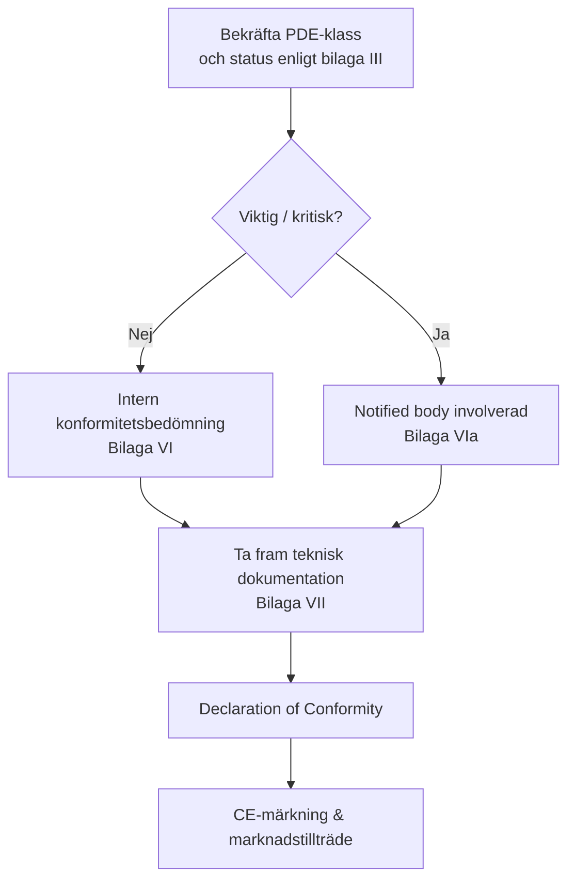

## CRA och CE‑ekosystemet

CRA är en **CE‑märkningförordning**, liknande RED eller EMC: du måste visa att produkten uppfyller sina väsentliga krav innan den sätts på marknaden.[1]  

För många inbyggda PDE:er blir detta en **självbedömningsväg**; för viktiga/kritiska produkter krävs en **notified body** enligt bilaga VI/VIa.[1]

---

## Vilken evidens behövs?

Kärnan i konformitetsbedömningen är din **tekniska dokumentation** och den **processevidens** som skapas av SDL, SBOM och sårbarhetshantering.[1]  

Exempel:

- arkitekturdiagram och threat models,  
- kartläggning av kontroller mot kraven i bilaga I,  
- testrapporter och sammanfattningar av pen‑tester,  
- beskrivningar av provisioning‑ och update‑flöden,  
- SBOM + VEX eller likvärdiga format för vulnerabilitets­deklarationer,  
- CVD‑policy och loggar över incidenter och vulnerability handling.  

---

## Roll för standarder

Innan CRA‑harmoniserade standarder har citerats i Official Journal kan du luta dig mot **“state‑of‑the‑art”‑standarder** som kommissionen refererar till för att visa konformitet (artikel 25).[1]  

Typiska exempel:

- **IEC 62443‑4‑1 / 4‑2** för industriell/inbyggd säkerhet,  
- **ETSI EN 303 645** för konsument‑IoT,  
- **NIST SSDF** för secure development lifecycles.  

Att använda erkända standarder ger en **presumption of conformity** för motsvarande kontroller och gör bedömningen enklare för notified bodies.

---

## Declaration of Conformity (DoC)

DoC är ett kort dokument, signerat av tillverkaren, som:

- identifierar produkt och versioner,  
- listar tillämplig lagstiftning (CRA, RED, EMC, LVD, …),  
- refererar standarder och interna dokument som används för att visa konformitet,  
- identifierar ansvarig person i EU.  

Håll DoC synkroniserad med den tekniska dokumentationen och uppdatera den när större ändringar av firmware eller funktionalitet görs, så att kraven i artikel 22 fortsätter att uppfyllas.

---

## Checklista för beredskap

Innan du påstår konformitet, verifiera:

- [ ] Scope och klassificering bekräftad (PDE, viktig/kritisk). Se [Scope & Definitions](./scope-and-definitions).  
- [ ] SDL definierad och följd för nuvarande release. Se [SDL](./secure-development-lifecycle).  
- [ ] Embedded Technical Controls mappade mot kraven i bilaga I. Se [Embedded Technical Controls](./embedded-technical-controls).  
- [ ] Teknisk dokumentation och SBOM‑paket komplett. Se [Documentation & SBOM](./documentation-and-sbom).  
- [ ] Process för vulnerability handling i drift; supportperiod definierad. Se [Vulnerability Handling](./vulnerability-handling).  

Denna checklista kopplar direkt till **Developer Checklist** som används av utvecklingsteamen (se [Developer Checklist](./developer-checklist)).

[1]: https://eur-lex.europa.eu/legal-content/EN/TXT/?uri=CELEX:32024R2847
