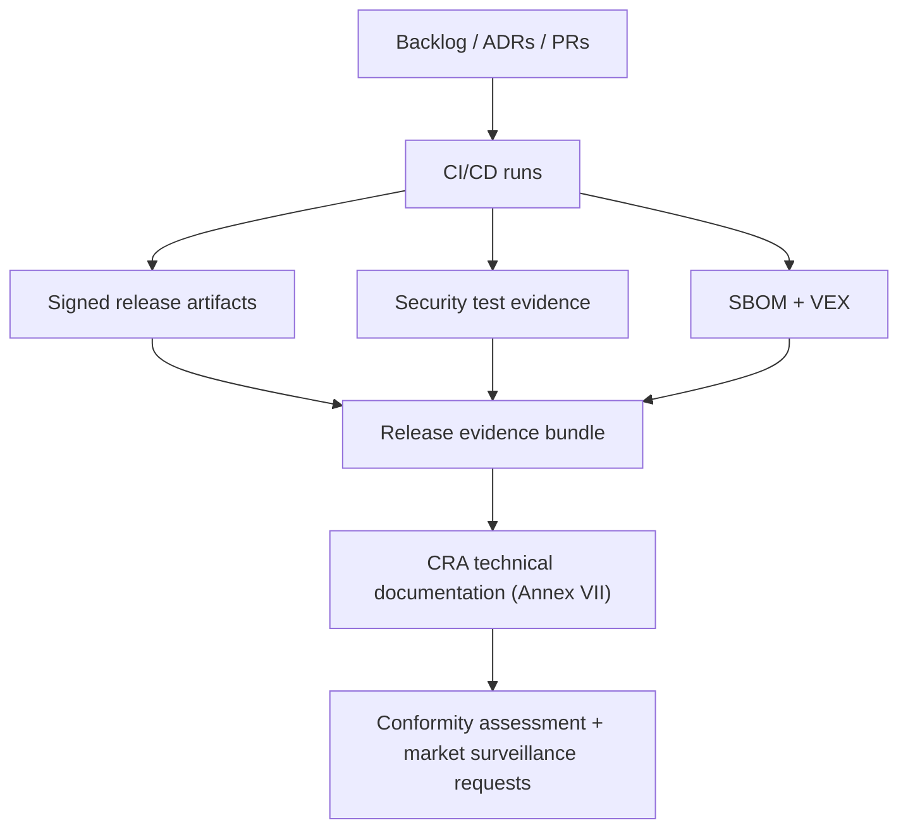
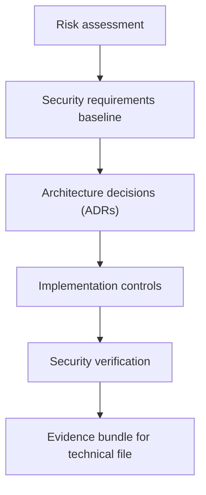
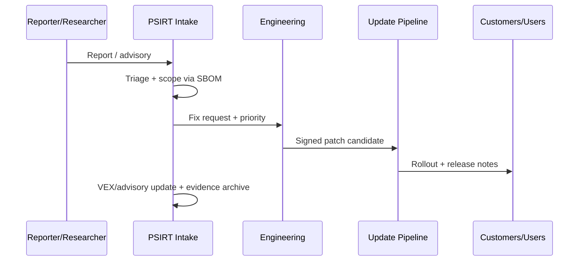

---
id: cra-developer-checklist
slug: /security/cra/developer-checklist
title: Utvecklarchecklista och mallar
sidebar_position: 10

last_update:
  author: 'Ayoub Bourjilat (AC6)'
  date: '2025-12-19'
---

## Vad checklistan är (och inte är)

Den här sidan är en **release-redo checklista** för inbyggda produkter under EU:s Cyber Resilience Act (CRA). Den gör CRA-krav till konkreta ingenjörsuppgifter och tvingar varje "klart" att peka på **bevis** som hör hemma i din CRA technical file.

Den är **inte** en ersättning för din juridiska analys eller val av conformity assessment-väg. Det är verktyget för vardagen som gör kraven genomförbara av firmware-, plattforms- och DevSecOps-team.

> **Evidensregel:** en kryssruta är bara "klar" om den länkar till *minst en* av: issue/ticket-ID, PR/MR, CI-körning, testrapport, signerat artefakt, SBOM/VEX, designdokument, ADR eller daterad beslutsnot.

---

## CRA-ankare (klausulerna som driver checklistan)

Du ser samma CRA-ankare på de flesta kontroller:

- **Designad, utvecklad, producerad** i linje med bilaga I del I (tillverkarkrav).  
- **Cybersecurity risk assessment** dokumenterad och inkluderad i teknisk dokumentation.  
- **Due diligence** på tredjepartskomponenter (inkl. öppen källkod).  
- **Sårbarhetshantering** under supportperioden (bilaga I del II).  
- **Obligatorisk rapportering** för *aktivt exploaterade sårbarheter* och *allvarliga incidenter* (med hårda tidskrav).  
- **Teknisk dokumentation** (bilaga VII) + **användarinformation** (bilaga II).

Behöver du exakta formuleringar – citera alltid OJ-texten i CRA technical file.

---

## Rekommenderad repo-struktur (Docusaurus + engineering-evidens)

Håll "presentationsdokument" (Docusaurus) separata från "auditevidens" (technical file), men länka dem.

```
repo-root/
  docs/                         
  security/
    cra/
      releases/
        2025.12.0/
          00-scope-classification.md
          01-risk-assessment.md
          02-threat-model.md
          03-architecture.md
          04-controls-mapping.md
          05-test-evidence.md
          06-sbom-vex/
          07-release-attestation.md
          08-user-info-annex-ii.md
      templates/                # Copy/paste-mallar från den här sidan
      adr/                      # Architecture Decision Records (säkerhetsbeslut)
  ci/
  firmware/
  bootloader/
```

---

## Evidenskedja (hur bevis hamnar i technical file)



---

## Ägarbild (engineering-RACI som revisorer förstår)

En praktisk RACI för inbyggda produkter. Behåll tabellen i technical file (uppdatera per release).

| Arbetsmoment | R (Responsible) | A (Accountable) | C (Consulted) | I (Informed) |
|---|---|---|---|---|
| Scope/classification decision record | Product security | Regulatory/Compliance | Firmware lead, Product | Sales, Support |
| Risk assessment + updates | Product security | Engineering director | QA, Platform | PSIRT |
| Secure boot / identity / debug locking | Firmware lead | Engineering director | HW lead, Manufacturing | Support |
| CI-hardening + signing pipeline | DevOps/Build lead | Engineering director | Product security | QA |
| SBOM/VEX generation + archival | DevOps/Build lead | Product security | Firmware lead | Compliance |
| Security testing plan + execution | QA/Security test | QA lead | Firmware lead | Compliance |
| CVD + PSIRT process | PSIRT lead | Product security | Support, Legal | All teams |
| Article 14 reporting execution | PSIRT lead | Legal/Compliance | Product security | Exec staff |

---

## Releasechecklista (kryssa per release, bifoga evidenslänkar)

### 0) Scope, klassificering och produktgränser

- [ ] **PDE-scope bekräftat** (product with digital elements, inkl. firmware och eventuell remote data processing inom scope).  
  Evidens: `00-scope-classification.md` + ADR-ID.
- [ ] **Important/critical-status kontrollerad** mot bilaga III/IV (och dokumenterad även om "ej tillämpligt").  
  Evidens: annex-checktabell + motivering.
- [ ] **Variantkarta fryst för releasen** (SoC-varianter, HW-revisioner, feature flags, protokollprofiler).  
  Evidens: `product-variants.yaml` + bill of materials per variant.
- [ ] **Avsett användningsområde och miljö angivna** (konsument/industri, anslutningsantaganden, fysisk åtkomst).  
  Evidens: `intended-use.md` + input till threat model.
- [ ] **Supportperiod deklarerad och dokumenterad** (minsta varaktighet och end-of-support-policy).  
  Evidens: `support-period.md` + kundplan.

> Tips för inbyggt: definiera scope per *image* (bootloader, app, radiostack), per *HW-SKU* och per *clouddel*. Det mesta revisionsstrulet kommer från oklara gränser.

---

### 1) Cybersecurity risk assessment (security-by-design-starten)

- [ ] **Cybersecurity risk assessment finns** för produkten och uppdateras för releasen.  
  Evidens: `01-risk-assessment.md` med changelog.
- [ ] **Riskbedömningen täcker**: avsett syfte + rimligen förutsebar användning, användningsförhållanden (driftsmiljö), skyddsvärden, förväntad användningstid.  
  Evidens: rubriker + referenser.
- [ ] **Mapping mot bilaga I del I inkluderad**: för varje krav, ange tillämplighet + hur det implementeras eller varför ej tillämpligt.  
  Evidens: `04-controls-mapping.md`.



---

### 2) Threat model (inbyggnadsfokus)

- [ ] **Systemkontextdiagram** skapat/uppdaterat: enhet, gateways, appar, remote processing, update-servrar, tillverkning.  
  Evidens: diagram + versionshistorik.
- [ ] **Trust boundaries identifierade** (secure vs non-secure execution, debuggräns, uppdateringsgräns, externa nät).  
  Evidens: threat model-avsnitt "trust boundaries".
- [ ] **Angriparmodell dokumenterad** (fjärra angripare, lokal angripare med fysisk access, supply-chain-aktör).  
  Evidens: `02-threat-model.md`.
- [ ] **Abuse/misuse-cases** dokumenterade för: uppdateringsväg, debug/service mode, provisioning, radio/nätverksstack.  
  Evidens: threat list + mitigeringar.

---

### 3) Secure boot, identitet och provisioning

- [ ] **Boot chain dokumenterad** från ROM → first stage → second stage → applikation.  
  Evidens: `03-architecture.md` (boot chain-sektion).
- [ ] **Autenticitet & integritetsverifiering påtvingad** i varje bootsteg (signatur + hash-policy).  
  Evidens: kod/konfiguration + testrapport för felcase.
- [ ] **Anti-rollback-policy definierad** (monotont versionsnummer, säker räknare, fuse-policy) och testad.  
  Evidens: versionspolicy + testloggar.
- [ ] **Device identity** definierad (per-enhetsnyckel/cert-strategi) och skyddad av root-of-trust (secure element, enclave, OTP el. liknande).  
  Evidens: nyckelhierarki + provisioning-SOP.
- [ ] **Provisioning-process härdad** (hantering av fabriknycklar, separation of duties, auditloggar).  
  Evidens: tillverkningsprocedur + åtkomstkontrollbevis.

---

### 4) Runtime-isolering och minnessäkerhet (MCU-realistiskt)

- [ ] **Privilege-separation aktiverad där stöds** (MPU/MMU-regioner, opriviligerade tasks/userspace, secure partitions).  
  Evidens: RTOS-konfig + minneskarta + tester.
- [ ] **Minnessäkerhetskontroller** på plats: bounds checking-strategi, säkra parse-regler för externa indata (nätverk, seriell, USB, filer).  
  Evidens: kodningsstandard + PR-checklista + riktade tester.
- [ ] **Exploit-härdande flaggor aktiva** där toolchain stöder (stack protector, FORTIFY-liknande, W^X där relevant).  
  Evidens: buildflaggor + CI-byggloggar.
- [ ] **Watchdog och felåterhämtning** implementerad och testad (failsafe-läge, säker omstart, begränsad retry).  
  Evidens: HIL-testloggar.

---

### 5) Gränssnittshärdning (skeppa inte "debug-by-default")

- [ ] **Debugportar skyddade** (låsta/inaktiverade i fält eller skyddade av autentiserad serviceprocedur).  
  Evidens: option bytes/fuse-inställningar + fabriksverifieringstest.
- [ ] **Alla nätverkstjänster inventerade** (portar, protokoll, versioner) och minimerade.  
  Evidens: `attack-surface.md` + skanningsresultat.
- [ ] **Managementgränssnitt autentiserade och auktoriserade** (rollseparation, rate limits, lockout, säkra sessioner).  
  Evidens: API-spec + tester.
- [ ] **Secure-by-default-konfiguration** dokumenterad och verifierad (inga defaultlösenord, minsta privilegier, defensiv exponering).  
  Evidens: default-konfigmatris + automatiskt test.

---

### 6) Kryptografi och nyckellivscykel

- [ ] **Crypto-profil deklarerad** (protokoll, algoritmer, nyckelstorlekar, RNG-krav) och motiverad som "state of the art" för ert use case.  
  Evidens: crypto-profil + motivering.
- [ ] **Nyckellivscykel täckt**: generering, lagring, användning, rotation, revokering, hantering av kompromettering.  
  Evidens: nyckelhanteringsplan.
- [ ] **Certifikatvalideringsregler definierade** (tidskälla, pinning-policy, förnyelse, felhantering).  
  Evidens: kommunikationssäkerhetsdesign + tester.

---

### 7) Build, CI/CD och release-integritet

- [ ] **Build provenance fångad** (commit-hash, toolchain-version, konfiguration, reproducerbar-build-strategi eller spårbar motsvarighet).  
  Evidens: `build-metadata.json` bifogat artefakter.
- [ ] **Signerande nycklar skyddade** (HSM/offline key ceremony/secure enclave) och åtkomst loggad.  
  Evidens: signing-SOP + utdrag ur auditlogg.
- [ ] **SBOM genererad per build och per variant**, lagrad med artefakter.  
  Evidens: SBOM-filer i `06-sbom-vex/` + CI-jobbloggar.
- [ ] **Dependency governance aktiv** (allow/deny-listor, sårbarhetsskanning, licensskanning, uppgraderingspolicy).  
  Evidens: dependency-policy + skanningsresultat.

---

### 8) Säkerhetsverifiering (bevisa att kontrollerna fungerar)

- [ ] **Plan för säkerhetstester finns** och körs för releasen.  
  Evidens: `05-test-evidence.md` + CI-loggar.
- [ ] **Negativa tester** täcker: ogiltiga signaturer, korrupta uppdateringar, ogiltiga cert, felaktiga paket, försök att kringgå auth.  
  Evidens: testfall + resultat.
- [ ] **Fuzzing** på parsers/state machines (host-harness + periodisk HIL där möjligt).  
  Evidens: fuzzrapporter + korpusplats.
- [ ] **Pen-test / red-team-liknande tester** planerade proportionellt till risk (särskilt för exponerade tjänster och uppdateringsväg).  
  Evidens: rapportsammanfattning + åtgärdstickets.

---

### 9) Dokumentationspaket (technical file + användarinformation)

- [ ] **Teknisk dokumentationsbunt uppdaterad** för releasen (arkitektur, riskbedömning, control-mapping, tester, provisioning, uppdateringar).  
  Evidens: `security/cra/releases/<ver>/`-bunt.
- [ ] **Användarriktad säkerhetsinfo förberedd** (supportperiod, uppdateringsmetod, säkra konfigråd, kvarstående risker).  
  Evidens: `08-user-info-annex-ii.md` + länk till publicerade docs.
- [ ] **Underlag till EU Declaration of Conformity uppdaterat** (produktidentitet, standarder som används, notified body-info om tillämpligt).  
  Evidens: DoC-utkast + versionskarta.

---

### 10) Sårbarhetshantering, uppdateringar och rapporteringsberedskap

- [ ] **CVD-kontakt publicerad** (security page / security.txt) med krypteringsnyckel och svarstider.  
  Evidens: URL + repo-kopia.
- [ ] **PSIRT-arbetsflöde i drift** (intake, triage, fix, advisory, rollout, postmortem).  
  Evidens: runbook + ticket-mallar.
- [ ] **Uppdateringsmekanismen testad end-to-end** (A/B eller swap, strömavbrott, rollback-förebyggande, återställningsväg).  
  Evidens: HIL-loggar + automatiska uppdateringstester.
- [ ] **Article 14 reporting playbook finns** och är genomgången: vem rapporterar, vilka data, hur 24h/72h hålls för aktivt exploaterade sårbarheter och allvarliga incidenter.  
  Evidens: rapporteringsrunbook + jourlista + torkkörning.



---

## Mallar (copy/paste)

### Mall A - Release evidence index (en sida)

Skapa `07-release-attestation.md`:

```md
# CRA Release Evidence Index - <product> <version>

## Identification
- Product/SKU(s):
- HW revisions:
- Firmware image IDs (bootloader/app/radio):
- Build commit/tag:
- Release date:

## Scope & classification
- PDE scope decision (ADR):
- Annex III/IV check:

## Risk assessment
- Risk assessment doc:
- Changes since last release:

## Key controls
- Secure boot evidence:
- Debug locking evidence:
- Update mechanism evidence:
- Access control evidence:

## SBOM/VEX
- SBOM location(s):
- VEX location(s):
- Dependency scan report:

## Security testing
- CI run IDs:
- Fuzz report:
- Pen-test summary:

## User information (Annex II)
- Support period statement:
- Update instructions:
- Residual risks:

## Sign-off
- Firmware lead:
- Product security:
- QA:
- Date:
```

### Mall B - ADR-skelett (säkerhetsbeslut)

Skapa `security/cra/adr/ADR-XXXX.md`:

```md
# ADR-XXXX: <Decision title>

## Context
- Product scope:
- Threats driving this decision:
- Constraints (MCU resources, power, cost, boot ROM, etc.):

## Decision
- What we decided:
- Why (risk-based rationale):

## Security properties
- Confidentiality:
- Integrity:
- Availability:
- Update/maintenance impact:

## Alternatives considered
- Option A:
- Option B:

## Consequences
- What changes in implementation:
- Testing required:
- Documentation updates required:

## Links
- Tickets/PRs:
- Threat model section:
- Controls mapping section:
```

### Mall C - SBOM/VEX "minimum bar"

```md
# SBOM/VEX minimum bar (per release)

- SBOM format: SPDX or CycloneDX
- Granularity: per firmware image + per variant
- Must include: bootloader, RTOS/kernel, middleware, crypto, protocol stacks, build tools (when feasible)
- VEX must state: affected / not affected / under investigation / fixed
- Storage: alongside signed artifacts with immutable retention policy
```

---

## Vanliga problem team stöter på här (och hur man undviker dem)

1. **Odefinierat scope**: team glömmer att *firmware + remote data processing + update services* ingår. Fix: rita systemkontext tidigt och frys "vad som ingår" per release.
2. **Variant-explosion**: en "produkt" är egentligen 12 SKU:er och 5 firmware-feature sets. Fix: underhåll variantkarta och generera SBOM/testevidens per variantgrupp.
3. **Otydlig supportperiod**: ingen kan peka på deklarerad supportperiod eller end-of-support-plan. Fix: skapa en auktoritativ `support-period.md` och länka den från användardocs.
4. **Uppdateringsväg ej testbar**: funkar "i labbet" men fallerar vid strömavbrott, lite flash, eller partiella nedladdningar. Fix: HIL-uppdateringsrepetition som release-gate.
5. **Debug lämnas öppen**: SWD/JTAG eller fabriksskal nåbart i fält. Fix: gör debug-låsning till tillverknings-testpunkt med loggat bevis.
6. **SBOM ofullständig**: saknar bootloader, kryptobibliotek eller toolchaininfo. Fix: bind SBOM-generering till build-pipelinen och behandla SBOM som artefakt.
7. **Ingen rapporteringsberedskap**: Article 14-tider är svåra utan jour och förberett rapporteringsformulär. Fix: gör minst en torrkörning.
8. **Evidens utspridd**: kontroller finns men bevis ligger i mejl/laptops. Fix: en evidence-bundle per release, alltid.

---

## Referenser

- Regulation (EU) 2024/2847 (Cyber Resilience Act) - Official Journal (ELI): http://data.europa.eu/eli/reg/2024/2847/oj/eng
- NIST SP 800-218 (SSDF): https://csrc.nist.gov/pubs/sp/800/218/final
- ISO/IEC 29147 (Vulnerability disclosure): https://www.iso.org/standard/45170.html
- ISO/IEC 30111 (Vulnerability handling processes): https://www.iso.org/standard/69725.html
- SPDX specifications: https://spdx.dev/specifications/
- CycloneDX specification: https://cyclonedx.org/specification/

