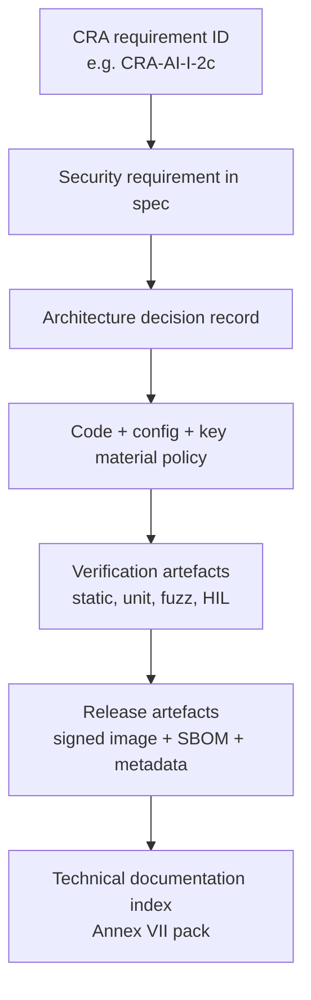
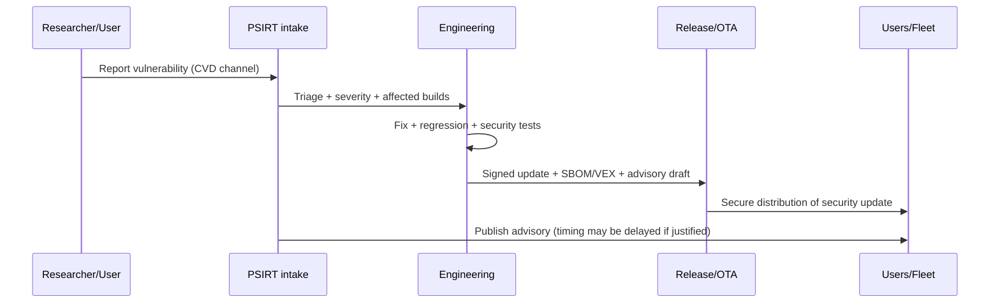
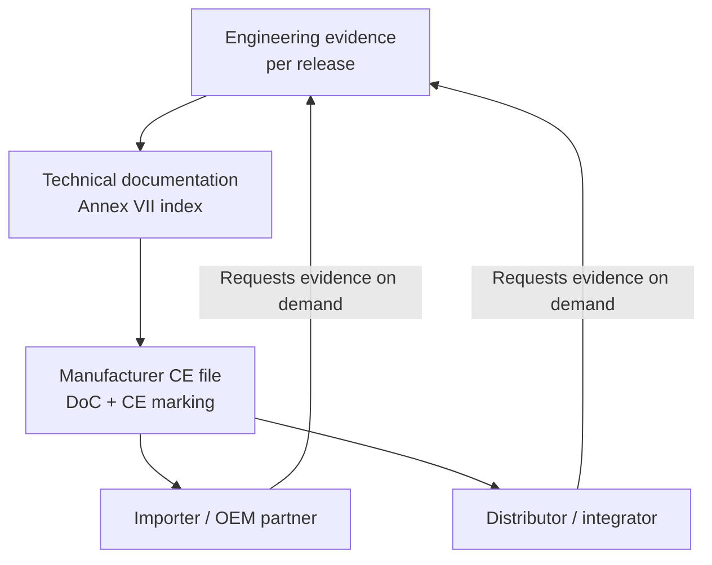

---
id: cra-developer-requirements
slug: /security/cra/developer-requirements
title: Utvecklarkrav och ansvar
sidebar_position: 2.5
---

## Vad den här sidan är (och inte är)

Detta är en **utvecklarinriktad översättning** av Cyber Resilience Act (CRA): den förklarar *vad engineering måste implementera och bevara som evidens* så att **tillverkaren** kan visa efterlevnad. Den skapar **inte** "personliga juridiska plikter" för enskilda utvecklare – CRA lägger skyldigheter på **economic operators** (manufacturer/importer/distributor m.fl.).[1]

För inbyggda produkter är nyckeln enkel: **vi behandlar arkitektur + SDLC-artefakter som compliance-evidens** och versionerar dem per release.[2][3]

---

## Juridiska ankare som utvecklare måste realisera

CRA gör tre saker icke-valbara för engineeringteam:

1. **Riskbaserad säkerhetsengineering** (före release och uppdaterad vid behov). Tillverkare måste göra en cybersecurity risk assessment och ha den i teknisk dokumentation.[4][5]
2. **Väsentliga cybersäkerhetskrav** inbyggda i produkten (bilaga I, del I). I praktiken: designkrav + implementationskontroller + verifiering.[2]
3. **Sårbarhetshantering + säkerhetsuppdateringar** under supportperioden (bilaga I del II + Artikel 13 supportperiod). Det är en löpande driftförmåga, inte en engångsuppgift.[6][5]

:::note CRA "documentation" är en produktfunktion
CRA kräver teknisk dokumentation **innan** marknadsföring och **löpande uppdaterad åtminstone under supportperioden**.[3] Om engineering inte producerar och versionerar artefakterna faller compliance – även om enheten "är säker i praktiken".
:::

---

## Ägarbild för embedded (RACI som håller i revisioner)

### Varför RACI spelar roll

Revisioner faller oftare på **oklar ägarskap** än på saknad kryptoprimitiv. CRA förväntar sig att tillverkaren visar "de medel som används" och "processerna som införts" för att möta bilaga I i den tekniska dokumentationen.[3]

Nedan en praktisk ägarbaseline för ett inbyggt PDE (MCU/SoC + firmware + ev. cloud/OTA). Anpassa rollerna till din organisation.

| Aktivitet / evidens | Firmware | HW/Silicon security | Backend/OTA | DevOps/CI | PSIRT | Product/PM | Compliance |
| --- | --- | --- | --- | --- | --- | --- | --- |
| Cybersecurity risk assessment | R | C | C | C | C | A | C |
| Security requirements taggade mot bilaga I | R | C | C | C | C | A | C |
| Architecture decision records (ADR) | R | C | C | C | C | A | I |
| Secure boot / root-of-trust-integration | R | A | C | C | I | I | I |
| Debug & lifecycle state policy | C | A | I | I | I | I | I |
| Secure update mechanism | R | C | A | C | C | C | I |
| SBOM + provenance-generering | R | I | I | A | C | I | C |
| Security testplan & resultat | R | C | C | C | C | I | A |
| CVD-policy + vuln intake-pipeline | C | I | C | C | A | C | I |
| Supportperiod-uttalande & slutdatum | I | I | I | I | C | A | C |
| Technical documentation pack (bilaga VII) | C | C | C | C | C | C | A |

Legend: **A** accountable (signerar), **R** responsible (utför), **C** consulted, **I** informed.

---

## Spårbarhet: gör CRA-klausuler till engineering-ID:n

Ett praktiskt mönster är att tagga backlog, tester och design med **stabila ID:n** som matchar CRA-strukturen.

Exempel på ID-schema:

- `CRA-AI-I-2c-sec-updates-auto-default` (Annex I, Part I, punkt (2)(c))
- `CRA-AI-II-7-secure-update-distribution` (Annex I, Part II, punkt (7))
- `CRA-A13-8-support-period` (Artikel 13(8))

Varför viktigt:
- det länkar **design → kod → tester → evidens**,
- det gör det trivialt att generera ett "evidence index" för bilaga VII technical documentation.[3]

---

## SDLC-kontroller som mappar rent till CRA

### 1) Scope + klassificering (gate 0)

Engineering ska validera:
- produkten är ett **PDE** och avsedd driftsmiljö är dokumenterad,
- om produkten är **important/critical** (bilaga III/IV), eftersom det styr bedömningsdjupet,
- vad **supportperioden** är, då den styr uppdateringsstrategi och livscykelkostnad.[5][3]

Output (minst):
- scope statement + produktgränsdiagram,
- initial risk assessment-post,
- stub för supportperiod-motivering (slutförs före release).

### 2) Säkerhetskrav (gate 1)

Från bilaga I, del I, punkt (2) härleds systemkrav, t.ex.:
- **secure-by-default-konfiguration**,[2]
- **skydd mot obehörig åtkomst** och robust authz/authn,[2]
- **konfidentialitet och integritet för data/kod**, inkl. secure comms och secure storage,[2]
- **minimerad attackyta och begränsad påverkan** (segmentering, least privilege, minnesskydd),[2]
- **logging/monitoring-hookar** så incidenter kan upptäckas/analyseras,[2]
- **robust säkerhetsuppdateringsmekanism**, inkl. säker distribution och update policy.[2][6]

Output:
- lista över säkerhetskrav taggade med CRA-ID,
- threat model-sammanfattning + mitigeringar,
- ADR:er för större säkerhetsbeslut (root-of-trust, uppdateringsstrategi, identitet).

### 3) Implementationsräcken (gate 2)

Artikel 13 förväntar sig att tillverkaren håller produkten compliant under produktion och förändring.[7] För embedded betyder det:

- **Reproducerbara builds**: buildscript + toolchain-versioner är pin:ade.
- **Säker dependency governance**: manifest versionerade; tredjeparts-komponenter får inte kompromissa säkerhet (due diligence).[5]
- **Kodat regleras**: statisk analys, obligatoriska reviews, policy för unsafe-kod i Rust/C/C++.
- **Nyckelhantering**: nycklar aldrig i källrepo; signering sker med kontrollerad åtkomst (HSM el. liknande).

Output:
- CI-pipeline-konfig, SBOM-jobbloggar, build provenance-metadata,
- review-checklistor och undantagsregister,
- SOP för kryptonyckelhantering (vem får signera, hur nycklar skyddas).

### 4) Release engineering (gate 3)

Release är där "bevis" skapas:

- **Signerade firmware-artefakter** + hashar + versionsmetadata.
- **SBOM** kopplad till den levererade builden (CRA-definition av SBOM är explicit).[8]
- **Evidens för uppdateringsrepetition**: strömavbrottscase, rollback-vägar, recoverybeteende.
- **Användarriktade säkerhetsinstruktioner** (bilaga II) måste stämma med det engineering levererat (t.ex. hur installera säkerhetsuppdateringar).[9]

Output:
- releasemanifest (image-hash, signing key ID, SBOM-referens),
- testrapporter + HIL-loggar,
- releasenotes inklusive säkerhetsrelevanta ändringar.

### 5) Post-market / PSIRT-loop (gate 4)

Bilaga I, del II kräver **sårbarhetshantering** och säker, snabb distribution av uppdateringar.[6] Artikel 13 kräver också effektiv hantering **under supportperioden**.[5]

Engineering måste därför upprätthålla:
- intake-kanal för sårbarheter (single point of contact kopplas till tillverkarens plikter),[7]
- triage + fix-arbetsflöde,
- säker distributionsmekanism för uppdateringar,
- publik advisory-process (med möjlighet att fördröja publicering när motiverat).[6]

## Supply chain-handover: vad importörer/distributörer kommer fråga efter

Även om vi skeppar direkt kan partners vara **importörer** eller **distributörer** med verifierings- och samarbetsplikter. Importörer måste kunna tillhandahålla teknisk dokumentation på begäran och informera tillverkaren när de blir medvetna om sårbarheter.[10] Distributörer ska samarbeta och ge info/dokument som behövs för att visa efterlevnad.[11]

Därför bör engineering skapa ett **CRA Evidence Pack** per release (minimum):

- signerade firmware-artefakter + hashar + releasemanifest,
- SBOM (och VEX om det används) knuten till levererad build,
- sammanfattning av säkerhetstester,
- beskrivning av uppdateringsmekanism + rollback/recovery-beteende,
- uttalande om supportperiod och slutdatum,
- kontakt för vulnerability disclosure.

:::tip OEM/ODM-varning: "substantial modification"
Om en importör/distributör (eller annan) gör en **substantial modification** och sedan släpper produkten kan de behandlas som **manufacturer** och omfattas av Artikel 13 och 14 för det de ändrat (eller ev. hela produkten).[12][13] Det bör speglas i avtal och integrationsguider.
:::

---

## Inbyggd "must cover"-lista (mappad till bilaga I)

Detta är inte hela kontrollkatalogen (se **Embedded Technical Controls**), men de ämnen som återkommer i bedömningar för inbyggt.

| Ämne | Vanliga inbyggda mönster | CRA-ankare |
| --- | --- | --- |
| Secure-by-default | debug låst i produktion; secure comms på; least privilege-defaults | Annex I Part I(2)(b)[2] |
| Minimal attackyta | stäng oanvända tjänster; minimera exponerade portar/API:er; säkra diagnostik | Annex I Part I(2)(j)[2] |
| Identity & access control | enhetsidentitet, mutual auth, authz-policy | Annex I Part I(2)(d)[2] |
| Confidentiality & integrity | TLS med moderna chiffer; signerat firmware; secure storage | Annex I Part I(2)(e-f)[2] |
| Availability | watchdog, rate limiting, säkra felmoder | Annex I Part I(2)(h-i)[2] |
| Logging/monitoring hooks | händelsetaxonomi; manipulationsskyddade loggar; exportstrategi | Annex I Part I(2)(l)[2] |
| Updates | signerade uppdateringar; säker distribution; rollback-recovery | Annex I Part I(2)(c) + Part II(7-8)[2][6] |
| Vulnerability handling | CVD-policy; kontaktpunkt; publika advisories | Annex I Part II(5-6)[6] |
| Third-party components | dependency due diligence; rapportera uppströms | Artikel 13(5-6)[5] |

---

## Vanliga problem här (och hur man undviker dem)

1. **"Vi är säkra men kan inte bevisa det."**  
   Lösning: gör evidensartefakter till förstklassiga outputs (ADRs, testrapporter, SBOM, update-repetitionsloggar) och indexera dem i technical documentation.[3]

2. **Scope-drift i inbyggda system.**  
   Lösning: definiera produktgränsen tydligt (enhetsfirmware + bootloader + companion-app + molnendpoints för uppdateringar). Versionssätt scopedigram per release.

3. **Rollförvirring mellan OEM/ODM/integratörer.**  
   Lösning: dokumentera uttryckligen vem som styr firmwarebuild, signeringsnycklar, uppdateringsendpoints och supportperiod. Om någon ändrar säkerhetskritiska delar, behandla det som potentiell "substantial modification".[12][13]

4. **Supportperiod underskattas.**  
   Lösning: bestäm tidigt och validera mot förväntad livslängd; CRA anger en minsta supportperiod (med begränsat undantag om förväntad användning är kortare).[5]

5. **SBOM finns men är inte knuten till levererad binär.**  
   Lösning: generera SBOM i CI från exakta bygginputs, lagra den med releasemanifestet och håll definitionen i linje med Artikel 3.[8]

6. **Uppdateringsmekanism designas sent.**  
   Lösning: behandla säkra uppdateringar som arkitekturkrav (bootloader-strategi, partitionering, rollback, nyckelrotation), inte som en "feature" efter MVP.[2][6]

7. **Tredjeparts-komponenter blir blinda fläcken.**  
   Lösning: ha governance för dependencies; om vi hittar en sårbarhet i en komponent måste vi rapportera uppströms och åtgärda enligt bilaga I del II.[5][6]

8. **Ingen operativ sårbarhetshantering.**  
   Lösning: implementera PSIRT-process med tydlig intake, triage, fix och advisory, och säkerställ att säker distributionsmekanism kan leverera fixar "utan dröjsmål".[6]

---

## Referenser

[1]: https://eur-lex.europa.eu/legal-content/EN/TXT/?uri=CELEX:32024R2847 "Regulation (EU) 2024/2847 (CRA) - Chapter II obligations of economic operators"

[2]: https://eur-lex.europa.eu/legal-content/EN/TXT/?uri=CELEX:32024R2847 "CRA Annex I, Part I - Essential cybersecurity requirements (secure-by-design / secure-by-default)"

[3]: https://eur-lex.europa.eu/legal-content/EN/TXT/?uri=CELEX:32024R2847 "CRA Article 31 + Annex VII - Technical documentation (continuous update at least during support period)"

[4]: https://eur-lex.europa.eu/legal-content/EN/TXT/?uri=CELEX:32024R2847 "CRA Article 13(2-4) - Cybersecurity risk assessment and inclusion in technical documentation"

[5]: https://eur-lex.europa.eu/legal-content/EN/TXT/?uri=CELEX:32024R2847 "CRA Article 13(5-9) - Due diligence for third-party components + support period + vulnerability handling during support period"

[6]: https://eur-lex.europa.eu/legal-content/EN/TXT/?uri=CELEX:32024R2847 "CRA Annex I, Part II - Vulnerability handling and security updates"

[7]: https://eur-lex.europa.eu/legal-content/EN/TXT/?uri=CELEX:32024R2847 "CRA Article 13(13-14) - Retention of technical documentation and keeping series production in conformity"

[8]: https://eur-lex.europa.eu/legal-content/EN/TXT/?uri=CELEX:32024R2847 "CRA Article 3(39) - Definition of SBOM"

[9]: https://eur-lex.europa.eu/legal-content/EN/TXT/?uri=CELEX:32024R2847 "CRA Annex II - User information including how security updates can be installed"

[10]: https://eur-lex.europa.eu/legal-content/EN/TXT/?uri=CELEX:32024R2847 "CRA Article 19 - Importer obligations (documentation availability, vulnerability awareness)"

[11]: https://eur-lex.europa.eu/legal-content/EN/TXT/?uri=CELEX:32024R2847 "CRA Article 20 - Distributor obligations (due care, cooperation, documentation)"

[12]: https://eur-lex.europa.eu/legal-content/EN/TXT/?uri=CELEX:32024R2847 "CRA Article 21 - Importers/distributors treated as manufacturers in certain cases"

[13]: https://eur-lex.europa.eu/legal-content/EN/TXT/?uri=CELEX:32024R2847 "CRA Article 22 - Other substantial modification cases treated as manufacturers"
