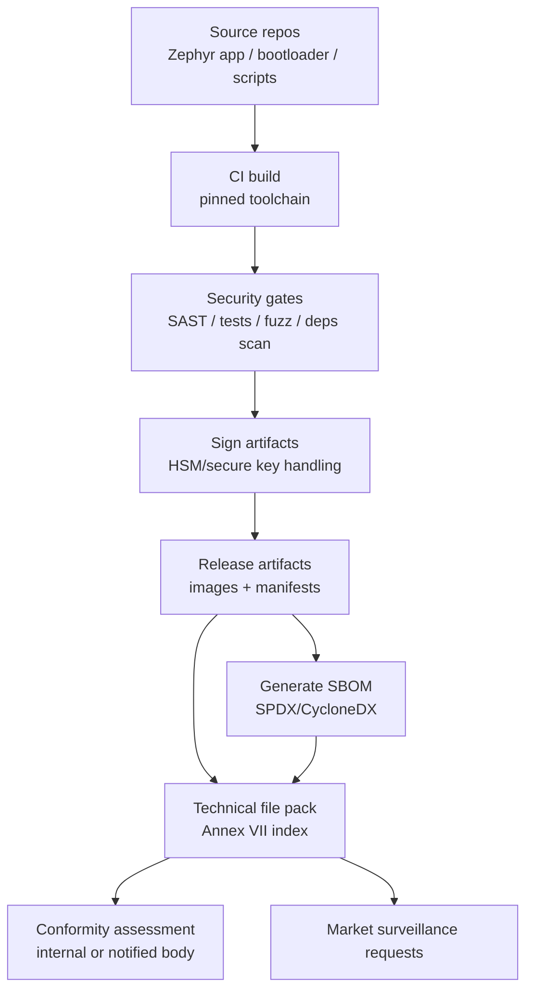
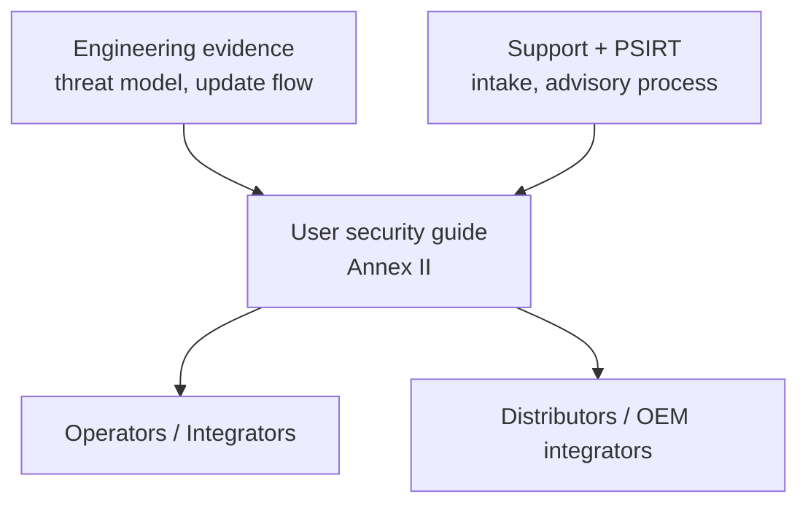
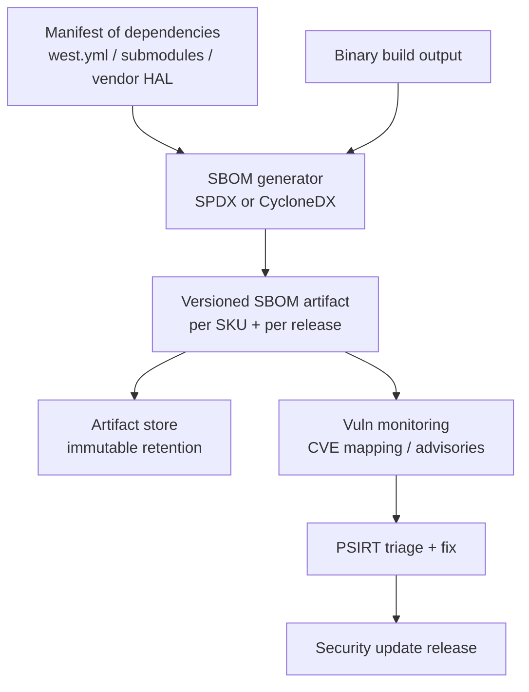

---
id: cra-docs-sbom
slug: /security/cra/documentation-and-sbom
title: Dokumentation, användarinformation och SBOM
sidebar_position: 6

last_update:
  author: 'Ayoub Bourjilat (AC6)'
  date: '2025-12-19'
---

## Vad CRA förväntar sig att se

CRA blir tre konkreta "dokumentationsoutput":

1. **Teknisk dokumentation (technical file)**  
   Krävs av **Artikel 31** och specificeras i **Bilaga VII**. Det är det strukturerade evidenspaketet för conformity assessment och market surveillance.  
2. **Användarriktad säkerhetsinformation och instruktioner**  
   Krävs av **Bilaga II**. Det operatörer/kunder behöver för att använda produkten säkert (inkl. uppdateringsinstruktioner och supportperiod).  
3. **Software Bill of Materials (SBOM)**  
   Krävs av **Bilaga I, del II(1)** och refereras igen i **Bilaga VII(8)** (tillgänglig för myndigheter på begäran).

> **Nyckelpunkten:** CRA handlar inte bara om "var säker"; det är "var säker *och kunna bevisa det* med konsekvent, versionerad evidens".

---

## 1) Teknisk dokumentation (technical file)

### 1.1 Juridiska ankare du måste mappa mot ditt evidenspaket

- **Artikel 31(1)** kräver att technical documentation anger medlen som säkerställer att PDE uppfyller de väsentliga cybersäkerhetskraven (bilaga I).  
- **Artikel 31(2)** kräver att technical documentation hålls **uppdaterad**.  
- **Artikel 13(13)** kräver att technical documentation och EU declaration of conformity hålls tillgängliga för marknadskontroll i **minst 10 år efter marknadsföring, eller under supportperioden – det som är längst**.  
- **Bilaga VII** ger minimikraven på innehåll.

**Vad detta betyder för inbyggda team:** behandla technical file som ett versionerat, reproducerbart "release-evidence-paket" knutet till varje levererad firmware/hårdvaruvariant.

---

### 1.2 Minimiinnehåll i technical file (Bilaga VII) – översatt för inbyggt

Nedan mappas Bilaga VII till vanliga leverabler för inbyggt (MCU/SoC + RTOS + bootloader + ev. cloud/app).

#### (1) Allmän produktbeskrivning
- Avsett syfte och driftsmiljö (konsument / industri / säkerhetsnära begränsningar).
- Mjukvaruversioner som påverkar compliance (t.ex. MCUboot-version, Zephyr-baseline, kryptobibliotek, radiostack-versioner).
- Hårdvarufoton/markeringar/intern layout (för kort/moduler: etiketter, revisions-ID, nyckelgränssnitt; inkludera *minst* det en granskare behöver för att identifiera enheten).
- Hänvisning till användarinformation och instruktioner (Bilaga II).

#### (2) Processer för design, utveckling, produktion + sårbarhetshantering
- Arkitekturbeskrivning med **komponentgränser och trust boundaries**:
  - Boot chain (ROM → 1st stage → MCUboot → app)
  - Secure/non-secure-värld (TrustZone-M / TrustZone-A om finns)
  - Nyckellagring + livscykelstatus (OTP/fuses/secure element/PUF/"sealed" flash)
  - Remote data processing (om produkten är beroende av det för funktioner)
- Specifikation av sårbarhetshantering:
  - intake-kanal, triage, fix-workflow, release, advisory-publicering
  - hänvisning till policy för coordinated disclosure (var den publiceras)
  - **säker distribution av uppdateringar** (hur du hindrar skadliga uppdateringar)

#### (3) Kontroll av design- och utvecklingsändringar
- Change-control-process för:
  - säkerhetsrelevanta konfigändringar
  - kryptoförändringar (algoritmer, nyckelstorlekar, trust anchors)
  - ändringar i uppdateringspipeline (signeringsnycklar, metadataformat, update endpoints)
- Evidens: spårbara ändringsposter (tickets/PR:er) länkade till releaser.

#### (4) Riskbedömning och riskmitigering
- Riskbedömning som täcker:
  - tillgångar (hemligheter, säkerhetsfunktioner, tillgänglighet, IP)
  - angripare (remote, lokal, insider, supply-chain)
  - attackytor (nätverk, debug, uppdateringsväg, fysiska portar, flyttbart media)
- Länka varje risk till mitigeringar och till bilaga I-krav.

#### (5) Harmoniserade standarder / common specifications som används (om några)
- Lista standarder du påstår konformitet med och omfattning:
  - t.ex. ETSI EN 303 645 för konsument-IoT-baseline
  - IEC 62443-4-2 för tekniska säkerhetskrav (komponentnivå)
  - NIST SSDF för SDL-struktur (processevidens)
- Om du **inte** tillämpar en standard, dokumentera alternativ och motivering.

#### (6) Testrapporter och resultat
För inbyggt inkluderar säkerhetsrelevant test typiskt:
- negativa tester för secure boot (fel signatur, rollback-försök, korrupt header)
- robusthetstester för uppdatering (strömavbrott under swap, avbruten nedladdning)
- protokollfuzzning på parsers/state machines (host-harness + HIL-smoke)
- statisk analys för kritiska moduler (parsers, auth, kryptoanvändning)
- sammanfattning av penetrationstest (efter exponering/klass)

#### (7) EU declaration of conformity
- Lagrats med technical file, länkat till produkt-ID och mjukvaruversioner.

#### (8) SBOM tillgänglig för marknadskontroll
- SBOM förberedd och **tillhandahålls på motiverad begäran** (Bilaga VII(8)).

---

### 1.3 Spårbar evidensmodell (gör revision enkelt)

Huvudjobbet är att få varje påstående att spåra till en build och en enhetsvariant.



**Praktiskt tips:** ha en `evidence-index.yaml` per release med exakta sökvägar + hashar för varje evidenspost.

Exempel (minimal):

```yaml
release_id: "prodX-1.2.0+build.458"
hardware_variants:
  - sku: "GW-MCXN-RevB"
    hw_rev: "B"
    secure_boot: "mcuboot-rsa3072"
artifacts:
  firmware_image:
    file: "artifacts/gw-mcxn/app_signed.bin"
    sha256: "..."
  sbom:
    file: "sbom/gw-mcxn-1.2.0.cdx.json"
    sha256: "..."
  test_report:
    file: "tests/security/update-powercut-report.md"
    sha256: "..."
```

---

## 2) Användarriktad säkerhetsinformation (Bilaga II)

Bilaga II är inte marknadsföring; det är **operativ säkerhetsvägledning**.

Minst bör instruktionerna täcka (Bilaga II):
- produkt- och tillverkaridentitet och kontaktuppgifter,
- kontaktpunkt för sårbarhetsrapportering (och var den publiceras),
- avsett syfte samt grundläggande funktioner och säkerhetsegenskaper,
- säker installation/konfiguration/drift,
- hur man tar emot/verifierar/installerar säkerhetsuppdateringar,
- **supportperiod** för säkerhetsuppdateringar,
- viktiga begränsningar/antaganden för att förbli säker.



**Inbyggda förväntningar (vad som ser bra ut):**
- **Uppdaterings-UX är tydligt:** "hur triggar jag en uppdatering?", "hur ser jag status?", "vad händer vid fel?", "hur återställer jag?"
- **Säkerhetsställning är tydlig:** vilka tjänster exponeras, vilka är avstängda, default credential-policy (helst: inga), debug-läge i produktion.
- **Scope-gräns tydlig:** vad som ligger inom produktens ansvar vs extern infrastruktur (gateways, mobilappar, molnendpoints).

---

## 3) SBOM under CRA (vad det är *och* inte är)

### 3.1 Vad CRA uttryckligen kräver

**Bilaga I, del II(1)**: tillverkaren ska **ta fram en SBOM** som täcker *minst* toppnivåberoenden, i ett **vanligt maskinläsbart format**.  
**Bilaga VII(8)**: SBOM ingår i technical documentation och ska **tillhandahållas myndigheter på motiverad begäran**.

Bilaga II(9) lägger till: **om** du väljer att göra SBOM tillgänglig för användare ska du ange var den finns.

> **Viktigt:** CRA kräver inte "publicera hela SBOM öppet". Det kräver **att du har en, håller den konsekvent och kan lämna den till myndigheter**.

---

### 3.2 SBOM-scope för inbyggt (vad som bör ingå)

För firmwareprodukter bör en "audit-proof" SBOM typiskt innehålla:

- **Boot chain-komponenter**
  - ROM-antaganden (dokumenterade, ingen mjukvarukomponent)
  - 1st stage-bootloader (om tillämpligt)
  - MCUboot + konfiguration (signaturschema, rollback-policy)
- **RTOS och middleware**
  - Zephyr/FreeRTOS-version + modulhashar
  - nätverksstackar (TCP/IP, TLS/DTLS, CoAP/MQTT, BLE)
  - kryptobibliotek (mbedTLS, TinyCrypt, PSA crypto, vendor HAL crypto)
- **Applikationskomponenter**
  - protokollparsers, managementgränssnitt (mcumgr/DFU), device management-agent
- **Build-verktyg som påverkar binären**
  - kompilator/toolchain-version, länk-skript, code generators (där relevant)

> **Tumregel:** om en komponent kan introducera en sårbarhet i den levererade binären (eller i uppdateringspipen som producerar den) hör den hemma i SBOM eller i en tydligt länkad "build BOM".

---

### 3.3 SBOM-genereringspipeline (rekommenderad)



**Best practice för varianter:** generera **en SBOM per build-target** (SKU / SoC / feature set), eftersom inbyggda varianter ofta kompilerar in/ut olika stackar (BLE, Wi-Fi, cellular, secure element-drivrutiner osv.).

---

### 3.4 Om VEX (nyttigt, men inte CRA-nyckelord)

CRA kräver sårbarhetshantering och SBOM; den kräver inte ett specifikt "VEX"-format.  
I praktiken är dock **en VEX-liknande förklaring** det renaste sättet att ange varför en CVE gäller eller inte för just din build.

Om du använder VEX, håll den strikt:
- identifiera komponent + version
- ange *affected / not affected / under investigation*
- förklara villkoret (feature ej byggd, kodväg oåtkomlig, patchad downstream etc.)
- länka till exakt build/SBOM-ID

---

## Minimal, revisionsklar "documentation pack" (inbyggt-vänlig)

En struktur som mappar snyggt till Bilaga VII och klarar varianter:

1. `00-index/`
   - `evidence-index.yaml` (release-ID, hashar, varianter)
2. `01-product-description/`
   - SKU:er, hårdvarurevisioner, avsett bruk, stödda miljöer
3. `02-architecture-and-threat-model/`
   - kontextdiagram, trust boundaries, boot chain, dataflöden
4. `03-risk-and-requirements/`
   - riskbedömning, bilaga I-mapping, lista över säkerhetskrav
5. `04-sdl-and-testing/`
   - SDL-beskrivning, planer och resultat för säkerhetstester, fuzz-notes
6. `05-production-provisioning-updates/`
   - provisioningprocedur, nyckelhantering, uppdateringsdistribution och recovery
7. `06-sbom-and-vuln-handling/`
   - SBOM:ar, process för sårbarhetsintag, advisory-mallar
8. `07-user-facing-info/`
   - säkerhetsguide för användare/admin, uppdateringsinstruktioner, supportperiod

---

## Vanliga problem (och hur man undviker dem)

Använd som "pre-audit sanity check".

1. **"Vilken exakt sak är produkten?"**  
   Inbyggt är ofta enhet + app + gateway + moln. Utan definierad gräns blir dokumentationen inkonsekvent.  
2. **Firmwarevarianter exploderar evidensmängden.**  
   Olika radio/crypto/secure element → olika SBOM:ar och tester. Planera variantmodell tidigt.  
3. **SBOM finns men kan inte bevisas matcha levererad binär.**  
   Lös med immutable artifact storage + evidence-index + reproducible build-krav.  
4. **Uppdateringsinstruktioner är vaga.**  
   Bilaga II kräver tydliga steg och fel/återställningsbeteende, inte bara "stödjer OTA".  
5. **Nyckelhantering är "stamkunskap".**  
   Provisioning och signering är kärnan för compliance; dokumentera vem som får signera, var nycklar lever och hur rotation/revokation sker.  
6. **Säkerhetstest-evidens är inte kopplad till release.**  
   "Vi fuzzade en gång" är inte evidens. Knyt resultat till release-ID och lagra rapporter immutabelt.  
7. **Supportperioden är inte konkret.**  
   Om supportperiod är oklar faller de operativa kraven. Sätt den i produktmaterial och device-metadata där möjligt.

---

## Referenser (primära källor)

[1]: Regulation (EU) 2024/2847 (Cyber Resilience Act), EUR-Lex (konsoliderad text) - Artiklarna 13 och 31; Bilagor I, II, VII: https://eur-lex.europa.eu/legal-content/EN/TXT/?uri=CELEX:32024R2847

