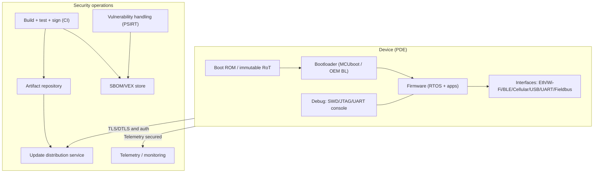
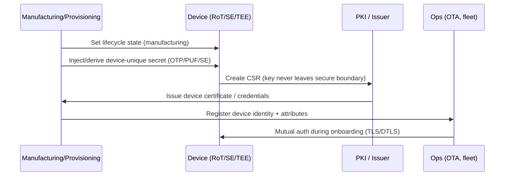
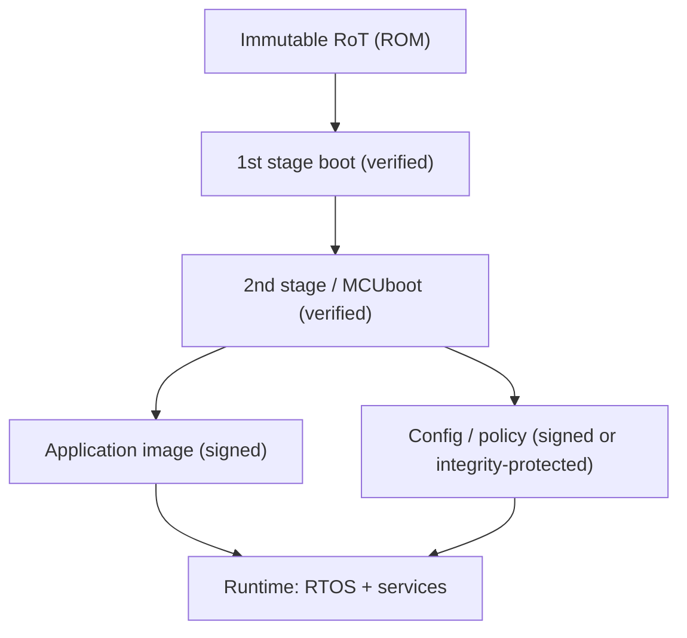
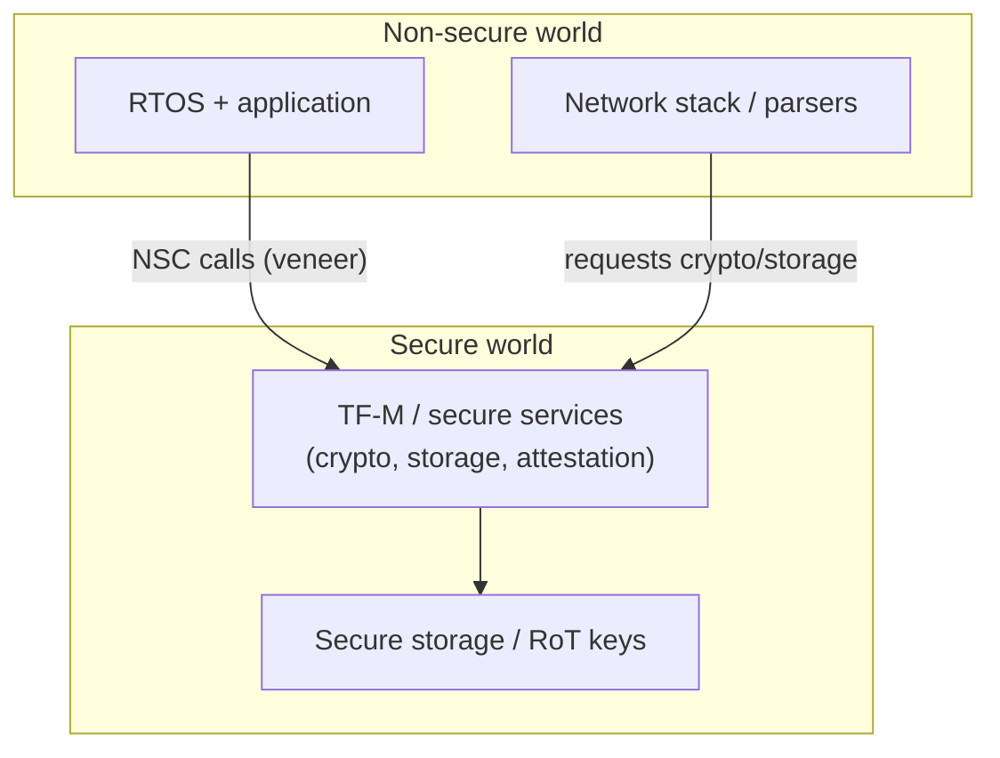
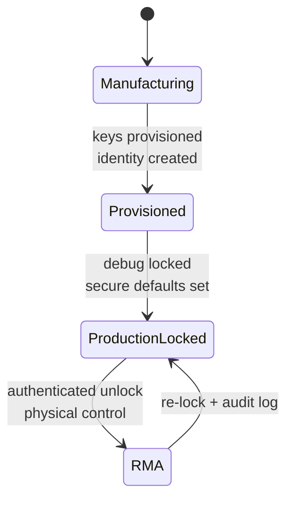
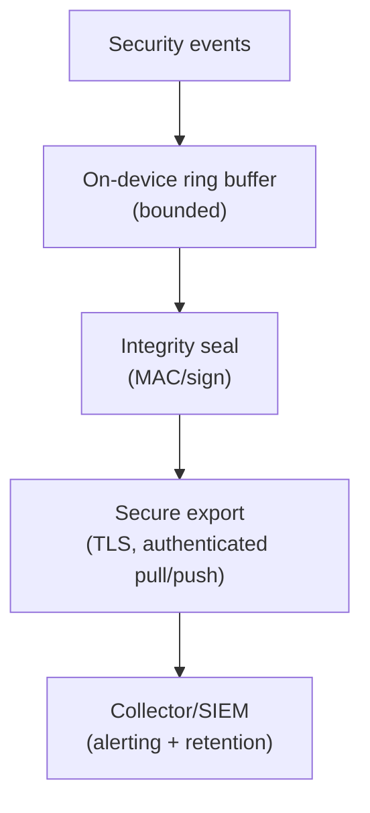
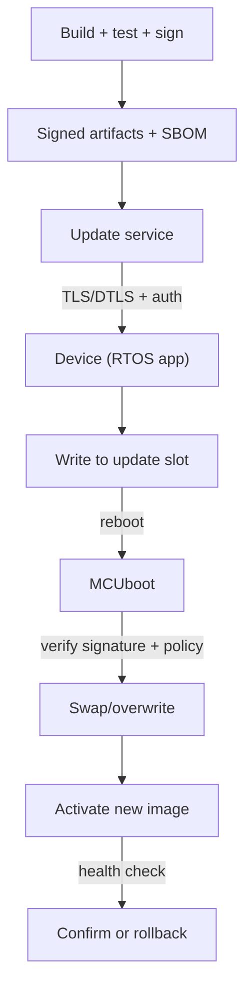
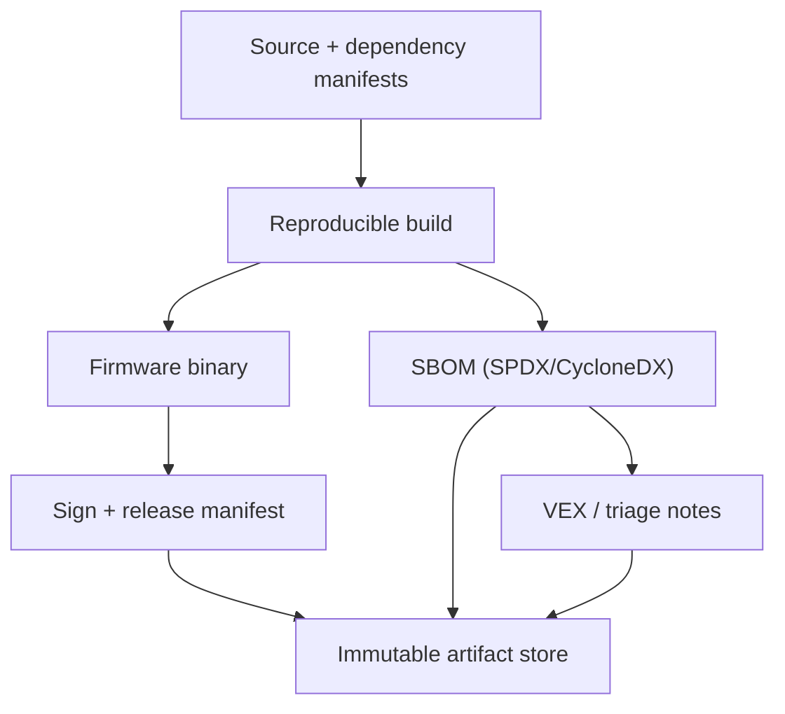

---
id: cra-embedded-controls
slug: /security/cra/embedded-technical-controls
title: Mappning av inbyggda tekniska kontroller
sidebar_position: 4
---

## Syfte med mappningen

Den här sidan mappar **CRA bilaga I** till **implementerbara tekniska kontroller** i inbyggda produkter: CPU/SoC-funktioner, firmware/boot chain, RTOS-konfig och update + vulnerability handling-stack.

Den är skriven som **evidensstöd**: varje mapping inkluderar CRA-klausul, vad en bedömare väntar sig i en inbyggd arkitektur och vilka artefakter som ska finnas i **technical documentation (Bilaga VII)**.[1]

---

## 0) Referensmodell för inbyggt (vad vi mappar mot)

För inbyggt spänner CRA nästan alltid över **enhet + firmware + uppdateringsbackend**. Mappningen är bara trovärdig om produktgränsen är tydlig (se *Scope & Definitions*).

Nyckelidé: de flesta CRA-klausuler mappar till **flera lager** (kisel → boot → runtime → ops).

---

## 1) CRA-egenskaper → inbyggda kontroller (Bilaga I del I)

Bilaga I del I(2)(a-m) är listan att agera på. Nedan en **kontrollmapping** som håller sig till lagtexten.

### 1.1 Snabbtabell (vad som implementeras och var)

| CRA-klausul | Kontrollmål (inbyggt) | Vanliga inbyggda kontroller (exempel) | Evidens (Bilaga VII-vänlig) |
| --- | --- | --- | --- |
| I(2)(a) inga kända exploaterbara sårbarheter vid release | Förhindra att skeppa kända exploaterbara problem | SBOM + CVE-triage; säker konfig; fuzzning av parsers; SAST för C/C++; dependency-gates | SBOM per build; CVE/VEX-logg; säkerhetstestrapport |
| I(2)(b) secure-by-default + reset | Säkra defaults dag 0 + factory reset | debug låst; minimala tjänster; unika creds; secure comms på; factory reset raderar hemligheter | Secure defaults-matris; factory reset-spec + test |
| I(2)(c) säkerhetsuppdateringar (auto default + opt-out) | Patchbarhet + säker update-UX | signerad OTA; rollback-säkert; staged rollout; auto update default (där relevant) + opt-out + postpone | Update-arkitektur; rolloutprocedur; test för update-fel |
| I(2)(d) skydd mot obehörig åtkomst + rapport | Stark authN/authZ + audit | enhetsidentitet; mutual auth; access control-policy; rate limits; auth-loggar | Identitetsmodell; auth-protokoll; eventtaksonomi |
| I(2)(e) konfidentialitet | Skydda hemligheter och känslig data | TLS/DTLS; krypterad lagring; secure element/TEE; nyckel-nollställning | Kryptoprofil; nyckelhanteringsplan; dataflow-klassning |
| I(2)(f) integritet för data/kommandon/program/konfig + rapport | Hindra obehörig ändring + upptäck/rapportera | secure boot; signerad konfig; integritetskontroller; anti-rollback; korruptionshändelser | Boot chain-dokument; konfigsignering; korruptionstestloggar |
| I(2)(g) dataminimering | Samla bara nödvändigt | telemetriminsimering; sampling/retention; stäng onödiga identifierare | Telemetrisystem + motivering; retentionpolicy |
| I(2)(h) tillgänglighet för väsentliga funktioner | Resiliens + DoS-mitigering | watchdog; resursbudgetar; indata-gränser; rate limiting; recoveryläge | Robusthetstester; resursgränser; recoveryprocedur |
| I(2)(i) minimera negativ påverkan på andra | Skada inte andra nät/enheter | backoff/rate caps; undvik scan-beteende; säkra retry-policy | Spec för nätbeteende; rate-limit-konfig |
| I(2)(j) begränsa attackytor | Minska exponerade gränssnitt | stäng oanvända portar; ta bort vid build; auth mgmt; säkra diagnosticer | Interfaceinventering; port-/servicematris; hardening-konfig |
| I(2)(k) minska påverkan m. exploit-mitigering | Inneslut kompromiss | MPU/MMU; TrustZone; privilegieseparation; hardening-flaggor; sandboxing | Isoleringsdesign; buildflaggor; pen-test-sammanfattning |
| I(2)(l) logga/övervaka relevant intern aktivitet + opt-out | Säkerhetsloggning med användarkontroll | eventtaksonomi; manipulationssäkra loggar; säker export; opt-out-beteende | Loggdesign; loggskydd; export-API |
| I(2)(m) secure deletion + säker överföring | Säker avveckling | secure wipe (intern + extern flash); autentiserad migrering | Secure wipe-design + verifiering; användarinstruktioner |
| I(1) "lämplig nivå baserat på risk" | Proportionalitet stödd av riskbedömning | threat model; riskregister; kontrollrational per miljö | Riskbedömning mappar Annex I-kontroller |

**Källa:** CRA Bilaga I del I(1)-(2).[1]

---

## 2) Root of trust och enhetsidentitet

### 2.1 Varför grundläggande

Utan pålitlig identitet och bootstatus kan du inte trovärdigt möta:
- obehörig åtkomst-skydd (I(2)(d)),
- integritet (I(2)(f)),
- säkra uppdateringar (I(2)(c)),
- exploit-mitigering (I(2)(k)).[1]

### 2.2 Praktiskt mönster för inbyggt

**Mål:** varje enhet har **unik kryptografisk identitet** förankrad i hårdvaruskyddat material.

**Typiska alternativ** (välj vad ditt SoC stöder):

- **OTP / eFuse** för enhetsunika nycklar eller KEK
- **PUF-deriverade nycklar** (unika utan rå nyckelbitslagring)
- **Secure element** (extern) eller **secure enclave / TEE** (intern)
- **TrustZone**-partition för krypto + secure storage (Armv8-M/A)

#### Identitet och provisioning-pipeline

**Evidens att behålla (technical file):**
- provisioning-spec (vad som injiceras/deriveras och var),
- lifecycle-diagram (manufacturing → production → RMA),
- cert/nyckel-rotation och revocation-plan.

---

## 3) Secure boot och mätt integritet (program + konfig)

### 3.1 CRA-ankare

- integritetsskydd för program och konfig (I(2)(f))  
- attackytereduktion och exploit-mitigering (I(2)(j), I(2)(k))  
- praktiskt stöd för säkra uppdateringar/anti-rollback (I(2)(c)).[1]

### 3.2 Minimal trovärdig secure boot-kedja

**Beslut som måste tas:**
- signaturschema (nyckeltyp, rotationsstrategi),
- anti-rollback (monotona räknare / versionspolicy),
- failover-beteende (recoveryläge vs rollback-slot),
- konfigintegritet (signerade buntar, autentiserade kommandon).

**Verifieringsevidens:**
- negativa tester (fel signatur, nedgraderad version, korrupt flash),
- tester av strömavbrott mitt i uppdatering,
- secure boot-logghändelser (boot verdict) mappade till I(2)(l).[1]

---

## 4) Runtime-isolering och minnessäkerhet

### 4.1 CRA-ankare

- reducera incidentpåverkan via exploit-mitigering (I(2)(k))  
- begränsa attackyta (I(2)(j))  
- skydda konfidentialitet/integritet (I(2)(e)-(f)).[1]

### 4.2 Vad "exploitation mitigation" betyder på inbyggt

På MCU kanske du saknar full MMU, men bör ändå använda:
- **MPU**-regioner (privileged vs unprivileged, readonly kod, no-exec data där stöd finns),
- **TrustZone-M**-separation (Secure/Non-secure + secure gateways),
- hårdnade builds (stack canaries, bounds checks, W^X där möjligt, CFI när toolchain stöder).

#### TrustZone-M-partition (koncept)

**Evidens:**
- minneskarta (secure vs non-secure, MPU-regioner),
- lista över privilegierade API:er (vad kräver secure world/kernel),
- testplan som bevisar isolering (negativa tester).

---

## 5) Gränssnittshärdning och debug-livscykel

### 5.1 CRA-ankare

- secure-by-default (I(2)(b))  
- obehörig åtkomst-skydd + rapportering (I(2)(d))  
- attackytereduktion (I(2)(j)).[1]

### 5.2 Interfaceinventering är ett måste

Gör en enda lista över:
- fysiska portar (USB, UART, CAN, SWD/JTAG),
- radioytor (BLE, Wi-Fi, NFC),
- mjukvarutjänster (webb-UI, RPC, mgmt-protokoll, update-endpoints).

Markera sedan för varje:
- **aktiverad i produktion?**
- **autentiserad/auktoriserad?**
- **rate limit?**
- **loggas?**
- **hur stängs av?**

#### Debug-livscykel (exempel)

**Evidens:**
- policy för livscykel (när debug är på, hur unlock sker, loggning),
- rapport över produktionskonfig (secure defaults, avstängda tjänster),
- pen-test-noter för managementplanet.

---

## 6) Kryptografi och nyckelhantering (state-of-the-art)

### 6.1 CRA-ankare

- konfidentialitet "med state-of-the-art" (I(2)(e))  
- integritetsskydd och korruptionsrapportering (I(2)(f)).[1]

### 6.2 Vad granskare väntar sig (inbyggt)

Du ska kunna visa:
- **vilka protokoll** du använder (TLS/DTLS, MQTT over TLS osv.),
- **vilka cipher suites** och nyckelstorlekar (policy, inte bara "vi kör TLS"),
- hur nycklar genereras, lagras, roteras, revokeras, återställs (RMA).

Håll det enkelt och försvarbart:
- använd välunderhållna kryptobibliotek,
- undvik föråldrade protokoll och svaga nycklar,
- verkställ certifikatvalidering som passar miljön.

**Evidens:**
- kryptoprofil,
- certifikat-trustmodell (rot CA, intermediärer, pinning-regler),
- SOP för nyckellivscykel och incidentplan vid nyckelkompromiss.

---

## 7) Loggning/övervakning (device-nivå)

### 7.1 CRA-ankare

Bilaga I del I(2)(l) kräver loggning och övervakning av "relevant intern aktivitet" inkl. åtkomst/ändring av data/tjänster/funktioner, med opt-out.[1]

### 7.2 Inbyggda mönster

Även begränsade enheter behöver säkerhetsrelevanta events. Vanliga klasser:

- boot-utfall (secure boot lyckas/misslyckas),
- autentisering/auktorisation,
- uppdateringar (download, verify, activate, rollback),
- konfigändringar,
- integritetsfel (signaturmisslyckande, korruptionsflaggor),
- debug-unlock-försök / lifecycle-förändringar.

#### Loggpipeline

**Evidens:**
- händelsetaksonomi + severity-mappning,
- loggskyddsdesign (manipulationsskydd/integritet),
- definition av "opt-out" och beteende (vad stängs, vad krävs kvar för säkerhet/säkerhetsskyldigheter).

---

## 8) Säker uppdateringsväg (device + fleet)

### 8.1 CRA-ankare (exakt)

- Del I(2)(c): säkerhetsuppdateringar, auto default där relevant, opt-out, notifieringar, skjuta upp.[1]  
- Del II(2): åtgärda sårbarheter utan dröjsmål, ge säkerhetsuppdateringar; separera säkerhetsuppdateringar från funktionsuppdateringar där möjligt.[1]  
- Del II(7)-(8): säker distributionsmekanism; distribuera utan dröjsmål (normalt gratis); advisory-meddelanden.[1]

### 8.2 Minimikrav på uppdateringsmekanism (inbyggt)

En uppdateringsdesign är trovärdig om den uppfyller:

1. **Autenticitet**: bara tillverkar-auktoriserade bilder kan installeras (signaturkontroll).
2. **Integritet**: korruption upptäcks före aktivering (hash/verifiering).
3. **Anti-rollback**: policy förhindrar nedgradering till sårbara byggen.
4. **Strömavbrottstålighet**: enheten återhämtar sig (A/B, swap, recoveryläge).
5. **Statustransparens**: enheten kan rapportera uppdateringsstatus säkert.
6. **Fleet-kontroll**: staged rollout och rollback på flott-nivå (riskhantering).

#### Zephyr + MCUboot-stil (koncept)

**Evidens:**
- uppdateringsarkitektur (device + backend),
- testresultat för felmatrisen (avbruten nedladdning, avbruten swap, korrupt bild),
- advisory-mallar (Del II(8)) och rolloutloggar.

---

## 9) SBOM och supply chain-kontroller (firmware)

### 9.1 CRA-ankare

Bilaga I del II(1) kräver identifiering/dokumentation av komponenter, inkl. **SBOM** i vanligt maskinläsbart format, som täcker minst toppnivåberoenden.[1]

### 9.2 SBOM för firmware (bör innehålla)

- bootloader,
- RTOS,
- nätverks-/kryptobibliotek,
- middleware (parsers, serialiseringsstackar),
- vendor HAL och secure element-SDK:er,
- build-toolchain-komponenter där de påverkar provenance.

#### SBOM-flöde som överlever revision

**Evidens:**
- SBOM per release kopplad till build-hash,
- CVE-triageloggar och ev. VEX,
- evidens att sårbarheter åtgärdas utan dröjsmål (Del II(2)).[1]

---

## 10) "Knobs"-checklista (vad som faktiskt konfigureras)

### Hardware / SoC
- lifecycle state (manufacturing/production/RMA)
- secure storage tillgängligt (OTP/PUF/SE/TEE)
- debug lock-policy (permanent vs kontrollerad upplåsning)
- monotona räknare / anti-rollback-lagring
- TRNG-tillgänglighet och health checks

### Boot / firmware
- signaturverifiering aktiverad för boot och updates
- image version-policy och rollbackregler
- recovery-läge in/ut-policy
- konfigintegritet (signerad konfig / autentiserade kommandon)

### RTOS / runtime
- privilegieseparation (MPU/MMU, userspace)
- isolerade kryptotjänster (TEE/secure partition där möjligt)
- compiler-hardening-flaggor på
- indata-validering för alla parsers/protokoll
- resursgränser (heap, köer, connections) för tillgänglighet

### Nätverk
- TLS/DTLS påtvingat och konfigurerat (protokollversioner, suites)
- certifikatvalidering och trust anchors
- rate limiting/backoff för att inte skada andra nät (I(2)(i))

### Observability / loggning
- taksonomi för säkerhetshändelser + retention
- integritetsskydd för loggar
- säker export-autentisering

---

## Vanliga problem i denna mapping (inbyggt)

Om sidan känns svår att tillämpa är det ofta:

1. **Odefinierad PDE-gräns**: enheten dokumenteras men OTA/provisioning/telemetri gör inte det (mapping brister för updates/loggning).
2. **Variant-explosion**: flera minneskartor/bootkedjor (A/B vs swap) men evidens täcker bara en väg.
3. **Ingen lifecycle-policy**: manufacturing vs production vs RMA är odefinierat, så debug/nycklar/rollback blir inkonsekventa.
4. **Identitetsmodell saknas**: "enheten har TLS" men ingen per-enhetsidentitet, utfärdande eller revocation-plan.
5. **Anti-rollback saknas**: uppdateringsmekanism finns men tillåter nedgradering till sårbar firmware (strider mot I(2)(c)).
6. **Loggning osäker**: loggar kan förfalskas eller exporteras utan auth (svagar I(2)(l)).
7. **Secure wipe ej implementerad**: factory reset finns men hemligheter kvar i flash/extern lagring (I(2)(m)).
8. **SBOM utan triage**: SBOM produceras men ingen process för påverkan/åtgärd utan dröjsmål (Del II(2)).
9. **Opt-out oklart**: opt-out för loggar/auto-uppdateringar inte definierat för produktklassen; dokumentera tolkning + instruktioner (Bilaga II).
10. **Evidens inte versionerad**: kontroller finns men artefakter är inte länkade till release-hash i technical file (Bilaga VII-problem).

---

## Referenser

[1]: Regulation (EU) 2024/2847 (Cyber Resilience Act) - Annex I (Part I & Part II) (EUR-Lex) https://eur-lex.europa.eu/legal-content/EN/TXT/?uri=CELEX:32024R2847

[2]: ETSI EN 303 645 v3.1.3 (Consumer IoT baseline) https://www.etsi.org/deliver/etsi_en/303600_303699/303645/03.01.03_60/en_303645v030103p.pdf

[3]: IEC 62443-4-2 (IACS component technical security requirements) (standard reference; obtain via IEC/ISA)

[4]: CRA Annex VII - Technical documentation requirements (EUR-Lex) https://eur-lex.europa.eu/legal-content/EN/TXT/?uri=CELEX:32024R2847
