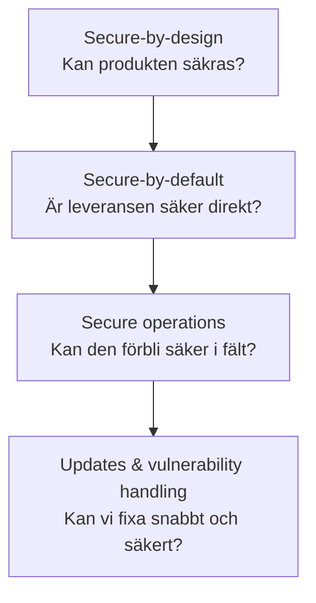
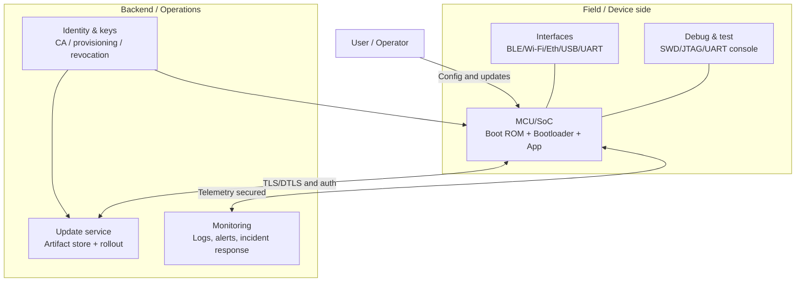
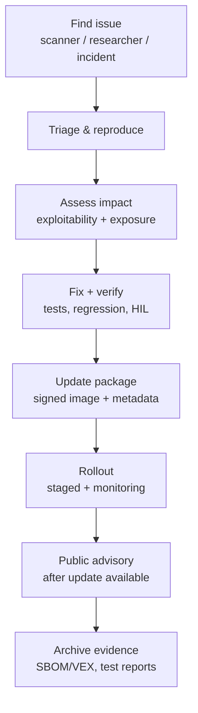
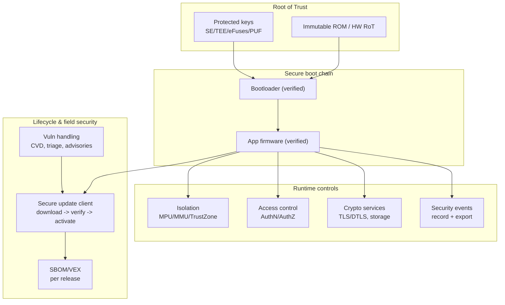
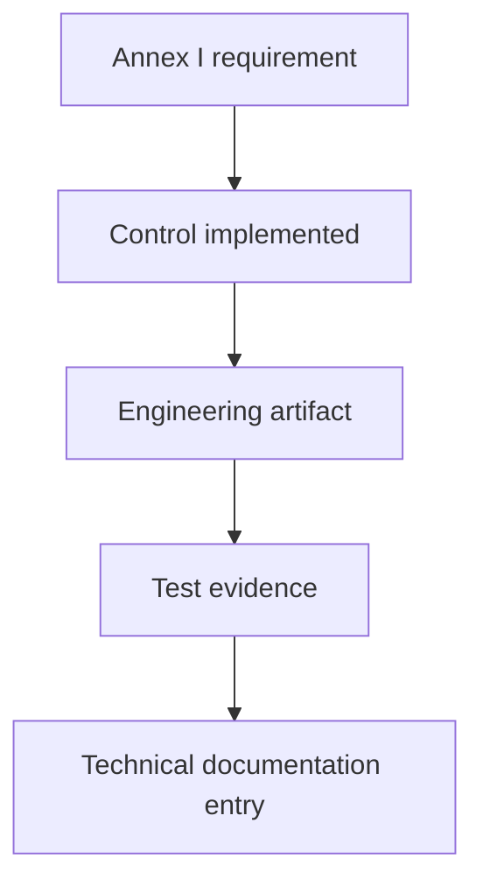

---
id: cra-fundamental-security
slug: /security/cra/fundamental-security-requirements
title: Grundläggande säkerhetskrav
sidebar_position: 3
---

## Vad CRA faktiskt kräver (ingenjörstolkning)

Cyber Resilience Act (CRA) är teknikneutral men **inte vag**: produkter med digitala element (PDE) ska **designas, utvecklas och produceras** för att nå en "lämplig cybersäkerhetsnivå baserat på riskerna" (Bilaga I, del I(1)) och listar sedan **konkreta egenskaper** du måste leverera (Bilaga I, del I(2)(a-m)).[1]

För inbyggda system blir frågan:

> Kan vi visa – med designdokument, testresultat och driftprocesser – att enhet, firmware och uppdaterings-ekosystem skyddar **konfidentialitet, integritet, tillgänglighet**, och att vi kan hålla produkten säker **hela supportperioden**?[1][2]

Den här sidan är för MCU/SoC-produkter (sensorer, gateways, PLC:er, industri-/konsumentenheter) och översätter CRA-språk till kontroller och evidens som kan lagras i **technical documentation** (Bilaga VII).[4]

---

## Secure-by-design vs secure-by-default (blanda inte ihop dem)

Båda krävs, men är olika:

- **Secure-by-design** = *arkitekturbesluten* som gör säkerhet möjlig (root of trust, boot chain, isolering, nyckellivscykel, uppdateringsväg, loggning). Styrs av riskbedömningen (Art. 13(2)-(3)) och ska landa i att uppfylla Bilaga I.[2][1]
- **Secure-by-default** = *leveranskonfigurationen* som är säker dag 0 utan att användaren är säkerhetsexpert. CRA kräver uttryckligen **secure-by-default** vid marknadsplacering (Bilaga I, del I(2)(b)).[1]

Tänk så här:

Om secure-by-design är svagt (ingen pålitlig boot, inget nyckelskydd, ingen uppdateringsmekanism) blir secure-by-default en checklista utan trovärdig evidens.

---

## Referensmodell för inbyggt (vad granskare vill förstå)

CRA-evidens blir enklast när du definierar en **referensarkitektur** och visar hur varje krav implementeras över trust boundaries.

**Poängen:** granskare tittar på (1) vad som ingår i PDE, (2) vilka externa tjänster som krävs för säkerhet (uppdateringar, identitet, övervakning) och (3) hur kompromettering begränsas.

---

## Bilaga I översatt till inbyggda enheter

Bilaga I del I är "säkerhetsegenskapslistan". Nedan behålls CRA-referensen och översätts till kontroller + evidens som går att skeppa.

### Del I(1): "Lämplig nivå av cybersäkerhet baserat på risk"

Topregeln: en dokumenterad och underhållen **cybersecurity risk assessment** ska motivera säkerhetsnivån (Art. 13(2)-(3)).[2] Den ska visa hur Bilaga I del I(2) gäller och implementeras.[2][1]

Praktiskt för inbyggt:
- definiera **säkerhetsmiljö** (driftsmiljö, fysisk åtkomst, nätverksexponering),
- identifiera tillgångar (nycklar, credentials, säkerhetsfunktioner, IP),
- definiera angriparförmåga (remote, lokal, supply chain),
- välj kontroller proportionellt till riskprofilen.

### Del I(2)(a): "Inga kända exploaterbara sårbarheter" vid release

Krav: PDE ska släppas **utan kända exploaterbara sårbarheter**.[1]

Inbyggt:
- sårbarhetsskanning för **alla tredjepartskomponenter** (RTOS, TLS-stack, bootloader, bibliotek),
- firmwarekomposition är spårbar (SBOM) och CVE:er triageras (VEX vid behov),
- säkerhetstester (statisk analys + fuzzning av parsers/protokoll) är release-gate.

Evidens: releasesäkerhetsrapport, CVE-triageloggar, SBOM-snapshot, säkerhetstestresultat.[4][1]

### Del I(2)(b): Secure-by-default + återställning

Krav: **secure-by-default-konfiguration** och möjlighet att **återställa till ursprungsläge**.[1]

Inbyggt (exempel):
- debug-portar låsta i produktion (eller styrda via signerad challenge/RMA-procedur),
- inga default-adminlösenord; om credentials finns är de unika och roterbara,
- nätverkstjänster av som default om de inte krävs (inga öppna telnet/FTP; minimera lyssnare),
- fabriksåterställning raderar användarhemligheter och återställer härdad baseline.

Evidens: "secure defaults"-matris (tjänster/funktioner vs default) + specifikation av factory reset.[4][1]

### Del I(2)(c): Säkerhetsuppdateringar (auto default + opt-out)

Krav: sårbarheter ska kunna åtgärdas via **säkerhetsuppdateringar** och, där tillämpligt, **automatiska säkerhetsuppdateringar aktiverade som default**, med tydlig opt-out och möjlighet att skjuta upp.[1] Användarinstruktioner ska visa hur auto-uppdatering stängs av.[3]

Inbyggt:
- säker uppdateringsmekanism: signerade bilder verifieras före aktivering, rollback-säkert,
- uppdateringspolicy: staged rollout, kompatibilitetskontroller, recovery vid strömavbrott mitt i uppdatering,
- hanterings-UX: tydlig uppdateringsstatus och kontroll (opt-out/postpone där det krävs).

Evidens: uppdateringsarkitektur, signeringspolicy, rolloutprocedur, testloggar för uppdateringsfel.[4][1]

### Del I(2)(d): Skydd mot obehörig åtkomst + rapportering

Krav: skydd mot obehörig åtkomst med lämpliga kontrollmekanismer och **rapportering av möjlig obehörig åtkomst**.[1]

Inbyggt:
- enhetsidentitet (unik credential/cert per enhet),
- autentisering och auktorisering för managementåtgärder (konfig, debug-unlock, uppdateringar),
- rate limits / lockouts mot bruteforce,
- loggning av auth-fel och privilegieändringar.

Evidens: access control-modell (roller), auth-protokollspec, event/log-taksonomi.[4][1]

### Del I(2)(e): Konfidentialitet för data i vila och transit

Krav: skydda konfidentialitet för lagrad/överförd/behandlad data (t.ex. kryptering i vila/transit med state-of-the-art).[1]

Inbyggt:
- TLS/DTLS med moderna cipher suites,
- krypterad lagring av hemligheter (nycklar/token) via secure element/TEE eller härledda nycklar,
- skydda känsliga tillgångar i RAM där möjligt (isolering + nollställning vid reset).

Evidens: kryptoprofil, nyckelhanteringsplan, "data classification & flows"-dokument.[4][1]

### Del I(2)(f): Integritet för data/kommandon/program/konfig + rapportering

Krav: skydda integritet mot manipulation som inte är auktoriserad av användaren, och **rapportera korruption**.[1]

Inbyggt:
- secure boot som verifierar firmware-signaturer (och measured boot där möjligt),
- integritetsskyddad konfiguration (signerade config-buntar, monotona räknare),
- attestering eller periodiska integritetskontroller för kritiska områden (boot-flaggor, säkerhetstillstånd),
- korruptionsrapportering via loggar/telemetri (t.ex. misslyckad signaturkontroll, CRC-fel).

Evidens: beskrivning av secure boot chain, design för konfigintegritet, testfall för integritetsfel.[4][1]

### Del I(2)(g): Dataminimering

Krav: behandla bara data som är adekvat, relevant och begränsad till det som behövs för avsett syfte.[1]

Inbyggt:
- samla bara telemetri som krävs för säkerhet/drift,
- undvik "always-on"-identifierare om de inte behövs,
- definiera retention-fönster och sampling-policy på enheten.

Evidens: telemetrisystem med motivering per fält + retentionpolicy.[4][1]

### Del I(2)(h) + (i): Tillgänglighet och att inte skada andra

Krav: skydda tillgänglighet för väsentliga/grunda funktioner, inklusive resiliens/DoS-mitigering, och minimera negativ påverkan på andra enheter/nät.[1]

Inbyggt:
- watchdog + säkert recovery-läge,
- rate limiting för nätverkspunkter; gränser på resursanvändning (CPU, heap, köer),
- robust indata-validering för protokollparsers,
- "fail secure/close"-beslut för säkerhetskritiska vägar.

Evidens: tillgänglighetsanalys, robusthetstestresultat, resursbudgetgränser.[4][1]

### Del I(2)(j) + (k): Attackyta och exploateringsmitigering

Krav: begränsa attackytan (särskilt externa gränssnitt) och reducera incidentpåverkan via mitigeringar.[1]

Inbyggt:
- stäng av oanvända periferier/protokoll vid build,
- dela upp privilegierad vs oprivilegerad exekvering (MPU/MMU; TrustZone-M/A om finns),
- hårdnade builds: stack canaries, W^X där möjligt, CFI där det stöds,
- strikt parsing för all inkommande data (kommandon, OTA-manifest, BLE-attribut).

Evidens: interfaceinventering, isoleringsdesign, compiler/hardening-flaggor, motivering för tradeoffs.[4][1]

### Del I(2)(l): Loggning och övervakning (med opt-out)

Krav: registrera och övervaka relevant intern aktivitet (åtkomst till/ändring av data/tjänster/funktioner) och erbjuda opt-out.[1]

Inbyggt:
- lista över säkerhetshändelser: boot-utfall, auth-fel, debug-unlock-försök, uppdateringsfel, integritetslarm,
- manipulationsskyddad logglagring (ringbuffer med integritetsskydd) eller säker export,
- explicit opt-out-väg för användare där kontexten kräver det (dokumentera vad "opt-out" betyder för er enhetstyp).

Evidens: händelsetaksonomi + loggskydd + säker exportkanal.[4][1]

### Del I(2)(m): Secure deletion + säker överföring

Krav: användare ska kunna ta bort all data/inställningar permanent på ett säkert och enkelt sätt, och överföring ska vara säker när data kan flyttas.[1][3]

Inbyggt:
- "secure wipe" som täcker credentials, användardata och konfig (även i extern flash),
- säker avvecklingsprocedur i användardokumentation,
- om migration finns (t.ex. flytta config till ny enhet) ska överföring vara autentiserad och konfidentialitetsskyddad.

Evidens: design för secure wipe + verifikationsmetod (hur ni bevisar wipe) + användarinstruktioner.[3][4][1]

---

## Bilaga I del II: Sårbarhetshantering (livscykelmuskeln)

Del II är obligatorisk och där många inbyggda team faller eftersom säkerhet behandlas som engångschecklista.

CRA kräver bl.a.: **SBOM**, snabb åtgärd via säkerhetsuppdateringar, regelbundna tester, publika advisories efter uppdatering, CVD-policy/kontakt, och säker uppdateringsdistribution (ev. automatiskt), med säkerhetsuppdateringar utan dröjsmål och normalt utan kostnad.[1]

Planera för:
- **strömavbrottståliga uppdateringar** (A/B-slotar, swap/overwrite-strategi, recovery-läge),
- **segmentsdifferentiering** i fält (varianter, minneskartor, region-SKU:er),
- **långa supportperioder** där kiselbegränsningar gör backport svårt,
- säkerhetsuppdateringar separerade från featureuppdateringar där det går.[1]

---

## Allt samlat: ett "minimum credible" blueprint för inbyggt

Detta är inte enda designen, men ett vanligt mönster som mappar rent till Bilaga I:

Varje block mappar tillbaka till Bilaga I del I(2) och del II.[1]

---

## Evidens: vad som ska in i technical documentation

CRA:s technical documentation ska minst innehålla systemarkitektur, riskbedömning som visar hur Bilaga I tillämpas, specifikation av sårbarhetshantering (inkl. SBOM och säker uppdateringsdistribution) och testrapporter.[4][2]

Använd en "evidenskarta" så du kan svara på revision snabbt:

Exempel:
- Bilaga I(2)(c) uppdateringar → signerad OTA-design → uppdateringstestloggar → Bilaga VII punkt 2(b) + punkt 6.[1][4]
- Bilaga I(2)(j) attackyta → interfaceinventering → portskanning + fuzzresultat → Bilaga VII punkt 2(a) + punkt 6.[1][4]
- Del II(1) SBOM → SBOM i CycloneDX/SPDX → arkiverad per release → Bilaga VII punkt 2(b) + punkt 8 (på begäran).[1][4]

---

## Vanliga problem i inbyggt (använd som kontrollista)

Om det är oklart hur du implementerar/dokumenterar detta kapitel är det ofta något av följande:

1. **Oklar säkerhetsmiljö**: antaganden om fysisk åtkomst saknas, så "lämplig nivå" kan inte motiveras.[2][1]
2. **Ingen enhetlig uppdateringsstory**: flera SKU:er/bootvägar men bara en dokumenterad/testad (bryter Bilaga I(2)(c)-evidens).[1][4]
3. **Debug styrs inte**: SWD/JTAG/UART-policy är "stamkunskap" (skadar secure-by-default och attackytereduktion).[1]
4. **Oklar identitetsmodell**: ingen tydlig enhetsidentitet, roller eller accesskontroll för underhåll (missar Bilaga I(2)(d)).[1]
5. **Nyckellivscykel saknas**: provisioning, rotation, revokering, RMA inte designade (svagt konfidentialitets-/integritetsskydd).[1]
6. **Loggning ses som "nice to have"**: ingen händelsetaksonomi, inget skydd, ingen export, ingen definierad opt-out.[1]
7. **Secure wipe glöms**: factory reset finns men hemligheter blir kvar i flash/extern lagring (missar Bilaga I(2)(m) och användarinstruktioner).[1][3]
8. **SBOM utan drift**: SBOM genereras en gång men ingen triage/VEX och ingen koppling till release-gates (missar del II(1-2)).[1]
9. **Tillgänglighet testas inte**: watchdog/recovery finns men aldrig körda under DoS/resursstress.[1]
10. **Evidens utspridd**: artefakter finns men är inte refererade och versionerade i technical file (Bilaga VII blir plågsam).[4]

Om du bara fixar en sak: bygg en **reproducerbar releasepipeline** som producerar (1) signerade artefakter, (2) SBOM/VEX, (3) säkerhetstestresultat och (4) en kort "Bilaga I-täckningsrapport" med evidens per klausul.[1][4]

---

## Referenser

[1]: Regulation (EU) 2024/2847 (Cyber Resilience Act) - Annex I (Part I & Part II) (EUR-Lex) https://eur-lex.europa.eu/legal-content/EN/TXT/?uri=CELEX:32024R2847

[2]: Regulation (EU) 2024/2847 - Article 13 (risk assessment, lifecycle integration, due diligence, vulnerability handling linkage) (https://eur-lex.europa.eu/legal-content/EN/TXT/?uri=CELEX:32024R2847)

[3]: Regulation (EU) 2024/2847 - Annex II (user information: support period, update install, auto-update opt-out instructions, decommissioning) (https://eur-lex.europa.eu/legal-content/EN/TXT/?uri=CELEX:32024R2847)

[4]: Regulation (EU) 2024/2847 - Annex VII (technical documentation content: architecture, SBOM/CVD/update distribution, risk assessment mapping, test reports) (https://eur-lex.europa.eu/legal-content/EN/TXT/?uri=CELEX:32024R2847)

[5]: Regulation (EU) 2024/2847 - Article 3 definitions (e.g., SBOM, vulnerability, exploitable vulnerability, actively exploited vulnerability, significant cybersecurity risk) (https://eur-lex.europa.eu/legal-content/EN/TXT/?uri=CELEX:32024R2847)

[6]: NIST SP 800-218 (SSDF) (https://csrc.nist.gov/publications/detail/sp/800-218/final)

[7]: ETSI EN 303 645 v3.1.3 (Consumer IoT baseline) https://www.etsi.org/deliver/etsi_en/303600_303699/303645/03.01.03_60/en_303645v030103p.pdf

[8]: IEC 62443-4-2 (IACS component technical security requirements) (standard reference; obtain via IEC/ISA)
