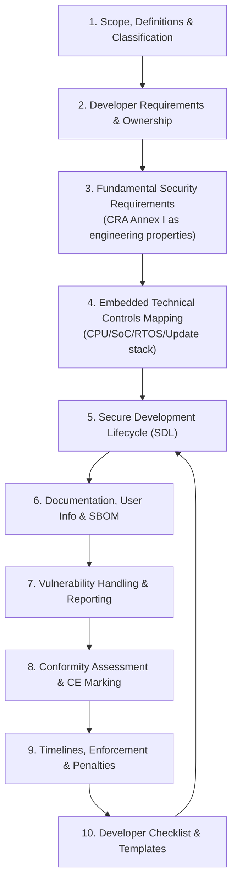
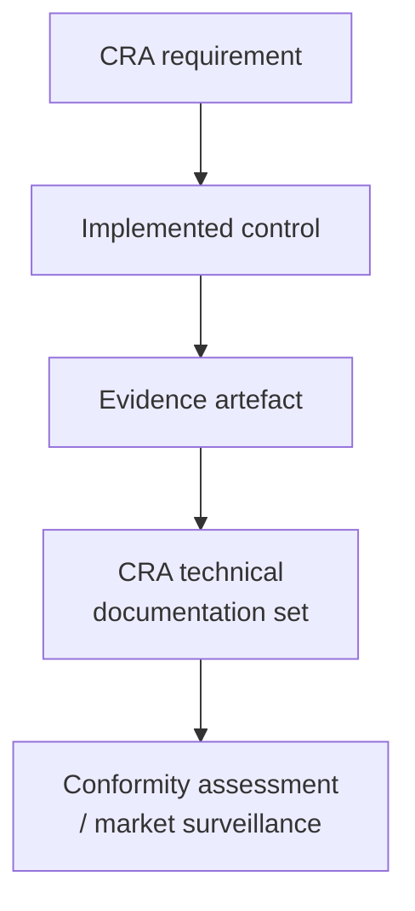

---
id: cra-overview
slug: /security/cra
title: CRA för inbyggda produkter – praktisk implementationsguide
sidebar_position: 1
---
import DocCardList from '@theme/DocCardList';
import {useCurrentSidebarCategory} from '@docusaurus/theme-common';

## Varför den här guiden finns

Cyber Resilience Act (CRA) handlar inte bara om att *ha* säkerhetsfunktioner – det handlar om att kunna **visa** att din produkt har **designats, utvecklats, producerats och underhållits** med cybersäkerhet i åtanke, och att du kan hålla den säker efter release. I praktiken betyder det att översätta legala krav till:

- **ingenjörsbeslut** (arkitektur, boot chain, isolering, kryptografi, uppdateringsväg),
- **upprepningsbara processer** (SDL, supply chain-kontroll, PSIRT),
- och **bevis** som du kan paketera i CRA:s tekniska dokumentation.

Den här dokumentationen hjälper inbyggda team att göra just detta: **omvandla CRA-krav till implementerbara kontroller + mätbara bevis**, release efter release.

> Detta är en ingenjörsinriktad implementationsguide. För juridisk tolkning och gränsfall (scope-undantag, rollfördelning, avtalstexter) – verifiera med juridik/compliance.

---

## Vad du uppnår om du följer guiden

I slutet har du en CRA-redo baslinje som är *revisionbar*:

- Ett **tydligt scope-beslut** (är det ett PDE? viktigt/kritiskt? vilka varianter omfattas?)
- Ett **riskdrivet säkerhetskrav-set** kartlagt mot CRA bilaga I
- En **arkitektur som fungerar som bevis** (trust boundaries, identitet, boot, uppdateringar, dataflöden)
- En **Secure Development Lifecycle** med dokumenterade outputs (granskningar, tester, verktyg, gates)
- Ett **dokumentationspaket** som matchar CRA:s förväntningar på teknisk dokumentation (bilaga VII) och användarinformation (bilaga II)
- Ett fungerande **flöde för sårbarhetshantering och rapportering**
- En **konformitetsväg** (egenbedömning vs notified body) och CE-förberedelse
- En **release-checklista** som kopplar varje påstående till bevis (tickets, PR:er, loggar, SBOM/VEX)

---

## Hur sidorna hänger ihop (läs i denna ordning)

---

## "Evidence-first"-mindsetet (den riktiga CRA-acceleratorn)

Snabbaste vägen till CRA-redo är att behandla varje säkerhetsbeslut som **två outputs**:

1) **en teknisk kontroll** (något implementerat eller konfigurerat), och  
2) **ett bevisartefakt** (något du kan peka på senare).

Exempel:
- "Secure boot är påtvingat" ? konfiguration + signerade bilder + verifieringsloggar + testresultat  
- "Uppdateringsmekanismen är säker" ? uppdateringsdesign + policy + rollback-tester + staged rollout-loggar  
- "Inga kända exploaterbara sårbarheter vid release" ? SBOM + VEX + triage-protokoll + fix-commits  

Därför avslutas varje sida i guiden med: **vad du måste producera** (artefakter) och **var det ska ligga** (repo, CI-loggar, technical file).

---

## Utforska CRA-ämnen

<DocCardList items={useCurrentSidebarCategory()?.items ?? []} />

---

## Embedded-specifik verklighetskontroll (fokus i guiden)

De flesta CRA-råd är teknikneutrala. Här gör vi det konkret för inbyggda produkter:

- **MCU/SoC-begränsningar** (MPU/MMU, TrustZone-M/A, säkert lagringsutrymme, låst debug)
- **RTOS-realitet** (privilegeseparation, användarland, integration av säker bootloader)
- **fältuppdateringar** (A/B-slotar, strömavbrottshantering, rollback-policy)
- **supply chain-synlighet** för firmware (SBOM per build + per variant)
- **gränser mellan device ? app ? gateway ? cloud** (vad som i praktiken ingår i PDE-"systemet")

---

## Vanliga problem den här guiden hjälper dig undvika

Du stöter på dessa i riktiga revisioner och incidenter:

- "Vi vet inte exakt vad som är **inom scope** (bara enhet? app? moln?)"
- "Vi kan inte förklara **varför** vi valde dessa kontroller (ingen risk-till-kontroll-karta)"
- "Vi har säkerhetsfunktioner men **ingen beviskedja** (inga loggar, inga dokument, ingen repeterbarhet)"
- "Vi släpper flera varianter men SBOM/konfigurationer är **inte variantmedvetna**"
- "Uppdateringar finns, men rollback, nyckelhantering och felmoder är **inte bevisade**"
- "Sårbarhetshantering är informell (ingen PSIRT-process, inga svarstider)"
- "CE/DoC hanteras sent och engineering kan inte svara på **technical file**-frågor snabbt"

Om något känns igen: börja med **Scope & Definitions**, gå sedan vidare till **Fundamental Security Requirements** och **Embedded Technical Controls**.

---

## Var kraven kommer ifrån

Guiden lutar sig mot den legala CRA-texten, främst:
- **Bilaga I** (väsentliga krav)  
- **Bilaga II** (användarriktad säkerhetsinformation)  
- **Bilaga VII** (innehåll i teknisk dokumentation)  
- samt CRA:s skrivningar om sårbarhetshantering/rapportering och vägar för conformity assessment.

[1]: https://eur-lex.europa.eu/legal-content/EN/TXT/?uri=CELEX:32024R2847 "Regulation (EU) 2024/2847 - Cyber Resilience Act (CRA)"
