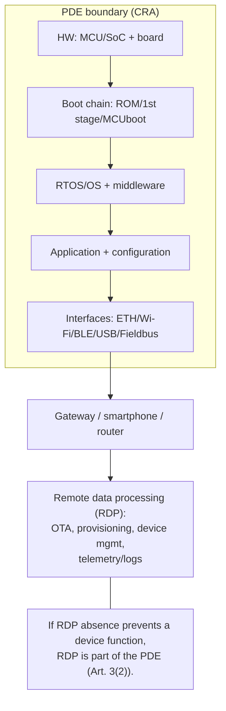
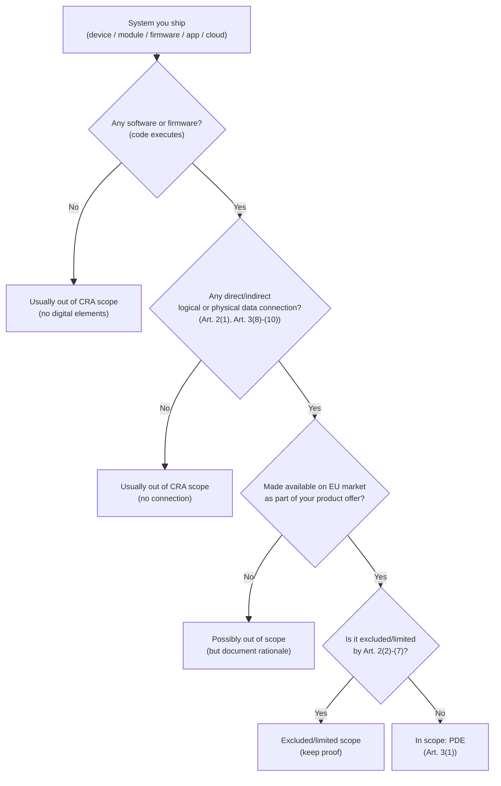
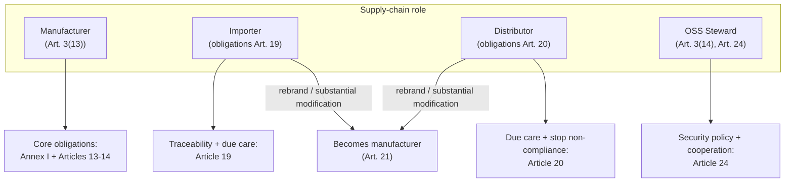
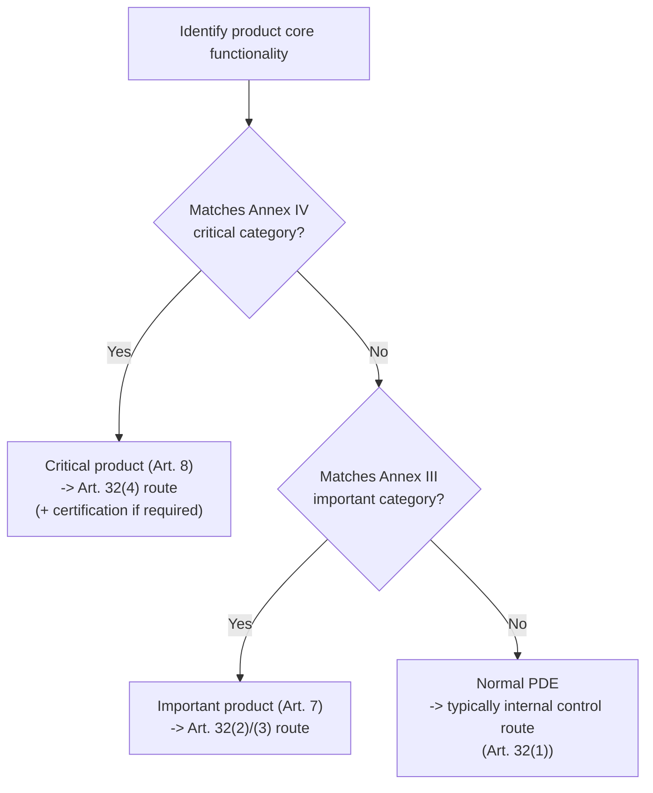

---
id: cra-scope-definitions
slug: /security/cra/scope-and-definitions
title: Scope, definitioner och klassificering
sidebar_position: 2
---

## Varför scope är viktigt (för inbyggda team)

Cyber Resilience Act (CRA) är en **CE-märkningsförordning för cybersäkerhet**: den definierar *vad* som måste byggas in, *hur* tillverkaren ska hantera sårbarheter över tid och *vilket bevis* som ska finnas i technical file.

För en inbyggd produkt avgör tidig scope-sättning:

- den **säkerhetsnivå** du måste konstruera (bilaga I),
- **conformity assessment-vägen** (egen vs tredjepart), styrd av om du omfattas av **bilaga III / bilaga IV**,
- storlek och livslängd på din **tekniska dokumentation** (inklusive uppdateringar under supportperioden),
- och driftsskyldigheterna för **sårbarhetshantering** och **säkerhetsuppdateringar**.

---

## 1) CRA scope: den legala utlösaren, översatt till teknik

CRA gäller **products with digital elements** som släpps på EU-marknaden **när avsett syfte eller rimligen förutsebar användning inkluderar en direkt eller indirekt logisk eller fysisk datakoppling till en enhet eller ett nätverk** (Art. 2(1)).

Om din enhet (eller dess mjukvara) kan utbyta data via *något* gränssnitt som rimligen kan kopplas till ett nätverk, anta att CRA gäller.

### Datakoppling (vad som "räknas")

CRA definierar uttryckligen:

- **logisk koppling**: en virtuell representation via mjukvarugränssnitt (Art. 3(8));
- **fysisk koppling**: koppling med fysiska medel, inklusive kablar eller radio (Art. 3(9));
- **indirekt koppling**: koppling sker som del av ett större system som kan kopplas direkt (Art. 3(10)).

För inbyggda produkter är därför alla dessa "kopplingar" i CRA-mening:

- Ethernet, Wi-Fi, cellular, Thread, BLE, Zigbee, LoRaWAN
- USB (CDC/DFU), UART, SPI, I2C via gateway/host
- CAN / CAN-FD, Modbus, RS-485, PROFINET, EtherCAT när de bryggas till IP
- debuggränssnitt (SWD/JTAG) om de kan nås i fält (riskbedömning)

---

## 2) Centrala definitioner du måste använda konsekvent

### 2.1 Product with Digital Elements (PDE)

Ett **product with digital elements** är en mjukvaru- eller hårdvaruprodukt **och dess remote data processing-lösningar**, inklusive komponenter som släpps separat (Art. 3(1)).

Tekniktolkning:

- Ett enda "PDE" kan vara **enhet + firmware + mobilapp + molnbackend**, om den avlägsna delen krävs för enhetsfunktion.
- Ett **mjukvaru-only** leverabel kan vara ett PDE (t.ex. gateway-agent).
- En modul/SDK/bibliotek kan vara ett PDE om du släpper det på marknaden under din kontroll.

### 2.2 Remote data processing (RDP)

**Remote data processing** är databehandling på avstånd, designad/utvecklad av (eller under ansvar av) tillverkaren, **och utan vilken PDE:n skulle hindras från att utföra en funktion** (Art. 3(2)).

Det är centralt i inbyggda ekosystem eftersom OTA, provisioning, telemetri och fleet management ofta ligger off-device.

#### PDE-gränsdiagram (typisk inbyggd produkt)

---

## 3) Vad som är utanför scope (och vad som INTE är det)

### 3.1 Tydliga undantag (Art. 2)

CRA **gäller inte**:

- vissa sektorsreglerade produktfamiljer i Art. 2(2)-(4) (t.ex. särskilda medicintekniska regimer; luftfartsregimer);
- reservdelar som ersätter identiska komponenter till samma specifikationer (Art. 2(6));
- produkter som utvecklats eller ändrats exklusivt för nationell säkerhet/försvar, eller specifikt för att hantera klassificerad info (Art. 2(7)).

CRA kan också begränsas/uteslutas där andra EU-regler redan hanterar samma cybersäkerhetsrisker på samma eller högre nivå (Art. 2(5)).

### 3.2 Vanliga missen "FOSS är utanför scope"

**Använd inte Art. 2 som generellt FOSS-undantag.** CRA har istället ett *specifikt regime* för **open-source software stewards** (Art. 3(14), Art. 24) och hanterar kommersiell placering och roller noga.

Om du skeppar en kommersiell enhet som innehåller öppen källkod är enheten fortfarande ett PDE och du bär tillverkaransvaret.

---

## 4) "Är min inbyggda produkt inom scope?" – beslutsflöde

Om du hamnar på **"In scope: PDE"**, fortsätt med:
- *Fundamental Security Requirements* (bilaga I, del I),
- *Secure Development Lifecycle / processer* (bilaga I, del II),
- *Sårbarhetshantering & rapportering* (Art. 14 + bilaga I del II),
- och *Conformity assessment* (Art. 32 + bilaga VIII).

---

## 5) Roller: vem äger vilka skyldigheter?

CRA tilldelar skyldigheter till **economic operators** (Art. 3(12)). För inbyggda kedjor är nyckelrollerna:

### 5.1 Manufacturer (du äger säkerhetsberättelsen)

En **manufacturer** är varje fysisk/juridisk person som utvecklar/tillverkar ett PDE (eller får det designat/utvecklat/tillverkat) och marknadsför det under eget namn/varumärke, oavsett betalning (Art. 3(13)).

Praktiskt: om du styr **firmwareinnehåll**, **uppdateringspolicy** och **CE-dossier**, är du tillverkare även om hårdvaran är ODM/EMS.

Tillverkarens skyldigheter finns främst i **Artiklarna 13 och 14** (t.ex. säkerställa bilaga I-efterlevnad; ta fram dokumentation och EU DoC; sårbarhetshantering; incidentrapportering; supportperiod; ge uppdateringar).

### 5.2 Importör

Importörens skyldigheter finns i **Artikel 19** (spårbarhet, behålla DoC, tillhandahålla teknisk dokumentation till myndigheter, korrigerande åtgärder, rapportera betydande cybersäkerhetsrisk etc.).

### 5.3 Distributör

Distributörens skyldigheter finns i **Artikel 20** (due care; verifiera CE-märkning och dokumentation; inte marknadsföra icke-efterlevande produkter; informera tillverkare om sårbarheter; samarbeta med myndigheter).

### 5.4 När importör/distributör blir "manufacturer"

Om en importör eller distributör släpper ett PDE på marknaden under eget namn/varumärke **eller gör en substantial modification** behandlas de som tillverkare och omfattas av Artiklarna 13 och 14 (Art. 21).

Andra som gör substantial modification och släpper produkten behandlas också som tillverkare för den ändrade omfattningen (Art. 22).

### 5.5 Open-source software stewards (om relevant)

En **open-source software steward** definieras i Art. 3(14). Deras skyldigheter finns i Art. 24 (cybersäkerhetspolicy, samarbete med myndigheter och särskilda incidentplikter när de driver infrastrukturen för utveckling).

#### Rolldiagram

---

## 6) Klassificering: normal vs important vs critical

Detta styr din conformity assessment-väg och granskningens djup.

### 6.1 Important products (bilaga III)

Produkter vars **core functionality** matchar kategorier i **bilaga III** är **important products** och omfattas av de bedömningsförfaranden som refereras i Art. 32(2) och (3) (Art. 7(1)).

Bilaga III är uppdelad i **Class I** och **Class II**; kommissionen kan uppdatera listan (Art. 7(3)) och publicerar tekniska beskrivningar (Art. 7(4)).

### 6.2 Critical products (bilaga IV)

Produkter med core functionality i **bilaga IV** är **critical products**. De måste visa conformity via europeiskt cybersäkerhetscertifieringsschema (om krävt) eller de högre assurance-vägarna (Art. 8 + Art. 32(4)).

### 6.3 Praktiskt klassificeringsflöde

**Ingenjörstips:** "core functionality" är inte samma som "innehåller ett bibliotek". Om du bäddar in en SSH-server i en sensor är frågan om SSH är en kärnfunktion för den marknadsförda produkten, inte bara att den finns.

---

## 7) CRA-ordlista du återanvänder (definiera en gång)

Använd CRA-definitionerna så att riskbedömning, arkitektur och uppdateringspolicy är konsekventa:

- **cybersecurity risk** och **significant cybersecurity risk** (Art. 3(37)-(38))
- **SBOM** (Art. 3(39))
- **vulnerability / exploitable / actively exploited** (Art. 3(40)-(42))
- **incident impacting the security of the PDE** (Art. 3(44))

Dessa styr hur du avgör om något triggar rapportering och hur du argumenterar "inga kända exploaterbara sårbarheter" vid release.

---

## 8) Praktiska inbyggda leverabler som *bevisar scope-beslut*

För revision/market surveillance bör du kunna visa en tydlig kedja:

1. **Scope statement** (1 sida): PDE-gräns + RDP-gräns + gränssnitt. (Art. 2(1), Art. 3(1)-(2))
2. **Konnektivitetsinventering**: fysiska/logiska gränssnitt, vilka som exponeras i produktion, och hur de skyddas. (Art. 3(8)-(10))
3. **Rolldeklaration**: mapping manufacturer/importer/distributor + vem som driver uppdateringsinfran. (Art. 3(12)-(14), Art. 19-21, Art. 24)
4. **Klassificeringsbeslut**: bilaga III/IV-check med "core functionality"-motivering. (Art. 7-8)
5. **Change-control-regel**: vad som räknas som "substantial modification" internt och hur ni kör om klassificering + riskbedömning. (Art. 21-22)

---

## 9) Vanliga problem team stöter på här (och hur de löses)

### A) "Var drar vi PDE-gränsen?"
**Vanligt problem:** team dokumenterar bara enheten men OTA/provisioning/telemetri krävs för drift.  
**Lösning:** om avsaknad av RDP hindrar en funktion, behandla den som RDP inom PDE-gränsen (Art. 3(2)). Dokumentera den i arkitekturdiagram och riskbedömning.

### B) "Är USB / UART / BLE verkligen en 'nätverkskoppling'?"
**Vanligt problem:** "det är lokalt, så CRA gäller inte."  
**Lösning:** CRA scope inkluderar indirekta kopplingar (Art. 2(1) + Art. 3(10)). Om gränssnittet realistiskt kan brygga till nätverk, ta med det i scope och threat model.

### C) "Vi använder open source, är vi undantagna?"
**Vanligt problem:** blandar ihop FOSS stewardship med tillverkarskyldigheter.  
**Lösning:** din kommersiella produkt är fortfarande ett PDE; du är tillverkare (Art. 3(13)). FOSS steward-plikter (Art. 24) tar inte bort tillverkarplikter.

### D) "Vi är distributör men lägger till vår firmware"
**Vanligt problem:** distributör tror på "lätta" skyldigheter men flashar om firmware och rebrandar.  
**Lösning:** rebranding eller substantial modification kan göra dig till manufacturer (Art. 21-22). Behandla releasen som en tillverkarsrelease (Artiklarna 13-14).

### E) "Important/critical-klassning är oklar"
**Vanligt problem:** närvaro av komponent vs core functionality.  
**Lösning:** dokumentera vad produkten är *till för*; mappa mot bilaga III/IV via **core function** (Art. 7-8). Lägg motiveringen i technical file.

### F) "Vi vet inte vad som ska in i technical file än"
**Lösning:** ha åtminstone scope-diagram, interface-inventering, rollmapping, klassificeringsbeslut och change-control-regel. CRA kräver teknisk dokumentation innan marknadsföring och uppdaterad under supportperioden (Art. 31).

---

## Referenser (normativa)

[1] Regulation (EU) 2024/2847 (Cyber Resilience Act) - konsoliderad text (EUR-Lex): https://eur-lex.europa.eu/legal-content/EN/TXT/?uri=CELEX:32024R2847  
[2] CRA Artikel 2 (Scope) - se [1], Art. 2(1)-(7).  
[3] CRA Artikel 3 (Definitioner: PDE, RDP, logisk/fysisk/indirekt koppling, manufacturer, OSS steward) - se [1], Art. 3(1)-(14).  
[4] CRA Artiklar 7-8 (Important/Critical products) och bilaga III-IV - se [1], Art. 7-8 och bilagor.  
[5] CRA Artiklar 19-22 och 24 (Importör/Distributör-plikter, när de blir manufacturer; OSS stewards) - se [1], Art. 19-22 och Art. 24.  
