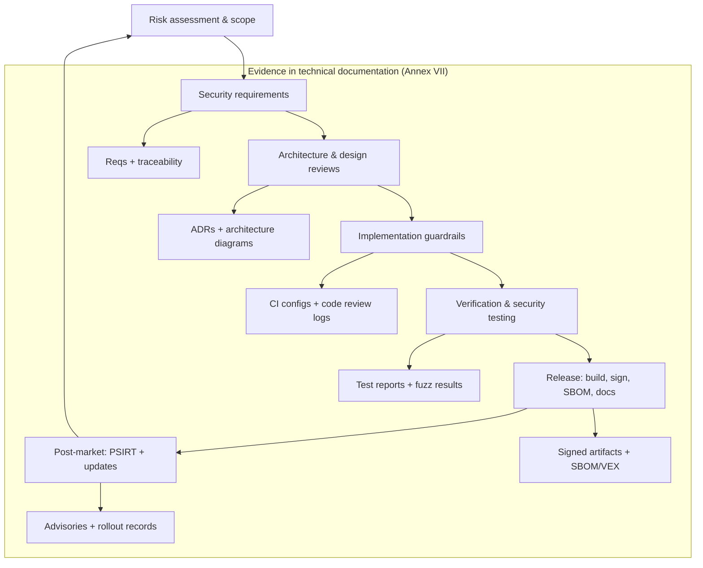
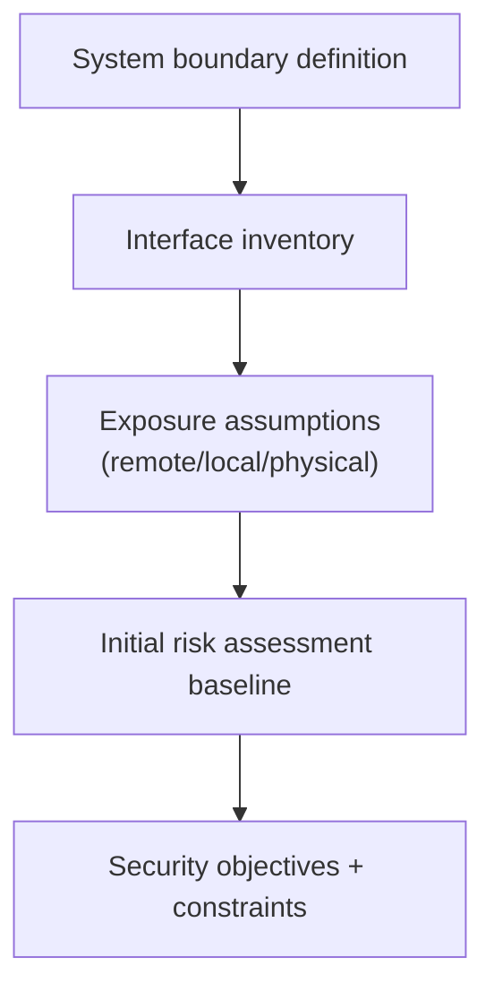
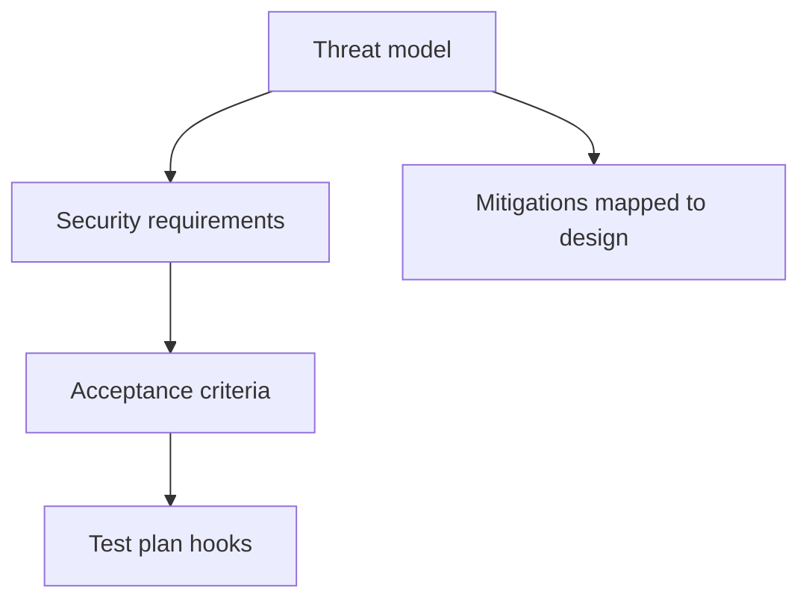
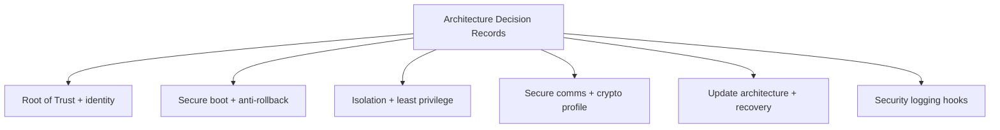
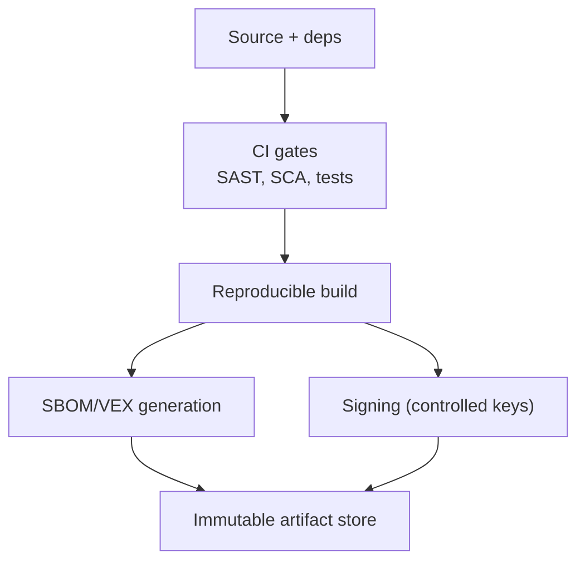
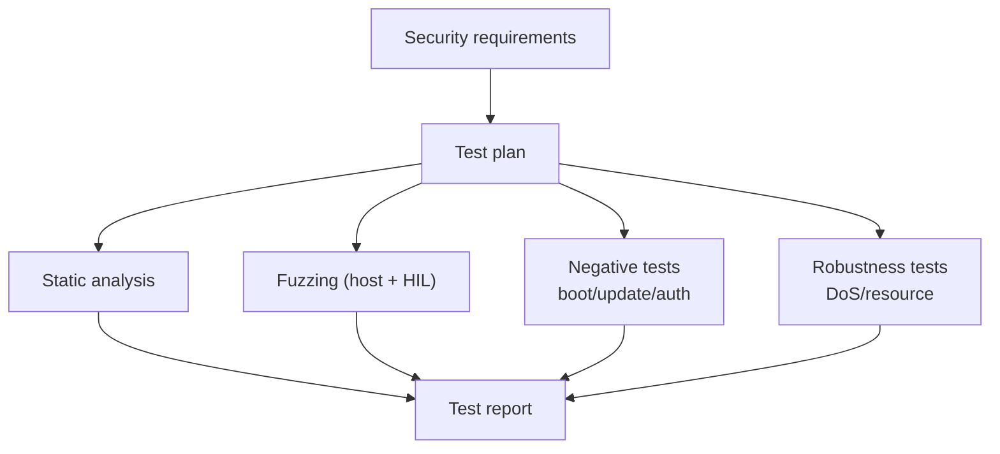
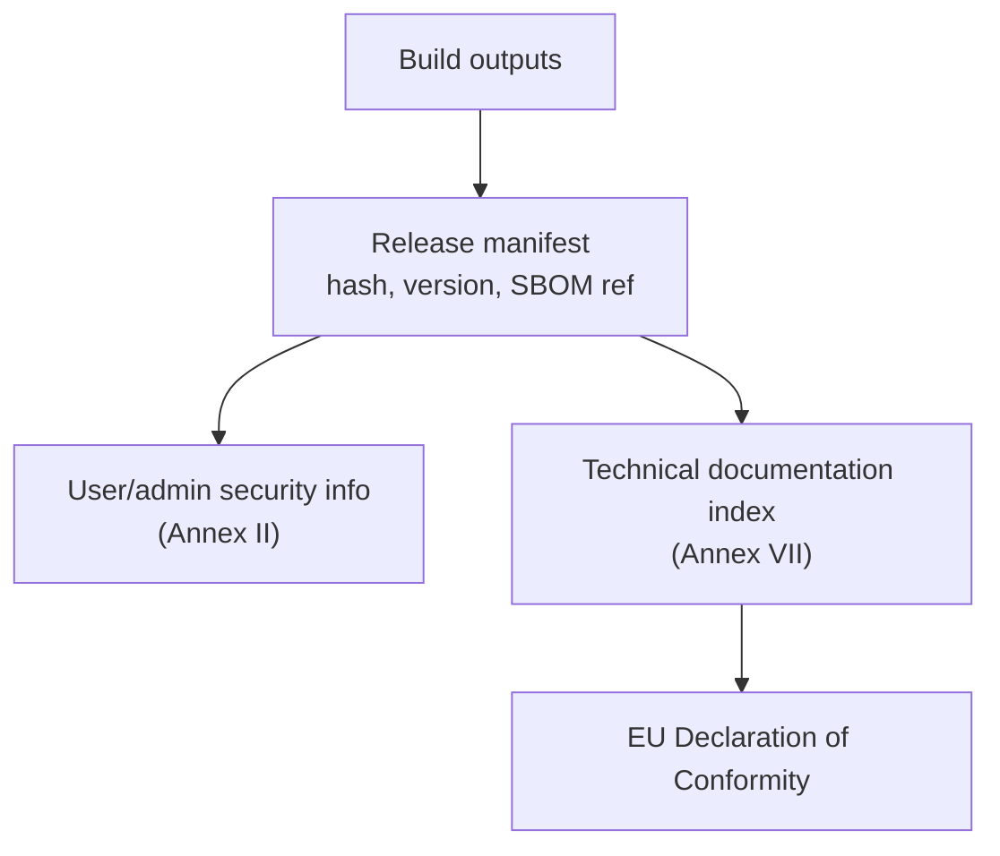
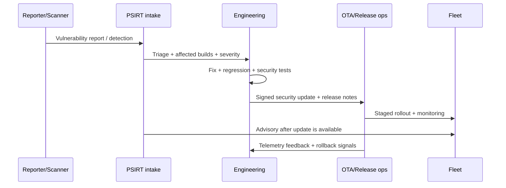
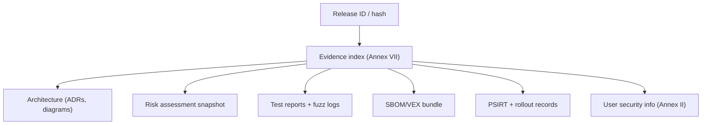

---
id: cra-sdl
slug: /security/cra/secure-development-lifecycle
title: Secure Development Lifecycle (SDL)
sidebar_position: 5

last_update:
  author: 'Ayoub Bourjilat (AC6)'
  date: '2025-12-19'
---

## Varför ett SDL krävs (CRA-perspektiv)

CRA utvärderar **inte bara slutlig firmware**. Den kräver att tillverkaren, vid marknadsplacering, säkerställer att produkten med digitala element har **designats, utvecklats och producerats** i linje med de väsentliga cybersäkerhetskraven i **Bilaga I del I**.[1]

CRA går längre:

- Tillverkare ska göra en **cybersecurity risk assessment**, dokumentera den och ta hänsyn till resultatet under **planering, design, utveckling, produktion, leverans och underhåll**.[2]
- Teknisk dokumentation ska skapas **innan** marknadsplacering och **löpande uppdateras** minst under **supportperioden** (och ska innehålla elementen i Bilaga VII).[3]
- Conformity kan visas via **harmoniserade standarder** eller **common specifications** (presumption of conformity), vilket gör att SDL måste vara "standardiserbart" och revisionsbart.[4]

Översatt till inbyggt: **SDL är mekanismen som bevisar att Bilaga I är implementerad**, release efter release.

---

## Hur ett CRA-redo SDL ser ut för inbyggda produkter

Ett CRA-redo SDL för inbyggt har tre egenskaper:

1. **Evidence-first**: varje fas producerar artefakter som kan indexeras i technical file (Bilaga VII).[3]
2. **Riskdrivet**: kontroller väljs och motiveras via produktens riskbedömning (Art. 13(2)-(4)).[2]
3. **Livscykel-komplett**: täcker design → release → fält, inkl. sårbarhetshantering och säkerhetsuppdateringar (Bilaga I del II).[1]

---

## SDL-faser för inbyggt (gates, output, CRA-ankare)

### Gate 0 - Produktgräns och klassificering

**Mål:** definiera PDE-gränsen och "security environment" så risk kan bedömas.

Måste fånga:
- enhetsgränssnitt (logiska/fysiska/indirekta kopplingar),
- antaganden om debug och produktion/tillverkning,
- remote-beroenden för funktion (uppdateringar, identitet, telemetri),
- produktvarianter (minneskarta, boot chain, radiostack, region-SKU).

**Output (minst):**
- scope statement + systemkontextdiagram,
- interfaceinventering + exponeringsantaganden,
- initial risk assessment-baseline.

**CRA-ankare:** riskbedömning över livscykeln (Art. 13(2)-(4)); teknisk dokumentation (Art. 31 + Bilaga VII).[2][3]

---

### Gate 1 - Säkerhetskrav och threat modeling

**Mål:** gör Bilaga I del I "säkerhetsegenskaper" till explicita krav och validera mot hot.

Threat modeling måste inkludera:
- remote-hot (protokollparsers, auth-bypass, uppdateringsspoofing),
- lokala hot (UART/USB-missbruk, debug, fault injection-antaganden),
- supply chain-hot (komprometterade dependencies, build-pipeline-tampering).

**Output (minst):**
- lista över säkerhetskrav taggade till Bilaga I,
- threat model med mitigeringar,
- testbara acceptanskriterier för säkerhet.

**CRA-ankare:** Bilaga I del I; riskbedömning visar hur I(2) tillämpas (Art. 13(3)).[1][2]

---

### Gate 2 - Arkitekturgranskningar (secure-by-design)

**Mål:** lås beslut tidigt som är dyra att ändra (root of trust, isolering, uppdateringsväg).

Checkpunkter att formalisera:
- root of trust & enhetsidentitet (nyckellagring, provisioning, revokering),
- secure boot-kedja & anti-rollback-policy,
- isolering (MPU/MMU/TrustZone; least privilege),
- säker kommunikationsprofil (protokoll, cipher suites, credentialvalidering),
- logging-hookar och exportmodell,
- uppdateringsstrategi (A/B, swap, recovery) och failure-matris.

**Output (minst):**
- arkitekturdiagram med trust boundaries,
- ADR:er för varje större val,
- design för nyckelhantering/provisioning (även om outsourcad).

**CRA-ankare:** Bilaga I del I(2) (secure-by-default, åtkomstkontroll, konfidentialitet/integritet, attackyta, logging, updates); teknisk dokumentation (Bilaga VII).[1][3]

---

### Gate 3 - Implementation guardrails (kod + dependencies + build)

**Mål:** undvik onödiga sårbarheter och skydda build/pipeline.

Guardrails för inbyggt:
- kodregler för osäkra språk (C/C++): förbjudna API:er, integer-regler, bounds checks,
- parser-säkerhet: strikt indata-validering, längdkontroller, state machine-härdning,
- dependency governance: versionspinning, sårbarhetsmonitor, allow/deny-listor,
- build-integritet: reproducerbara builds där möjligt, kontrollerad signering, manipulationsspårbar CI-logg.

**Output (minst):**
- CI-policy: vilka kontroller som krävs och blockerar,
- dependency-manifest + SBOM-jobb,
- SOP för säker nyckelhantering vid signering (vem/var/hur).

**CRA-ankare:** "inga kända exploaterbara sårbarheter" vid release (I(2)(a)); due diligence för tredjeparts-komponenter (Art. 13(5)-(6)); teknisk dokumentation ska beskriva medlen (Art. 31(1)).[1][3][2]

---

### Gate 4 - Verifiering och säkerhetstester (bevisa egenskaperna)

**Mål:** visa att implementerade kontroller möter Bilaga I och håller över tid.

Säkerhetstester för inbyggt bör omfatta:
- statisk analys för minnessäkerhet och kryptomissbruk,
- protokoll- och filformatfuzzning (host-harness + nattlig HIL),
- negativa tester för secure boot och uppdateringsvägar (fel signatur, downgrade),
- robusthetstester för tillgänglighet (resursutarmning, rate limiting, watchdog/recovery).

**Output (minst):**
- säkerhetstestplan kopplad till krav,
- testrapporter med pass/fail, buggar och åtgärdsbevis,
- fuzz-korpus + crash-triage för parsers.

**CRA-ankare:** Bilaga I del I(2) (integritet, åtkomstkontroll, tillgänglighet, loggning); Bilaga I del II förväntar sig löpande testning; test-evidens i Bilaga VII.[1][3]

---

### Gate 5 - Release engineering (compliance-grade artefakter)

**Mål:** producera exakt de artefakter som gör en release försvarbar.

Minimipaket för inbyggt:
- signerade firmwarebilder + hashar + versionspolicy-metadata,
- SBOM per build (och VEX/triage-noter vid behov),
- uppdateringsinstruktioner och säkerhetskonfig-råd för användare/operatörer,
- sammanfattning av "Bilaga I-täckning" med koppling klausul → kontroll → evidens.

**CRA-ankare:** säkerhetsuppdateringar och användarinformation (Bilaga I del I(2)(c) + Bilaga II); teknisk dokumentation före marknad (Art. 31(2)); EU DoC anger att Bilaga I uppfylls (Art. 28(1)).[1][3][5]

---

### Gate 6 - Post-market: PSIRT + säkerhetsuppdateringar

**Mål:** hålla PDE säker under supportperioden med fungerande sårbarhetshantering och säker distributionskedja.

Praktiska skyldigheter:
- intake-kanal för sårbarheter (single point of contact),
- triage (exponering + exploaterbarhet + påverkade builds),
- säker distribution av säkerhetsuppdateringar (signerade, integritetskontrollerade, rollback-säkra),
- advisory/notification efter att uppdatering finns (enligt policy).

**Output (minst):**
- PSIRT-process + verktygsflöde,
- loggar för uppdateringsutrullning (staged rollout, segmentering),
- advisory-mallar + bevis på closure.

**CRA-ankare:** sårbarhetshantering (Bilaga I del II); riskbedömning uppdateras under supportperioden (Art. 13(3)); teknisk dokumentation uppdateras under supportperioden (Art. 31(2)).[1][2][3]

---

## Mappa SDL mot NIST SSDF och IEC 62443-4-1 (valfritt men nyttigt)

CRA är det legala baslinjen. Ramverk som **NIST SSDF (SP 800-218)** och **IEC 62443-4-1** används ofta för att strukturera SDL och ge konsekvent evidens, men ersätter inte Bilaga I.[6][7]

Praktisk alignering:

- **Prepare (SSDF PO)** → Gate 0-1 (scope, roller, riskmodell, krav)
- **Protect (SSDF PS)** → Gate 2-3 (säker arkitektur, build-integritet, dependency governance)
- **Produce (SSDF PW)** → Gate 4-5 (testning, signering, SBOM, release-evidens)
- **Respond (SSDF RV)** → Gate 6 (PSIRT + uppdateringar)

---

## Vad som lagras var (så revision inte blir arkeologi)

En CRA-vänlig modell:
- designartefakter (ADR, diagram) i arkitekturrepo,
- CI- och releaseartefakter i immutabel lagring med retention,
- PSIRT-poster i tracker med exportbar evidens,
- och ett **enda index** för technical documentation som pekar på alla artefakter per release-hash (Bilaga VII).[3]

---

## Vanliga problem (och varför de spelar roll under CRA)

Om SDL känns "tungt" saknas ofta något av detta:

1. **PDE-gräns inte definierad**: enheten dokumenterad, men OTA/provisioning/telemetri inte → kan inte bevisa uppdaterings-/loggkrav.[2][3]
2. **Supportperiod beslutas sent**: uppdateringsstrategi och kostnad matchar inte livscykelkraven (riskbedömning och dokumentation ska uppdateras under supportperiod).[2][3]
3. **Variant-explosion utan evidens**: flera SKU:er/bootkedjor men bara en testad/dokumenterad → evidens speglar inte det som skeppas.
4. **Signering/nycklar behandlas som builddetalj**: nyckelvård och signeringsloggar saknas → kan inte bevisa uppdateringsautenticitet/integritet.[1][3]
5. **Inga negativa tester**: secure boot/update implementerad men aldrig attackerad i test (downgrade, korruption, replay) → integritetskontroller otestade.
6. **SBOM skapas en gång**: SBOM finns men är inte kopplad till release-hash; ingen triage/VEX → "inga kända exploaterbara sårbarheter" är inte försvarbart.[1]
7. **Debug-livscykel ej styrd**: SWD/JTAG/UART-policy bygger på stamkunskap → bryter secure-by-default och attackytereduktion.[1]
8. **PSIRT är "email"**: ingen dokumenterad intake/triage/fix/advisory → Bilaga I del II blir overifierbar.[1]
9. **Evidens utspridd**: artefakter finns men inte indexerade per release i technical documentation → revision blir långsam och felbenägen (Art. 31 + Bilaga VII).[3]
10. **Process ignorerar standardutveckling**: serieproduktion reagerar inte på uppdaterade harmoniserade standarder/common specs → CRA kräver procedurer för att behålla conformity över tid.[2][4]

---

## Referenser

[1]: Regulation (EU) 2024/2847 (CRA) - Annex I (Part I & Part II) (EUR-Lex) https://eur-lex.europa.eu/legal-content/EN/TXT/?uri=CELEX:32024R2847

[2]: CRA - Article 13 (manufacturer obligations: risk assessment integrated across lifecycle; updated during support period; included in technical documentation; production conformity procedures) https://eur-lex.europa.eu/legal-content/EN/TXT/?uri=CELEX:32024R2847

[3]: CRA - Article 31 + Annex VII (technical documentation: drawn up before market placement; continuously updated at least during support period; content requirements) https://eur-lex.europa.eu/legal-content/EN/TXT/?uri=CELEX:32024R2847

[4]: CRA - Article 27 (presumption of conformity via harmonised standards and common specifications; standardisation requests) https://eur-lex.europa.eu/legal-content/EN/TXT/?uri=CELEX:32024R2847

[5]: CRA - Article 28 (EU Declaration of Conformity states Annex I fulfillment) + Annex II (user security information) https://eur-lex.europa.eu/legal-content/EN/TXT/?uri=CELEX:32024R2847

[6]: NIST SP 800-218 (Secure Software Development Framework - SSDF) https://csrc.nist.gov/pubs/sp/800/218/final

[7]: IEC 62443-4-1 (Secure product development lifecycle requirements) (standard reference; obtain via IEC/ISA)

