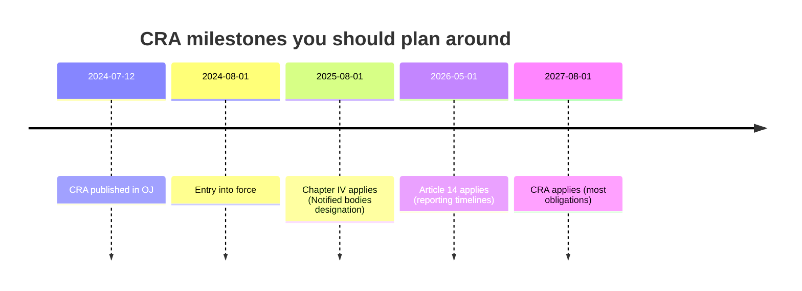
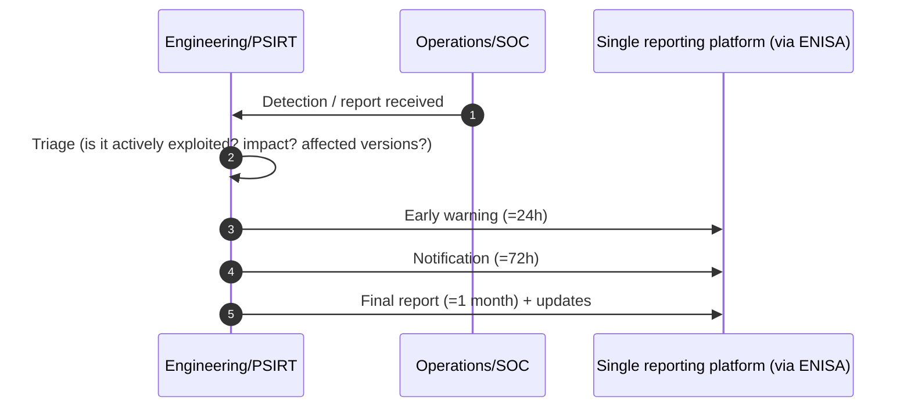
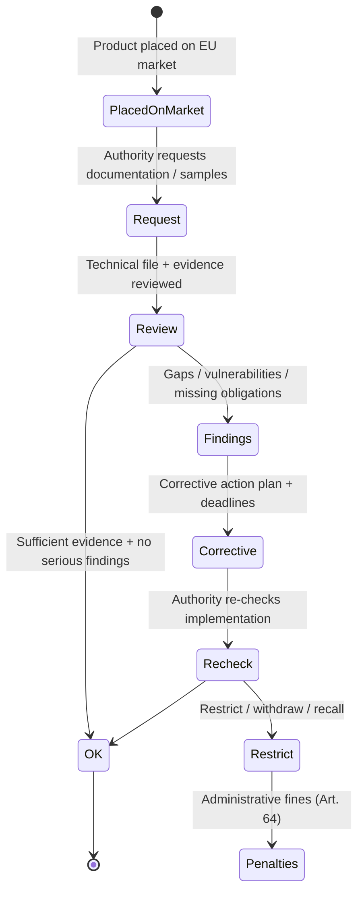
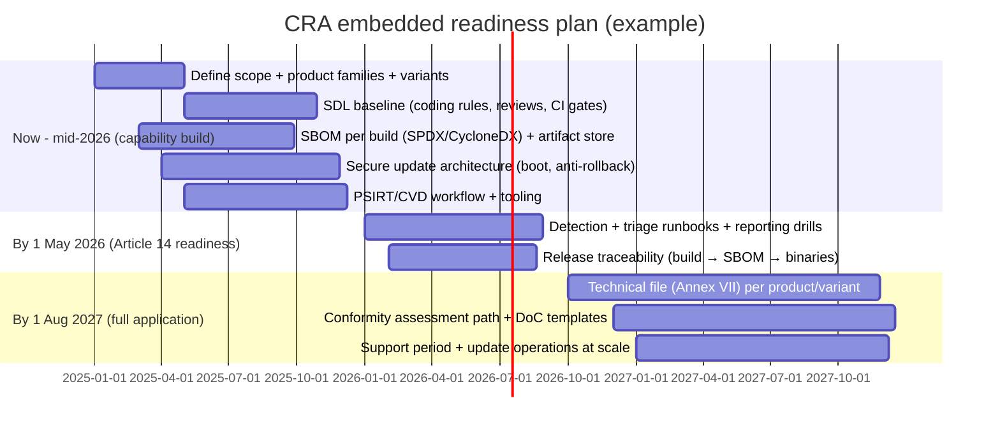

---
id: cra-timelines
slug: /security/cra/timelines-and-enforcement
title: Tidslinjer, tillsyn och sanktioner
sidebar_position: 9

last_update:
  author: 'Ayoub Bourjilat (AC6)'
  date: '2025-12-19'
---

## Varför tidslinjer spelar roll (särskilt för inbyggt)

CRA är en **CE-märkningsförordning**: när den väl gäller kan du inte "patcha compliance" i efterhand. För inbyggda produkter med lång livslängd (MCU:er i fält 10+ år) är det svåra oftast inte kryptot utan att planera **supportperiod**, **uppdateringslogistik**, **evidensbevaring** och **incident-/sårbarhetsrapportering** över produktvarianter.

---

## Viktiga CRA-datum att planera mot

Förordning (EU) 2024/2847 publicerades **12 juli 2024**, träder i kraft **1 aug 2024**. Art. 71 sprider tillämpning:

- **+12 mån (1 aug 2025):** Kapitel IV (utnämning av notified bodies)
- **+21 mån (1 maj 2026):** Artikel 14 (tidslinjer för vuln/incident-rapportering)
- **+36 mån (1 aug 2027):** Huvudkraven gäller (Bilaga I, dokumentation, uppdateringar, CE/DoC, tillsyn m.m.)

Blanda inte **ikraftträdande** med **tillämpning**: skyldigheter blir verkställbara först när de tillämpas.

| Datum (tillämpning) | Vad som börjar gälla | Vad det betyder (inbyggt) |
|---|---|---|
| **1 aug 2025** | **Kapitel IV** (notified bodies) | NB kan utses tidigt så att branschen förbereder bedömningar. |
| **1 maj 2026** | **Artikel 14** (rapporteringstider) | Du måste kunna rapportera vissa aktivt exploaterade sårbarheter/incidenter med strikta tider. Detta är en *processkapabilitet*. |
| **1 aug 2027** | **CRA gäller (det mesta)** | Fulla CRA-krav, inkl. Bilaga I, technical documentation, sårbarhetshantering, uppdateringar, CE/DoC, marknadstillsyn. |

**Ingenjörsimplicering:** väntar du till sent 2027 missar du poängen – CRA vill ha **repeterbar evidens**, inte panik i sista stund.

---

## Vad "befintliga produkter" betyder för långlivade enheter

Vanlig fälla: "vi skeppade modellen för år sedan, så den påverkas inte." I CE-termer räknas **när du placerar produkten på marknaden**. Om du fortsätter skeppa samma modell efter att CRA gäller, behöver den releasen + technical file vara compliant **vid den tidpunkten**.

Praktiska case:

- **Samma HW, ny firmware:** behandla som ny release inom CRA-evidens (SBOM/VEX, tester, uppdateringsväg, deklarerad supportperiod).
- **HW-respin (ny MCU/SoC-revision):** kör om riskanalys, säkerhetsegenskaper (debug-lås, TRNG, secure storage), påverkan på Bilaga III-klassning.
- **Produktfamiljer/SKU:** kunna generera evidens **per variant** (radio, crypto-accel, minnesstorlek, bootkedja).

---

## Rapporteringstider du måste klara (Art. 14)

När **Art. 14** gäller (**1 maj 2026**) måste du operativt kunna detektera, triagera och rapportera. CRA sätter tidsfönster:

- **Early warning** inom **24h** efter att du blir medveten om *actively exploited vulnerability* eller incident, sedan
- **notification** inom **72h**, och
- **final report** inom **1 månad** (med ev. uppföljning).

**Inbyggt reality check:** för att klara tiderna behöver du loggning/telemetri (även minimal), PSIRT-flöde och förmåga att snabbt mappa rapport till påverkade firmware-builds (SBOM + release-spårbarhet).

---

## Marknadstillsyn och enforcement: vad myndigheter gör

När CRA gäller kan myndigheter:

- begära din **technical documentation**,
- testa produkter,
- kräva **korrigerande åtgärder** (fix, begränsa, dra tillbaka/recall),
- och införa sanktioner.

Mental modell:

**Vanliga fel i inbyggt:**
- uppdateringsväg inte säker eller odokumenterad,
- ingen SBOM för firmware + toolchain,
- ingen trovärdig sårbarhetshantering/CVD,
- svaga defaults (öppen debug, defaultlösenord, exponerade tjänster),
- "papersäkerhet": påståenden utan testbevis.

---

## Sanktioner (Art. 64): nivåer

Maximala administrativa böter (övre gräns):

| Brott (förenklat) | Maxböter |
|---|---|
| Brott mot **väsentliga krav** (Bilaga I) och vissa kärnplikter (inkl. rapportering) | upp till **€15,000,000** eller **2.5%** av global omsättning (det högre) |
| Brott mot olika **economic-operator-plikter** (dokumentation, samarbete, vissa supply chain-plikter) | upp till **€10,000,000** eller **2%** av omsättning |
| **Felaktig/ofullständig/missvisande info** till myndigheter | upp till **€5,000,000** eller **1%** av omsättning |

Notera:
- CRA har **justeringar för mikro/små företag** på vissa rapporteringstidslinjer (Art. 64).
- **Open-source software stewards** har mycket lägre max-tak (Art. 64).

---

## Praktisk roadmap för inbyggt, alignad till datumen

---

## Fasat arbete (PT1, PT2, PT3) och standardstrategi

Många kör tre faser:

- **PT1 (baseline readiness):** mappa scope och riskklass (Bilaga III), bestäm supportperiod, update-policy, SBOM/VEX-generering, PSIRT-flöde, skissa technical file. Aligna med **horisontella standarder** tidigt.
- **PT2 (implementation + evidens):** implementera kontroller/testning i linje med kommande **harmoniserade standarder**. Om de saknas: följ kandidater/etablerade **horisontella standarder** (t.ex. 62443-4-2, 81001-5-1, ETSI EN 303 645) och mappa mot Bilaga I. Lägg till **vertikala standarder** om relevant för domänen.
- **PT3 (assessment + marknadsplacering):** finalisera technical file (Bilaga VII), kör vald conformity-path (egen vs tredje part beroende på kritikalitet), ta fram DoC och CE-märkning, säkra tillsyn/uppdateringar för supportperioden.

Påminnelser:

- Harmoniserade standarder ger presumption of conformity men kan dröja. Börja med horisontella standarder och uppdatera mapping när harmoniserade texter publiceras.
- Vertikala standarder ska tillämpas när produkten tillhör den domänen; dokumentera motiv och evidens per produkt/variant.
- Håll mapping i technical file: Bilaga I-krav -> kontroll -> test/evidens -> tillämpad standard (harmoniserad/horisontell/vertikal).

---

## Vanliga problem (självtest)

1. **Blandar ihop ikraftträdande och tillämpning.**  
   Planerar från fel datum och missar tidiga milstolpar (aug 2025 / maj 2026).

2. **Oklart "placing on the market" för firmware.**  
   Kan inte svara: *vilken firmware-build kopplas till CE technical file för denna batch?*

3. **Odefinierad supportperiod för inbyggt.**  
   Sälj lovar 5-10 år, engineering planerar 18 månader. CRA kräver att detta är explicit och evidensbaserat.

4. **Offline/intermittent uppkoppling.**  
   Du behöver ändå en trovärdig uppdateringsmekanism: signerade uppdateringar, integritetskontroller, recovery, och användarguide för hur uppdatering görs.

5. **Variant-explosion.**  
   Olika MCU, radio, minnesstorlek, bootflöden – evidens behövs per variant, inte "ett PDF för allt".

6. **Rapporteringsberedskap underskattas.**  
   24h/72h är inte förenligt med "vi tar det nästa sprint". Du behöver PSIRT-beredskap och tydliga trösklar.

7. **Leverantörs-evidens saknas.**  
   ODM/OEM/SDK-leverantörer ger inte SBOM, testrapporter eller vuln-status – då kan du inte stänga egna skyldigheter.

---

## Referenser

[1]: Regulation (EU) 2024/2847 (Cyber Resilience Act), Article 71 (application dates) and Article 14 (reporting timelines): https://eur-lex.europa.eu/eli/reg/2024/2847/oj  

[2]: Regulation (EU) 2024/2847, Article 64 (administrative fines): https://eur-lex.europa.eu/eli/reg/2024/2847/oj

