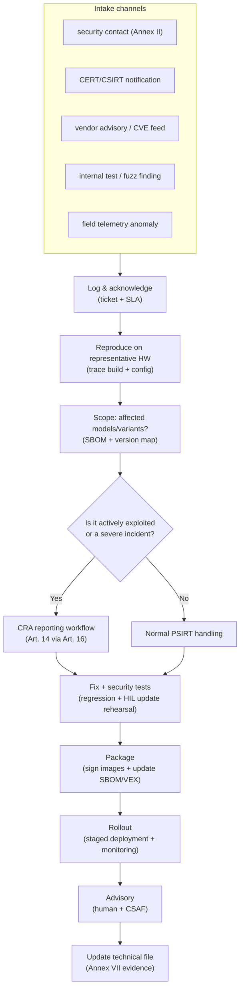
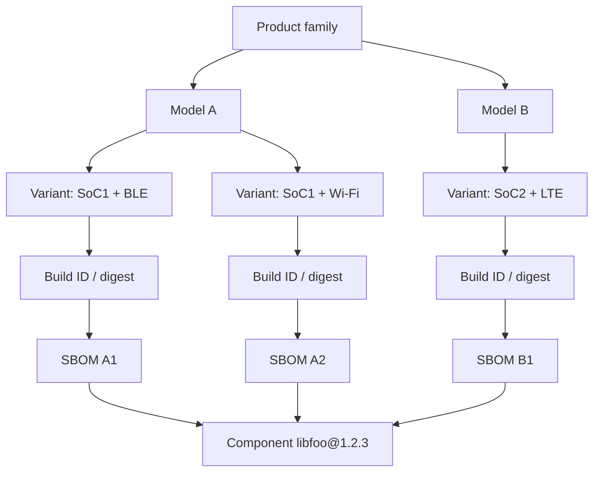

---
id: cra-vuln-handling
slug: /security/cra/vulnerability-handling
title: Sårbarhetshantering och rapportering
sidebar_position: 7

last_update:
  author: 'Ayoub Bourjilat (AC6)'
  date: '2025-12-19'
---

## Varför sårbarhetshantering är ett förstaklassigt CRA-krav

I CRA är säkerhet inte "skeppa och glöm". För **products with digital elements (PDE)** måste tillverkaren:

- hantera sårbarheter effektivt **under hela supportperioden** (Art. 13(8)),
- uppfylla **kraven på sårbarhetshantering** i **Bilaga I del II**, 
- underhålla nödvändig **technical documentation** (Bilaga VII),
- ge **användarinformation** och en rapporteringskontakt (Bilaga II),
- och **notifiera** vissa händelser via **single reporting platform** (Art. 14-16).

För inbyggt betyder det att PSIRT-process, SBOM/VEX, uppdateringspipeline och incidenttelemetri är *compliance-kontroller*, inte "nice-to-have".

---

## Definitioner du måste ha rätt (CRA Artikel 3)

Dessa styr rapporteringstriggers och evidens:

- **Vulnerability**: en svaghet som kan exploateras av cyberhot.
- **Exploitable vulnerability**: kan användas effektivt under praktiska driftsförhållanden.
- **Actively exploited vulnerability**: tillförlitlig evidens visar att en aktör utnyttjat den i ett system utan ägarens tillstånd.
- **Incident impacting the security of the PDE**: påverkar (eller kan påverka) förmågan att skydda **tillgänglighet, autenticitet, integritet eller konfidentialitet** för data/funktioner.
- **SBOM (software bill of materials)**: formellt register över komponenter och försörjningskedjerelationer i mjukvaran.

**Varför viktigt för inbyggt:** triage måste skilja "CVE finns i dependency" från "vi är påverkade" och från "den är aktivt exploaterad i fält". Det är olika skyldigheter, tidslinjer och externa budskap.

---

## Bilaga I del II som ingenjörschecklista (inbyggt)

Del II är i praktiken minsta PSIRT + uppdateringssystem. Mappa varje punkt till mekanismer och artefakter:

### 1) Identifiera och dokumentera sårbarheter + komponenter (SBOM)

**Krav (Bilaga I del II(1))**  
Underhåll en SBOM i **vanligt maskinläsbart format**, som täcker minst **toppnivåberoenden**.

**Inbyggt:**
- Generera SBOM **per build** och **per variant** (SoC, radiostack, feature flags, bootloader, crypto-backend).
- Behandla **toolchain** och build-generatorer som "säkerhetsrelevanta" (de kan införa sårbarheter).
- Knyt SBOM till **firmware-identitet** (build-ID + signing key ID + image-digest).

**Output**
- `sbom.cdx.json` eller `sbom.spdx.json` kopplat till artefakter
- komponent-/versionskarta (variant → SBOM)

### 2) Åtgärda utan dröjsmål (säkerhetsuppdateringar, separera vid behov)

**Krav (Bilaga I del II(2))**  
Åtgärda sårbarheter **utan dröjsmål**, bl.a. genom **säkerhetsuppdateringar**; där det är tekniskt möjligt, ge säkerhetsuppdateringar **separat** från funktionsuppdateringar.

**Inbyggt:**
- Ha en **security-fix-only-branch** för kunder som inte kan ta feature-diffar (säkerhet/industri).
- Håll kompatibilitetsregler explicita (bootloader ↔ app-imageformat; radiofirmwarebegränsningar).
- Definiera nedgradering/rollback-policy (fuses, monotona versioner) och matcha recoverystrategi.

**Output**
- procedur för säkerhetspatch-release
- kompatibilitetsmatris + rollbackregler

### 3) Regelbundna tester och säkerhetsgranskningar

**Krav (Bilaga I del II(3))**  
Genomför effektiva och regelbundna **tester och granskningar** av PDE:ns säkerhet.

**Inbyggt:**
- Kombinera host-baserad fuzzning (protokollparsers, fil-/packet-decoders) med **HIL-regression** på representativa kort.
- Gör säkerhetstestresultat spårbara till build och vuln-ticket.

**Output**
- fuzzrapporter + korpusarkiv
- HIL-loggar för uppdateringsrepetition (strömavbrott, brownout, rollbackförsök)

### 4) Publicera info om åtgärdade sårbarheter (med möjlighet till säker fördröjning)

**Krav (Bilaga I del II(4))**  
När en säkerhetsuppdatering finns, publicera:
- beskrivning,
- identifiering av berörd produkt,
- påverkan och allvar,
- tydlig remediationsinfo.

Fördröjning tillåts *endast* när riskerna med omedelbar publicering överväger säkerhetsnyttan och användare har fått möjlighet att patcha.

**Inbyggt:**
- Publicera advisories i **CSAF** (maskinläsbar) om kundbasen är industri/enterprise.
- "Affected product" måste matcha något fältet kan läsa (modell + HW-rev + FW-version + build-ID).

**Output**
- advisory (mänsklig + CSAF)
- lista över berörda versioner från SBOM/variant-karta

### 5) CVD-policy

**Krav (Bilaga I del II(5))**  
Inför och följ en **CVD-policy**.

**Inbyggt:**
- Dokumentera safe-harbour och testgränser (t.ex. ingen fysisk tampering, inga attacker på tredje parts nät).
- Definiera tidslinjer för ack/nedslag (undvik "svart hål"-inkorgar).

**Output**
- `security.md` + publicerad policysida
- intern PSIRT-SOP (roller, triage, disclosure-gates)

### 6) Underlätta rapportering (kontaktadress)

**Krav (Bilaga I del II(6))** + **Bilaga II(2)**  
Ge en single point of contact för rapportering och där CVD-policy finns.

**Inbyggt:**
- Säkerställ att kontakten fungerar hela supportperioden.
- Erbjud kryptering (PGP) och autentiserade kanaler för känsliga rapporter.

**Output**
- kontaktadress + publik nyckel
- länk införd i användardokumentation

### 7) Säker distribution av uppdateringar (automatiskt där tillämpligt)

**Krav (Bilaga I del II(7))**  
Tillhandahåll mekanismer för **säker distribution av uppdateringar**, och där tillämpligt för säkerhetsuppdateringar, på **automatiskt** sätt.

**Inbyggt:**
- Säker uppdatering = autentisering + integritet + anti-rollback + säker install + recovery-väg.
- För begränsade enheter kan "automatiskt" vara "enheten kollar + notifierar + installerar i servicefönster", men mekanismen måste vara pålitlig och säker.

**Output**
- threat model för uppdateringar
- specifikation för uppdateringsmetadata (manifest, signaturer, versionsregler)

### 8) Distribuera säkerhetsuppdateringar utan dröjsmål, gratis som standard

**Krav (Bilaga I del II(8))**  
Säkerhetsuppdateringar ska distribueras **utan dröjsmål** och, om inte annat avtalats med affärsanvändare för skräddarsytt PDE, **gratis**, med advisory-meddelanden.

**Inbyggt:**
- Releaseverktyg måste stödja "urgent security"-kanaler (snabb signering + staged rollout).
- Advisory ska inkludera driftsbegränsningar (nedtid, reboot, lagringsbehov).

**Output**
- mall för säkerhetsrelease-notes
- rolloutplan + snapshot av övervakning

---

## PSIRT-modell för inbyggt (vad granskare tittar på)

En trovärdig PSIRT har **tydligt ägarskap**, **repeterbara artefakter** och **spårbarhet** från rapport → fix → levererad uppdatering → disclosure → evidensuppdatering.

---

## Variant-aware scoping (inbyggda fällan)

Samma "produkt" kan finnas i många kombinationer:
- flera SoC:er,
- regional radiofirmware,
- valfria features compilas in/ut,
- olika bootloaders,
- olika molnendpoints.

Om du inte kan mappa "CVE-XXXX i libfoo" till "dessa levererade binärer" kan du inte:
- bevisa due diligence (Bilaga I del II(1)),
- snabbt bedöma påverkan,
- göra korrekta advisories (Bilaga I del II(4)),
- eller notifiera myndigheter med trovärdig info (Art. 14).

En praktisk metod är en **Product Coverage Graph**:

**Tumregel:** om du kan svara "vilka binärer påverkas?" inom timmar är systemet moget nog för CRA-tryck.

---

## Rapportering (CRA Art. 14) – triggers och tidslinjer

### Vad triggar rapporteringsplikt?

**1) Actively exploited vulnerability** i din PDE (Art. 14(1)).  
**2) Severe incident having an impact** på PDE-säkerheten (Art. 14(3)-(5)).

Båda notifieras **samtidigt** till:
- **CSIRT** utsett som koordinator, och
- **ENISA**,
via **single reporting platform** (Art. 16).

### Obligatorisk tidslinje (inbyggt tolkad)

För **actively exploited vulnerability**:
- **= 24h**: early warning (Art. 14(2)(a))
- **= 72h**: vulnerability notification med allmän info + mitigeringar (Art. 14(2)(b))
- **= 14 dagar efter att åtgärd finns**: final report (Art. 14(2)(c))

För **severe incident**:
- **= 24h**: early warning (Art. 14(4)(a))
- **= 72h**: incident notification med initial bedömning + mitigeringar (Art. 14(4)(b))
- **= 1 månad efter incidentnotisen**: final report (Art. 14(4)(c))

**Operativt:** du behöver ett "reporting-ready" minimidataset *innan* full rotorsaksanalys är klar.

### Minimidataset att ha redo (för 24h/72h)

- PDE-identitet: modell, FW-versioner, build-ID, distributionsfotavtryck (medlemsstater om känt)
- detektionsdatum/-tid + evidens för aktiv exploatering (eller incidentindikatorer)
- initial allvar och trolig påverkan (CIA + säkerhets/säkerhetspåverkan)
- mitigeringar som finns nu (konfigråd, stäng gränssnitt, FW-regler, nyckelrotation)
- status för fix (pågår / finns / rollout)

---

## Informera användare (Art. 14(8))

När du blir medveten om **actively exploited vulnerability** eller **severe incident** måste berörda användare (och vid behov alla användare) informeras med mitigering/åtgärd. Vid behov i **strukturerat, maskinläsbart format**.

I praktiken för inbyggt:
- kundadvisory + releasenotes,
- maskinläsbar advisory (CSAF) för enterprise-fleet,
- och (om möjligt) device/app-notiser som fältet faktiskt ser.

---

## Supply-chain-samordning (ODM/OEM + upstream + distributörer)

CRA förväntar sig att sårbarhetshantering funkar längs kedjan:

- **Upstream-rapportering**: hittar du sårbarhet i komponent (även open source) ska du rapportera till den som underhåller den och åtgärda; gör du en fix, dela kod/doc där lämpligt (Art. 13(6)).
- **Distributörer** ska informera tillverkaren utan onödigt dröjsmål när de blir medvetna om en sårbarhet (Art. 20).
- **Open-source software stewards** har dokumenterade skyldigheter; delar av Art. 14 kan gälla där de är involverade (Art. 24).

**Inbyggt reality check:** definiera (gärna avtalsmässigt) vem som äger:
- CVE-monitorering,
- akuta rebuilds + signering,
- hostade update-endpoints,
- kundkommunikation,
- och post-market-telemetri.

Om det inte är skrivet faller det under press.

---

## Vad som ska lagras i technical file (Bilaga VII)

Technical documentation ska beskriva design/utveckling/produktion **och sårbarhetshantering**, inkl.:
- SBOM,
- CVD-policy,
- evidens för rapporteringskontakt,
- och beskrivning av tekniska lösningar för säker uppdateringsdistribution.

Behandla technical file som ett levande system: varje advisory, SBOM/VEX och rapporteringsevent ska vara spårbart och åtkomligt.

---

## Vanliga problem (och hur man minskar risken)

1. **"Vad är produktgränsen?"**  
   Ingår bara firmware, eller även appar, gateways, moln-API:er, provisioningverktyg? Bestäm och dokumentera, annars blir rapportering inkonsekvent.

2. **Variant-explosion**  
   Samma "produkt" med olika radio/SoC/compile-flaggor. Utan variant → build → SBOM-karta blir påverkan gissning.

3. **Ingen telemetri = ingen "awareness"**  
   Art. 14-tider startar när du "blir medveten". Utan detektion och kundkanal lär du dig sent men bedöms ändå på tidslinjen.

4. **Offline / air-gapped**  
   Du behöver ändå säker uppdateringsmekanism och distributionsplan. "USB-update" duger bara om autenticitet/integritet och driftkontroller är starka.

5. **Signing-nycklar inte redo för kris**  
   Om signering kräver en person och en laptop klarar du inte 24h/72h. Använd kontrollerad, auditerad signering (HSM eller motsvarande process).

6. **"Säkerhetsuppdatering" blandas med feature**  
   Kunder kan vägra featureförändringar. Ha väg för säkerhets-only-uppdateringar där tekniskt möjligt (Bilaga I del II(2)).

7. **Publik disclosure utan identifieringsstrategi**  
   Advisories måste låta användare identifiera berörda produkter. Om fältet inte kan mappa "affected versions" till sin körning är disclosure värdelös.

8. **Luckor i OEM/ODM-handover**  
   Vem publicerar advisory? Vem pushar uppdatering? Vem svarar forskare? Utan RACI bär tillverkaren ansvaret ändå.

9. **Förväxling "actively exploited" vs "exploitable"**  
   "Exploitable" är inte automatiskt "actively exploited". Evidenströskel och beslutslogg måste vara explicita.

10. **Supportperiod mismatch**  
    Supportperioden ska spegla förväntad användningstid och är minst fem år om inte användningstiden är kortare (Art. 13(8)). Kan du inte patcha så länge, ändra arkitektur eller affärsmodell.

---

## Referenser

[1]: Regulation (EU) 2024/2847 (Cyber Resilience Act), Official Journal text (ELI): http://data.europa.eu/eli/reg/2024/2847/oj

[2]: Regulation (EU) 2024/2847 - Definitions (Article 3), manufacturer obligations (Article 13), reporting (Articles 14-17), user info (Annex II), vulnerability handling requirements (Annex I Part II), technical documentation (Annex VII): https://eur-lex.europa.eu/legal-content/EN/TXT/?uri=CELEX:32024R2847

